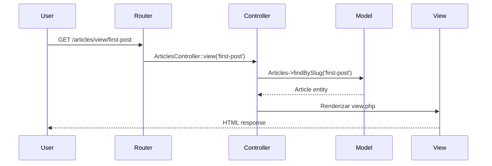
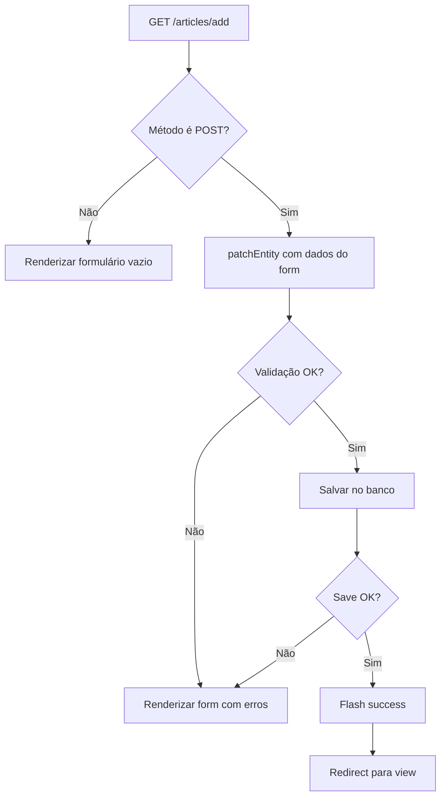

# Tutorial CMS - Criando o Controller de Artigos

!!! info "Parte 4 do Tutorial CMS"
    Esta é a quarta parte do [Tutorial CMS](../tutorials-and-examples.md). Certifique-se de ter completado:

    - ✅ [Parte 1: Instalação](cms-installation.md)
    - ✅ [Parte 2: Banco de Dados](cms-database.md)
    - ✅ [Parte 3: Model (ArticlesTable + Entity)](cms-articles-model.md)

---

## 📋 O Que Você Vai Aprender

Neste tutorial extenso, você aprenderá a criar um **CRUD completo**:

- ✅ **Index** - Listar artigos com paginação
- ✅ **View** - Visualizar artigo individual
- ✅ **Add** - Criar novo artigo
- ✅ **Edit** - Editar artigo existente
- ✅ **Delete** - Deletar artigo
- ✅ **Templates** - Views com FormHelper e HtmlHelper
- ✅ **Flash Messages** - Feedback para usuário
- ✅ **Validação** - Erros exibidos automaticamente
- ✅ **Segurança** - CSRF, XSS, Mass Assignment

---

## 🎮 Entendendo Controllers

### O Que É um Controller?

Controllers são a **camada intermediária** do MVC que:

- 📥 **Recebe** requisições HTTP
- 🧠 **Executa** lógica de negócio (via Models)
- 📤 **Prepara** dados para Views
- 🎨 **Renderiza** templates HTML



---

## 📝 Criando o Controller Básico

### Etapa 1: Criar Arquivo

Crie `src/Controller/ArticlesController.php`:

```php
<?php
// src/Controller/ArticlesController.php
declare(strict_types=1);

namespace App\Controller;

class ArticlesController extends AppController
{
    // Actions virão aqui
}
```

!!! tip "Convenção de Nomenclatura"
    - **Classe:** `ArticlesController` (plural + "Controller")
    - **Arquivo:** `ArticlesController.php` (mesmo nome da classe)
    - **Diretório:** `src/Controller/`
    - **URL:** `/articles/*` (plural, lowercase)

---

### Etapa 2: Configurar Components

Edite `src/Controller/AppController.php` para carregar componentes globais:

```php
<?php
// src/Controller/AppController.php
namespace App\Controller;

use Cake\Controller\Controller;

class AppController extends Controller
{
    public function initialize(): void
    {
        parent::initialize();

        $this->loadComponent('RequestHandler');
        $this->loadComponent('Flash');  // ← Para mensagens de feedback

        /*
         * Enable the following component for recommended CakePHP form protection settings.
         */
        //$this->loadComponent('FormProtection');
    }
}
```

---

## 📋 Action 1: index() - Listar Artigos

### Controller

Adicione em `ArticlesController.php`:

```php
<?php
// src/Controller/ArticlesController.php

public function index()
{
    // Configurar paginação:
    $this->paginate = [
        'limit' => 10,
        'order' => ['Articles.created' => 'DESC'],
        'contain' => ['Users'],  // Carregar autor
    ];

    $articles = $this->paginate($this->Articles);
    $this->set(compact('articles'));
}
```

**Explicação:**

| Linha | O que faz |
|-------|-----------|
| `$this->paginate = [...]` | Configura opções de paginação |
| `'limit' => 10` | 10 registros por página |
| `'order' => [...]` | Ordenar por data (mais recente primeiro) |
| `'contain' => ['Users']` | Carregar relacionamento (evita N+1 queries) |
| `$this->paginate(...)` | Executa query paginada |
| `$this->set(...)` | Passa variável `$articles` para template |

---

### Template

Crie `templates/Articles/index.php`:

```php
<!-- File: templates/Articles/index.php -->

<div class="articles index">
    <h1><?= __('Artigos') ?></h1>

    <p><?= $this->Html->link(__('Novo Artigo'), ['action' => 'add'], ['class' => 'button']) ?></p>

    <?php if ($articles->count()): ?>
        <table>
            <thead>
                <tr>
                    <th><?= $this->Paginator->sort('title', 'Título') ?></th>
                    <th><?= $this->Paginator->sort('Users.email', 'Autor') ?></th>
                    <th><?= $this->Paginator->sort('created', 'Criado') ?></th>
                    <th><?= $this->Paginator->sort('published', 'Publicado') ?></th>
                    <th><?= __('Ações') ?></th>
                </tr>
            </thead>
            <tbody>
                <?php foreach ($articles as $article): ?>
                <tr>
                    <td>
                        <?= $this->Html->link(
                            h($article->title),
                            ['action' => 'view', $article->slug]
                        ) ?>
                    </td>
                    <td><?= h($article->user->email) ?></td>
                    <td><?= $article->created->format('d/m/Y H:i') ?></td>
                    <td>
                        <?php if ($article->published): ?>
                            <span class="badge success">✓ Sim</span>
                        <?php else: ?>
                            <span class="badge warning">✗ Não</span>
                        <?php endif; ?>
                    </td>
                    <td class="actions">
                        <?= $this->Html->link(__('Ver'), ['action' => 'view', $article->slug]) ?>
                        <?= $this->Html->link(__('Editar'), ['action' => 'edit', $article->slug]) ?>
                        <?= $this->Form->deleteLink(
                            __('Deletar'),
                            ['action' => 'delete', $article->slug],
                            ['confirm' => __('Tem certeza que deseja deletar "{0}"?', $article->title)]
                        ) ?>
                    </td>
                </tr>
                <?php endforeach; ?>
            </tbody>
        </table>

        <!-- Paginação -->
        <div class="paginator">
            <ul class="pagination">
                <?= $this->Paginator->first('<< ' . __('primeira')) ?>
                <?= $this->Paginator->prev('< ' . __('anterior')) ?>
                <?= $this->Paginator->numbers() ?>
                <?= $this->Paginator->next(__('próxima') . ' >') ?>
                <?= $this->Paginator->last(__('última') . ' >>') ?>
            </ul>
            <p><?= $this->Paginator->counter(__('Página {{page}} de {{pages}}, mostrando {{current}} registro(s) de {{count}} no total')) ?></p>
        </div>
    <?php else: ?>
        <p class="notice"><?= __('Nenhum artigo encontrado. Que tal criar o primeiro?') ?></p>
        <p><?= $this->Html->link(__('Criar Primeiro Artigo'), ['action' => 'add'], ['class' => 'button']) ?></p>
    <?php endif; ?>
</div>
```

**Recursos do template:**

- ✅ **Cabeçalhos ordenáveis** (`Paginator->sort()`)
- ✅ **Escape HTML** (`h()` para XSS protection)
- ✅ **Formatação de data** (`format('d/m/Y H:i')`)
- ✅ **Badge de status** (publicado/não publicado)
- ✅ **Paginação completa** (primeira, anterior, números, próxima, última)
- ✅ **Mensagem de lista vazia**

---

### Testando

Acesse: [http://localhost:8765/articles](http://localhost:8765/articles)

Você deverá ver a lista de artigos com paginação!

---

## 👁️ Action 2: view() - Visualizar Artigo

### Controller

```php
<?php
// src/Controller/ArticlesController.php

public function view(?string $slug = null)
{
    $article = $this->Articles
        ->findBySlug($slug)
        ->contain(['Users', 'Tags'])  // ← Carregar autor E tags
        ->firstOrFail();

    $this->set(compact('article'));
}
```

**Recursos:**

- **Dynamic Finder:** `findBySlug($slug)` = `WHERE slug = :slug`
- **contain():** Evita N+1 queries (carrega relacionamentos em 1 query)
- **firstOrFail():** Lança `RecordNotFoundException` se não encontrar (404 automático)

---

### Template

Crie `templates/Articles/view.php`:

```php
<!-- File: templates/Articles/view.php -->

<div class="articles view">
    <h1><?= h($article->title) ?></h1>

    <div class="article-meta">
        <p>
            <strong><?= __('Autor:') ?></strong>
            <?= h($article->user->email) ?>
        </p>
        <p>
            <strong><?= __('Publicado:') ?></strong>
            <?= $article->published ? __('Sim') : __('Não') ?>
        </p>
        <p>
            <strong><?= __('Criado em:') ?></strong>
            <?= $article->created->format('d/m/Y \à\s H:i') ?>
        </p>
        <?php if ($article->modified != $article->created): ?>
        <p>
            <strong><?= __('Última edição:') ?></strong>
            <?= $article->modified->format('d/m/Y \à\s H:i') ?>
        </p>
        <?php endif; ?>
    </div>

    <?php if ($article->tags): ?>
    <div class="tags">
        <strong><?= __('Tags:') ?></strong>
        <?php foreach ($article->tags as $tag): ?>
            <span class="badge"><?= h($tag->title) ?></span>
        <?php endforeach; ?>
    </div>
    <?php endif; ?>

    <div class="article-body">
        <?= nl2br(h($article->body)) ?>
    </div>

    <div class="actions">
        <?= $this->Html->link(__('Editar'), ['action' => 'edit', $article->slug], ['class' => 'button']) ?>
        <?= $this->Html->link(__('Voltar'), ['action' => 'index'], ['class' => 'button secondary']) ?>
        <?= $this->Form->deleteLink(
            __('Deletar'),
            ['action' => 'delete', $article->slug],
            [
                'confirm' => __('Tem certeza?'),
                'class' => 'button danger'
            ]
        ) ?>
    </div>
</div>
```

**Recursos:**

- ✅ **Mostra autor** (`$article->user->email`)
- ✅ **Mostra tags** (loop em `$article->tags`)
- ✅ **nl2br()** para quebras de linha
- ✅ **Verifica se editado** (compara `created` vs `modified`)

---

## ➕ Action 3: add() - Criar Artigo

### Controller

```php
<?php
// src/Controller/ArticlesController.php

public function add()
{
    $article = $this->Articles->newEmptyEntity();

    if ($this->request->is('post')) {
        $article = $this->Articles->patchEntity($article, $this->request->getData());

        // TEMPORÁRIO: Hardcoded user_id
        // (será substituído por autenticação na próxima parte do tutorial)
        $article->user_id = 1;

        if ($this->Articles->save($article)) {
            $this->Flash->success(__('Artigo salvo com sucesso!'));
            return $this->redirect(['action' => 'view', $article->slug]);
        }

        $this->Flash->error(__('Não foi possível salvar o artigo. Por favor, tente novamente.'));
    }

    $this->set('article', $article);
}
```

**Fluxo:**



---

### Template

Crie `templates/Articles/add.php`:

```php
<!-- File: templates/Articles/add.php -->

<div class="articles form">
    <h1><?= __('Novo Artigo') ?></h1>

    <?= $this->element('article_form', ['article' => $article]) ?>
</div>
```

---

### Element (Formulário Reutilizável)

Crie `templates/element/article_form.php`:

```php
<!-- File: templates/element/article_form.php -->

<?= $this->Form->create($article) ?>
<fieldset>
    <legend><?= __('Informações do Artigo') ?></legend>

    <?= $this->Form->control('title', [
        'label' => 'Título',
        'placeholder' => 'Digite um título chamativo',
        'required' => true,
    ]) ?>

    <?= $this->Form->control('body', [
        'label' => 'Conteúdo',
        'type' => 'textarea',
        'rows' => 15,
        'placeholder' => 'Escreva o conteúdo do artigo...',
        'required' => true,
    ]) ?>

    <?= $this->Form->control('published', [
        'label' => 'Publicar artigo?',
        'type' => 'checkbox',
    ]) ?>
</fieldset>

<div class="actions">
    <?= $this->Form->button(__('Salvar Artigo'), ['class' => 'button']) ?>
    <?= $this->Html->link(__('Cancelar'), ['action' => 'index'], ['class' => 'button secondary']) ?>
</div>
<?= $this->Form->end() ?>
```

!!! tip "DRY: Don't Repeat Yourself"
    O formulário está em um **element** reutilizável que será usado tanto em `add.php` quanto em `edit.php`!

---

### Testando

1. Acesse: [http://localhost:8765/articles/add](http://localhost:8765/articles/add)
2. Preencha título e conteúdo
3. Clique em "Salvar Artigo"
4. Você será redirecionado para a página do artigo criado!

---

## ✏️ Action 4: edit() - Editar Artigo

### Controller

```php
<?php
// src/Controller/ArticlesController.php

public function edit(?string $slug = null)
{
    $article = $this->Articles
        ->findBySlug($slug)
        ->contain(['Tags'])  // Para formulário de tags (futuro)
        ->firstOrFail();

    if ($this->request->is(['post', 'put', 'patch'])) {
        $this->Articles->patchEntity($article, $this->request->getData());

        if ($this->Articles->save($article)) {
            $this->Flash->success(__('Artigo atualizado com sucesso!'));
            return $this->redirect(['action' => 'view', $article->slug]);
        }

        $this->Flash->error(__('Não foi possível atualizar o artigo. Por favor, tente novamente.'));
    }

    $this->set('article', $article);
}
```

**Diferenças de add():**

| add() | edit() |
|-------|--------|
| `newEmptyEntity()` | `findBySlug()->firstOrFail()` |
| Cria novo registro | Atualiza registro existente |
| `is('post')` | `is(['post', 'put', 'patch'])` |

---

### Template

Crie `templates/Articles/edit.php`:

```php
<!-- File: templates/Articles/edit.php -->

<div class="articles form">
    <h1><?= __('Editar Artigo') ?></h1>

    <?= $this->element('article_form', ['article' => $article]) ?>
</div>
```

!!! success "Reutilização de Código"
    O mesmo `article_form.php` usado em add()! 🎉

---

## 🗑️ Action 5: delete() - Deletar Artigo

### Controller

```php
<?php
// src/Controller/ArticlesController.php

public function delete(?string $slug = null)
{
    $this->request->allowMethod(['post', 'delete']);

    $article = $this->Articles
        ->findBySlug($slug)
        ->firstOrFail();

    if ($this->Articles->delete($article)) {
        $this->Flash->success(__('O artigo "{0}" foi deletado.', $article->title));
    } else {
        $this->Flash->error(__('Não foi possível deletar o artigo. Por favor, tente novamente.'));
    }

    return $this->redirect(['action' => 'index']);
}
```

**Segurança:**

- **allowMethod():** Bloqueia GET (evita delete acidental por crawlers)
- **Sem template:** Action só redireciona (sem renderização)

!!! danger "Importante: Bloqueio de GET"
    Deletar via GET é **extremamente perigoso**:

    ```php
    // ❌ PERIGO: Crawler pode deletar tudo!
    <a href="/articles/delete/1">Delete</a>

    // ✅ SEGURO: Requer POST
    <?= $this->Form->deleteLink('Delete', ['action' => 'delete', $article->slug]) ?>
    ```

---

## 🔐 Gerando Slugs Automaticamente

### Problema

Ao criar artigo, campo `slug` é `NOT NULL`, mas formulário não pede!

### Solução: beforeSave() Callback

Edite `src/Model/Table/ArticlesTable.php`:

```php
<?php
// src/Model/Table/ArticlesTable.php

use Cake\Utility\Text;
use Cake\Event\EventInterface;

public function beforeSave(EventInterface $event, $entity, $options): void
{
    if ($entity->isNew() && !$entity->slug) {
        $sluggedTitle = Text::slug($entity->title);

        // Truncar para 191 caracteres (índice utf8mb4):
        $slug = substr($sluggedTitle, 0, 191);

        // Evitar duplicatas (adicionar contador se necessário):
        $originalSlug = $slug;
        $counter = 0;

        while ($this->exists(['slug' => $slug])) {
            $counter++;
            $slug = $originalSlug . '-' . $counter;

            // Re-truncar se ficar > 191:
            if (strlen($slug) > 191) {
                $slug = substr($originalSlug, 0, 186) . '-' . $counter;
            }
        }

        $entity->slug = $slug;
    }
}
```

**Melhorias:**

- ✅ **Gera slug automático** de `title`
- ✅ **Evita duplicatas** (adiciona `-2`, `-3`, etc.)
- ✅ **Respeita limite de 191 chars** (utf8mb4 index)
- ✅ **Só executa em novos registros** (`isNew()`)

---

## ✅ Adicionando Validações

Edite `src/Model/Table/ArticlesTable.php`:

```php
<?php
// src/Model/Table/ArticlesTable.php

use Cake\Validation\Validator;

public function validationDefault(Validator $validator): Validator
{
    $validator
        ->integer('id')
        ->allowEmptyString('id', null, 'create')

        ->integer('user_id')
        ->requirePresence('user_id', 'create')
        ->notEmptyString('user_id', 'Autor é obrigatório')

        ->scalar('title')
        ->maxLength('title', 255)
        ->requirePresence('title', 'create')
        ->notEmptyString('title', 'Título não pode ser vazio')
        ->minLength('title', 10, 'Título deve ter no mínimo 10 caracteres')

        ->scalar('slug')
        ->maxLength('slug', 191)
        ->allowEmptyString('slug')  // Gerado automaticamente

        ->scalar('body')
        ->requirePresence('body', 'create')
        ->notEmptyString('body', 'Conteúdo não pode ser vazio')
        ->minLength('body', 10, 'Conteúdo deve ter no mínimo 10 caracteres')

        ->boolean('published')
        ->allowEmptyString('published');

    return $validator;
}
```

**Validações aplicadas:**

| Campo | Regras |
|-------|--------|
| `title` | Obrigatório, 10-255 caracteres |
| `body` | Obrigatório, mínimo 10 caracteres |
| `slug` | Opcional (gerado automaticamente) |
| `published` | Boolean, opcional |

---

### Exibindo Erros de Validação

O `FormHelper->control()` **exibe erros automaticamente**:

```php
<?= $this->Form->control('title') ?>

<!-- Se houver erro, gera: -->
<div class="input text required error">
    <label for="title">Título</label>
    <input type="text" name="title" id="title" class="form-error" value="">
    <div class="error-message">Título deve ter no mínimo 10 caracteres</div>
</div>
```

---

## 🎨 Melhorando a Experiência do Usuário

### Flash Messages com Ícones

Edite `templates/layout/default.php`:

```php
<!-- Dentro de <body>, antes de <?= $this->fetch('content') ?> -->

<?= $this->Flash->render() ?>

<style>
.message {
    padding: 15px;
    margin: 20px 0;
    border-radius: 5px;
    font-weight: bold;
}

.message.success {
    background: #d4edda;
    border: 1px solid #c3e6cb;
    color: #155724;
}

.message.error {
    background: #f8d7da;
    border: 1px solid #f5c6cb;
    color: #721c24;
}

.message.warning {
    background: #fff3cd;
    border: 1px solid #ffeaa7;
    color: #856404;
}
</style>
```

---

### Confirmação de Delete Melhorada

```php
<?= $this->Form->deleteLink(
    '🗑️ ' . __('Deletar'),
    ['action' => 'delete', $article->slug],
    [
        'confirm' => __('⚠️ ATENÇÃO: Esta ação é irreversível!\n\nTem certeza que deseja deletar o artigo "{0}"?', $article->title),
        'class' => 'button danger',
        'escape' => false  // Permite emoji
    ]
) ?>
```

---

## 🚀 Usando Bake CLI

### Gerar Controller

```bash
bin/cake bake controller Articles
```

**Resultado:**
```
Baking controller class for Articles...

Creating file src/Controller/ArticlesController.php
Wrote `src/Controller/ArticlesController.php`

Baking test case for App\Controller\ArticlesController ...

Creating file tests/TestCase/Controller/ArticlesControllerTest.php
Wrote `tests/TestCase/Controller/ArticlesControllerTest.php`
```

---

### Gerar Templates

```bash
bin/cake bake template Articles
```

**Resultado:**
```
Baking view template for Articles::index()...
Creating file templates/Articles/index.php
Wrote `templates/Articles/index.php`

Baking view template for Articles::view()...
Creating file templates/Articles/view.php
Wrote `templates/Articles/view.php`

Baking view template for Articles::add()...
Creating file templates/Articles/add.php
Wrote `templates/Articles/add.php`

Baking view template for Articles::edit()...
Creating file templates/Articles/edit.php
Wrote `templates/Articles/edit.php`
```

---

### Gerar TUDO de uma vez

```bash
bin/cake bake all Articles
```

Gera:
- ✅ Model (Table + Entity)
- ✅ Controller
- ✅ Templates (index, view, add, edit)
- ✅ Tests
- ✅ Fixtures

---

## ❓ Problemas Comuns

??? danger "Erro: `Property 'user' does not exist`"
    **Causa:** Controller não usa `contain()` para carregar relacionamento.

    **Solução:**
    ```php
    $article = $this->Articles
        ->findBySlug($slug)
        ->contain(['Users', 'Tags'])  // ← Adicionar!
        ->firstOrFail();
    ```

---

??? danger "Erro: `Unknown method 'deleteLink'`"
    **Causa:** CakePHP < 5.2 não tem `deleteLink()`.

    **Solução (CakePHP 4.x / 5.0 / 5.1):**
    ```php
    <?= $this->Form->postLink(
        'Delete',
        ['action' => 'delete', $article->slug],
        ['confirm' => 'Are you sure?']
    ) ?>
    ```

---

??? danger "Erro: `Call to a member function success() on null`"
    **Causa:** FlashComponent não carregado.

    **Solução:**
    ```php
    // src/Controller/AppController.php
    public function initialize(): void
    {
        parent::initialize();
        $this->loadComponent('Flash');  // ← Adicionar!
    }
    ```

---

??? warning "Paginação não aparece"
    **Causa:** Template não usa PaginatorHelper.

    **Solução:** Adicionar no final de `index.php`:
    ```php
    <div class="paginator">
        <?= $this->Paginator->numbers() ?>
    </div>
    ```

---

??? warning "Slug duplicado"
    **Causa:** beforeSave() não verifica duplicatas.

    **Solução:** Ver seção "Gerando Slugs Automaticamente" acima.

---

## 🎓 Conceitos Avançados

??? abstract "PRG Pattern (Post-Redirect-Get)"
    **Problema:** Recarregar página após POST re-envia formulário (double-submit).

    **Solução:**
    ```php
    if ($this->Articles->save($article)) {
        $this->Flash->success('Saved!');
        return $this->redirect(['action' => 'index']);  // ← Evita double-submit
    }
    ```

    **Fluxo:**
    1. POST /articles/add
    2. Save no banco
    3. **Redirect** para GET /articles
    4. Usuário recarrega página → Apenas re-faz GET (seguro!)

---

??? abstract "CSRF Protection (Cross-Site Request Forgery)"
    **FormHelper adiciona token automaticamente:**

    ```php
    <?= $this->Form->create($article) ?>
    ```

    **HTML gerado:**
    ```html
    <form method="post" action="/articles/add">
        <input type="hidden" name="_csrfToken" value="abc123...">
        <!-- Token único por sessão -->
    </form>
    ```

    **CakePHP valida automaticamente!** Se token inválido → Erro 403.

---

??? abstract "XSS Protection (Cross-Site Scripting)"
    **Sempre use h() em templates:**

    ```php
    <!-- ❌ VULNERÁVEL -->
    <h1><?= $article->title ?></h1>

    <!-- ✅ SEGURO -->
    <h1><?= h($article->title) ?></h1>
    ```

    **Por quê?**
    ```php
    // Usuário malicioso envia:
    $article->title = '<script>alert("XSS")</script>';

    // Sem h():
    // <h1><script>alert("XSS")</script></h1>  ← Executa JS!

    // Com h():
    // <h1>&lt;script&gt;alert("XSS")&lt;/script&gt;</h1>  ← Texto seguro
    ```

---

??? abstract "N+1 Queries Problem"
    **Problema:**
    ```php
    // Controller SEM contain():
    $articles = $this->Articles->find()->all();

    // Template:
    foreach ($articles as $article) {
        echo $article->user->email;  // ← Query POR ARTIGO!
    }

    // Total: 1 query (articles) + 10 queries (users) = 11 queries 😱
    ```

    **Solução:**
    ```php
    // Controller COM contain():
    $articles = $this->Articles->find()->contain(['Users'])->all();

    // Total: 1 query com JOIN = 1 query! 🎉
    ```

    **SQL gerado:**
    ```sql
    SELECT articles.*, users.*
    FROM articles
    INNER JOIN users ON articles.user_id = users.id
    ```

---

## 📋 Checklist de Implementação

Ao criar um CRUD, certifique-se de:

- [ ] Controller herda de `AppController`
- [ ] `FlashComponent` carregado em `AppController`
- [ ] Action **index()** usa `paginate()` com `contain()`
- [ ] Template **index.php** mostra `PaginatorHelper->numbers()`
- [ ] Action **view()** usa `contain()` para relacionamentos
- [ ] Action **add()** usa `newEmptyEntity()` e PRG pattern
- [ ] Action **edit()** usa `firstOrFail()` e aceita PUT/PATCH
- [ ] Action **delete()** usa `allowMethod(['post', 'delete'])`
- [ ] Form element criado (DRY para add/edit)
- [ ] Validações em `validationDefault()`
- [ ] beforeSave() gera slug único
- [ ] Todos os templates usam `h()` para XSS protection
- [ ] Flash messages configuradas
- [ ] Confirmação de delete

---

## 🚀 Próximos Passos

✅ **CRUD completo criado!** Agora você pode:

1. 🏷️ **[Adicionar Tags e Users CRUD](cms-tags-and-users.md)** - Gerenciar tags e usuários
2. 🔐 **[Implementar Autenticação](cms-authentication.md)** - Login/Logout
3. 🛡️ **[Implementar Autorização](cms-authorization.md)** - Controle de acesso

---

## 📚 Referências

- 📖 [CakePHP Controllers](https://book.cakephp.org/5/en/controllers.html)
- 🎨 [Views](https://book.cakephp.org/5/en/views.html)
- 🔧 [FormHelper](https://book.cakephp.org/5/en/views/helpers/form.html)
- 🔗 [HtmlHelper](https://book.cakephp.org/5/en/views/helpers/html.html)
- 📄 [PaginatorHelper](https://book.cakephp.org/5/en/views/helpers/paginator.html)
- ⚡ [Pagination](https://book.cakephp.org/5/en/controllers/pagination.html)
- 🔐 [Security](https://book.cakephp.org/5/en/controllers/components/security.html)

---

**✨ Criado com [Claude Code](https://claude.com/claude-code)**
