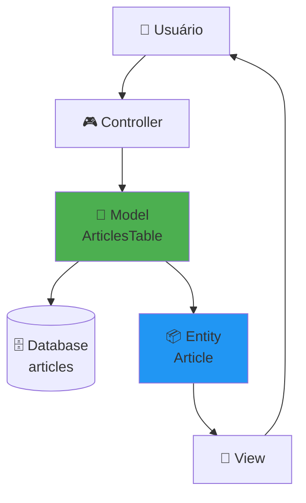

# Tutorial CMS - Criando Nosso Primeiro Model

!!! info "Parte 3 do Tutorial CMS"
    Esta é a terceira parte do [Tutorial CMS](../tutorials-and-examples.md). Certifique-se de ter completado:

    - ✅ [Parte 1: Instalação](cms-installation.md)
    - ✅ [Parte 2: Banco de Dados](cms-database.md)

---

## 📋 O Que Você Vai Aprender

Neste tutorial, você aprenderá:

- ✅ Entender arquitetura **Table + Entity** do CakePHP
- ✅ Criar classes Model manualment ou via Bake CLI
- ✅ Configurar **validações** completas
- ✅ Definir **relacionamentos** (associations)
- ✅ Proteger contra **mass assignment attacks**
- ✅ Usar **Behaviors** (Timestamp, Sluggable, etc.)
- ✅ Criar **Custom Finders** e **Virtual Fields**

---

## 🧠 Entendendo Models no CakePHP

### O Coração da Aplicação

Models são o **coração** das aplicações CakePHP. Eles fornecem:

- 📖 **Leitura de dados** (queries, find)
- ✍️ **Modificação de dados** (save, update, delete)
- 🔗 **Relacionamentos** (belongsTo, hasMany, belongsToMany)
- ✅ **Validação** (regras de negócio)
- 🛡️ **Application Rules** (constraints complexos)



---

## 🏗️ Arquitetura: Table + Entity

CakePHP usa **2 classes** para representar dados:

### 1. **Table** (Coleção de Registros)

- 📂 **Localização:** `src/Model/Table/ArticlesTable.php`
- 🎯 **Responsabilidade:** Acesso ao banco de dados (Repository pattern)
- 🔧 **Funções:**
  - Find queries (`find()`, `get()`)
  - Save/Delete (`save()`, `delete()`)
  - Validações (`validationDefault()`)
  - Relacionamentos (`belongsTo()`, `hasMany()`)
  - Behaviors (`addBehavior()`)

### 2. **Entity** (Registro Único)

- 📂 **Localização:** `src/Model/Entity/Article.php`
- 🎯 **Responsabilidade:** Lógica de negócio (Domain Model)
- 🔧 **Funções:**
  - Getters/Setters (`_getFullName()`, `_setPassword()`)
  - Mass assignment protection (`$_accessible`)
  - Virtual fields (`$_virtual`)
  - Hidden fields (`$_hidden`)

---

### Por Que 2 Classes?

!!! tip "Separação de Responsabilidades"

    **Table** = "Como acessar dados?"
    **Entity** = "O que fazer com os dados?"

**Comparação com outros frameworks:**

| Framework | Pattern | Classes | Vantagens | Desvantagens |
|-----------|---------|---------|-----------|--------------|
| **CakePHP** | Data Mapper | Table + Entity | Desacoplado, testável | Mais código |
| **Laravel** | Active Record | Model (1 classe) | Rápido, simples | Acoplado |
| **Symfony** | Data Mapper | Entity + Repository | Flexível | Complexo |
| **Django** | Active Record | Model (1 classe) | Pythônico | Acoplado |

**Vantagens do Data Mapper:**

- ✅ **Testabilidade:** Testar Entity sem acessar banco
- ✅ **Reusabilidade:** Usar Entity em diferentes contextos
- ✅ **Separação:** Lógica de negócio != Acesso a dados

---

## 📝 Criando ArticlesTable (Manual)

Crie o arquivo `src/Model/Table/ArticlesTable.php`:

```php
<?php
// src/Model/Table/ArticlesTable.php
declare(strict_types=1);

namespace App\Model\Table;

use Cake\ORM\Table;
use Cake\Validation\Validator;
use Cake\ORM\RulesChecker;

class ArticlesTable extends Table
{
    /**
     * Inicializa configurações do Model
     */
    public function initialize(array $config): void
    {
        parent::initialize($config);

        // Configurações opcionais (automáticas por convenção):
        $this->setTable('articles');           // Nome da tabela (opcional)
        $this->setDisplayField('title');       // Campo para exibição
        $this->setPrimaryKey('id');            // Chave primária (opcional)

        // Behaviors (funcionalidades prontas):
        $this->addBehavior('Timestamp');       // Auto-popula created/modified

        // Relacionamentos:
        $this->belongsTo('Users', [
            'foreignKey' => 'user_id',
            'joinType' => 'INNER',             // Artigo SEM autor é inválido
        ]);

        $this->belongsToMany('Tags', [
            'foreignKey' => 'article_id',
            'targetForeignKey' => 'tag_id',
            'joinTable' => 'articles_tags',
        ]);
    }

    /**
     * Regras de validação de campos
     */
    public function validationDefault(Validator $validator): Validator
    {
        $validator
            ->integer('id')
            ->allowEmptyString('id', null, 'create')

            ->integer('user_id')
            ->requirePresence('user_id', 'create')
            ->notEmptyString('user_id', 'Autor é obrigatório')

            ->scalar('title')
            ->maxLength('title', 255)
            ->requirePresence('title', 'create')
            ->notEmptyString('title', 'Título não pode ser vazio')
            ->minLength('title', 5, 'Título deve ter no mínimo 5 caracteres')

            ->scalar('slug')
            ->maxLength('slug', 191)
            ->requirePresence('slug', 'create')
            ->notEmptyString('slug', 'Slug obrigatório')
            ->alphaNumeric('slug', 'Slug deve conter apenas letras, números e hífens')

            ->scalar('body')
            ->allowEmptyString('body')

            ->boolean('published')
            ->allowEmptyString('published');

        return $validator;
    }

    /**
     * Regras de negócio (constraints complexos)
     */
    public function buildRules(RulesChecker $rules): RulesChecker
    {
        // Verificar se user_id existe na tabela users:
        $rules->add($rules->existsIn(['user_id'], 'Users'), [
            'errorField' => 'user_id',
            'message' => 'Usuário inválido'
        ]);

        // Slug deve ser único:
        $rules->add($rules->isUnique(['slug']), [
            'errorField' => 'slug',
            'message' => 'Este slug já está em uso'
        ]);

        return $rules;
    }

    /**
     * Custom Finder: Buscar apenas artigos publicados
     */
    public function findPublished($query, array $options)
    {
        return $query->where(['published' => true]);
    }
}
```

---

## 📦 Criando Article Entity (Manual)

Crie o arquivo `src/Model/Entity/Article.php`:

```php
<?php
// src/Model/Entity/Article.php
declare(strict_types=1);

namespace App\Model\Entity;

use Cake\ORM\Entity;

class Article extends Entity
{
    /**
     * Mass Assignment Protection
     * Define quais campos podem ser modificados via $this->request->getData()
     */
    protected array $_accessible = [
        'user_id' => true,
        'title' => true,
        'slug' => true,
        'body' => true,
        'published' => true,
        'created' => true,
        'modified' => true,
        'user' => true,        // Permite $article->user = $userEntity
        'tags' => true,        // Permite $article->tags = [$tag1, $tag2]
        // 'id' => false,      // BLOQUEADO (implícito) - protege PK
    ];

    /**
     * Campos ocultos em JSON/Arrays
     */
    protected array $_hidden = [
        // Exemplo: 'password' (se fosse Users entity)
    ];

    /**
     * Virtual Fields (calculados dinamicamente)
     */
    protected array $_virtual = [
        'excerpt',      // $article->excerpt
        'full_url',     // $article->full_url
    ];

    /**
     * Virtual Field: Extrato do artigo (primeiros 100 caracteres)
     */
    protected function _getExcerpt(): string
    {
        if (!$this->body) {
            return '';
        }

        $excerpt = substr(strip_tags($this->body), 0, 100);
        return strlen($this->body) > 100 ? $excerpt . '...' : $excerpt;
    }

    /**
     * Virtual Field: URL completa do artigo
     */
    protected function _getFullUrl(): string
    {
        return '/articles/view/' . $this->slug;
    }

    /**
     * Accessor: Formatar título (sempre capitalizado)
     */
    protected function _getTitle(?string $title): ?string
    {
        return $title ? ucfirst($title) : null;
    }
}
```

---

## 🔍 Entendendo Cada Conceito

### 1. Timestamp Behavior

!!! success "Auto-popula created e modified"

    **Configuração:**
    ```php
    $this->addBehavior('Timestamp');
    ```

    **Funcionamento:**
    ```php
    $article = $this->Articles->newEntity(['title' => 'Teste']);
    $this->Articles->save($article);

    // Automaticamente:
    echo $article->created;   // 2025-11-15 10:30:45
    echo $article->modified;  // 2025-11-15 10:30:45

    // Em update:
    $article->title = 'Novo título';
    $this->Articles->save($article);
    echo $article->modified;  // 2025-11-15 11:15:30 (atualizado!)
    ```

**Outros Behaviors úteis:**

| Behavior | O que faz | Quando usar |
|----------|-----------|-------------|
| **Timestamp** | Popula `created`/`modified` | ✅ Sempre |
| **CounterCache** | Cache de contadores | Performance (ex: `article_count` em Users) |
| **Translate** | Múltiplos idiomas | i18n |
| **Tree** | Hierarquias (parent/child) | Categorias, menus |

---

### 2. Relacionamentos (Associations)

#### belongsTo (N:1)

**"Artigo pertence a 1 Usuário"**

```php
$this->belongsTo('Users', [
    'foreignKey' => 'user_id',
    'joinType' => 'INNER',  // INNER = obrigatório, LEFT = opcional
]);
```

**Uso:**
```php
$article = $this->Articles->get(1, contain: ['Users']);
echo $article->user->email; // admin@example.com
```

---

#### belongsToMany (N:N)

**"Artigo tem várias Tags"**

```php
$this->belongsToMany('Tags', [
    'foreignKey' => 'article_id',
    'targetForeignKey' => 'tag_id',
    'joinTable' => 'articles_tags',
]);
```

**Uso:**
```php
$article = $this->Articles->get(1, contain: ['Tags']);
foreach ($article->tags as $tag) {
    echo $tag->title; // CakePHP, PHP, Tutorial
}
```

---

### 3. Validações

#### validationDefault() - Validação de Campos

**Valida formato, tamanho, presença:**

```php
$validator
    ->notEmptyString('title', 'Título obrigatório')
    ->minLength('title', 5, 'Mínimo 5 caracteres')
    ->maxLength('title', 255, 'Máximo 255 caracteres')

    ->email('email', false, 'E-mail inválido')

    ->url('website', 'URL inválida')

    ->integer('age')
    ->range('age', [18, 100], 'Idade deve estar entre 18 e 100')

    ->date('birthday', ['ymd'], 'Data inválida')

    ->boolean('published');
```

**Testando validações:**
```php
$article = $this->Articles->newEntity([
    'title' => 'ab',  // ❌ Muito curto (mínimo 5)
    'slug' => '',     // ❌ Vazio
]);

if ($article->hasErrors()) {
    print_r($article->getErrors());
    // [
    //   'title' => ['minLength' => 'Mínimo 5 caracteres'],
    //   'slug' => ['_empty' => 'Slug obrigatório']
    // ]
}
```

---

#### buildRules() - Regras de Negócio

**Valida relacionamentos e unicidade:**

```php
$rules
    ->add($rules->existsIn(['user_id'], 'Users'))  // user_id existe em users?
    ->add($rules->isUnique(['slug']))              // slug é único?
    ->add($rules->isUnique(['email']));            // email é único?
```

**Diferença entre Validator e Rules:**

| Validator | Rules |
|-----------|-------|
| Valida **formato** | Valida **lógica de negócio** |
| Rápido (sem DB) | Lento (query no DB) |
| Ex: email válido? | Ex: email já existe? |

---

### 4. Mass Assignment Protection

!!! danger "Segurança: Mass Assignment Attack"

**O que é o ataque?**

Usuário malicioso envia campos não esperados:

```php
// Controller VULNERÁVEL:
public function add()
{
    $article = $this->Articles->newEntity($this->request->getData());
    $this->Articles->save($article);
}
```

**Request malicioso:**
```json
POST /articles/add HTTP/1.1
Content-Type: application/json

{
  "title": "Meu Artigo",
  "user_id": 999,  // ← ATAQUE: Falsificar autor!
  "id": 1          // ← ATAQUE: Sobrescrever registro existente!
}
```

**Como `$_accessible` protege:**

```php
protected array $_accessible = [
    'title' => true,   // ✅ Permitido
    'slug' => true,    // ✅ Permitido
    'user_id' => true, // ⚠️ VULNERÁVEL se não validar sessão!
    // 'id' => false,  // ✅ BLOQUEADO (implícito)
];
```

**Melhor prática no Controller:**

```php
public function add()
{
    $article = $this->Articles->newEntity($this->request->getData());

    // ✅ FORÇAR user_id da sessão (ignora request):
    $article->user_id = $this->Authentication->getIdentity()->id;

    if ($this->Articles->save($article)) {
        $this->Flash->success('Artigo salvo!');
        return $this->redirect(['action' => 'index']);
    }
}
```

---

### 5. Convenções de Nomenclatura

!!! tip "Seguir convenções = menos código"

| Elemento | Convenção | Exemplo |
|----------|-----------|---------|
| **Tabela** | Plural, underscore | `articles`, `article_tags` |
| **Classe Table** | Singular, PascalCase + "Table" | `ArticleTable`, `ArticleTagTable` |
| **Classe Entity** | Singular, PascalCase | `Article`, `ArticleTag` |
| **Primary Key** | `id` | `articles.id` |
| **Foreign Key** | `{singular}_id` | `user_id`, `article_id` |
| **Junction Table** | Alfabética, underscore | `articles_tags` ❌ `tags_articles` |
| **Timestamps** | `created`, `modified` | Auto-populado |

**Quebrando convenções:**

```php
class ArticlesTable extends Table
{
    public function initialize(array $config): void
    {
        // Tabela customizada:
        $this->setTable('my_custom_articles');

        // Primary key customizada:
        $this->setPrimaryKey('article_id');

        // Display field customizado:
        $this->setDisplayField('custom_title');
    }
}
```

---

### 6. Custom Finders

!!! tip "Reutilizar queries complexos"

**Definição:**
```php
// src/Model/Table/ArticlesTable.php
public function findPublished($query, array $options)
{
    return $query
        ->where(['published' => true])
        ->orderDesc('created');
}

public function findByAuthor($query, array $options)
{
    return $query
        ->where(['user_id' => $options['user_id']])
        ->contain(['Users']);
}
```

**Uso:**
```php
// Controller:
$articles = $this->Articles->find('published');

$articles = $this->Articles->find('byAuthor', ['user_id' => 1]);
```

---

### 7. Virtual Fields

!!! tip "Campos calculados dinamicamente"

**Definição:**
```php
class Article extends Entity
{
    protected array $_virtual = ['excerpt', 'full_url'];

    protected function _getExcerpt(): string
    {
        return substr($this->body, 0, 100) . '...';
    }

    protected function _getFullUrl(): string
    {
        return '/articles/view/' . $this->slug;
    }
}
```

**Uso:**
```php
$article = $this->Articles->get(1);
echo $article->excerpt;   // "Lorem ipsum dolor sit..."
echo $article->full_url;  // "/articles/view/primeiro-artigo"
```

**Em JSON:**
```php
echo json_encode($article);
// {
//   "id": 1,
//   "title": "Primeiro Artigo",
//   "excerpt": "Lorem ipsum...",  ← Virtual field!
//   "full_url": "/articles/view/primeiro-artigo"  ← Virtual field!
// }
```

---

## 🚀 Usando Bake CLI (Geração Automática)

### Comando

```bash
bin/cake bake model Articles
```

### Output

```
Baking table class for Articles...

Creating file /app/src/Model/Table/ArticlesTable.php
Wrote `/app/src/Model/Table/ArticlesTable.php`

Baking entity class for Article...

Creating file /app/src/Model/Entity/Article.php
Wrote `/app/src/Model/Entity/Article.php`

Baking test case for App\Model\Table\ArticlesTable ...

Creating file /app/tests/TestCase/Model/Table/ArticlesTableTest.php
Wrote `/app/tests/TestCase/Model/Table/ArticlesTableTest.php`

Baking test fixture for Articles...

Creating file /app/tests/Fixture/ArticlesFixture.php
Wrote `/app/tests/Fixture/ArticlesFixture.php`
```

---

### Arquivos Gerados

| Arquivo | O que contém |
|---------|--------------|
| **ArticlesTable.php** | ✅ Validações detectadas<br/>✅ Relacionamentos detectados<br/>✅ Behaviors automáticos |
| **Article.php** | ✅ `$_accessible` gerado<br/>✅ Virtual fields sugeridos |
| **ArticlesTableTest.php** | ✅ Testes unitários base |
| **ArticlesFixture.php** | ✅ Dados de teste |

---

### Comparação: Manual vs Bake

| Recurso | Manual | Bake |
|---------|--------|------|
| **Validações** | ❌ Você escreve | ✅ Geradas automaticamente |
| **Relacionamentos** | ❌ Você escreve | ✅ Detectados via foreign keys |
| **Tests** | ❌ Você escreve | ✅ Gerados automaticamente |
| **Fixtures** | ❌ Você escreve | ✅ Gerados automaticamente |
| **Aprendizado** | ✅ Entende cada linha | ⚠️ Pode não entender |

---

### Quando Usar Cada Abordagem?

| Situação | Recomendação |
|----------|--------------|
| **Aprendendo CakePHP** | 📝 Manual (para entender) |
| **Protótipo rápido** | ⚡ Bake |
| **Schema segue convenções** | ⚡ Bake |
| **Schema legado** | 📝 Manual |
| **Lógica complexa** | 📝 Manual → Customizar Bake |
| **Produção** | ⚡ Bake → Revisar e customizar |

---

### Opções do Bake

```bash
# Gerar sem testes:
bin/cake bake model Articles --no-test

# Gerar sem fixtures:
bin/cake bake model Articles --no-fixture

# Usar outra conexão:
bin/cake bake model Articles --connection test

# Forçar sobrescrever:
bin/cake bake model Articles --force

# Theme customizado:
bin/cake bake model Articles --theme MyCustomTheme
```

---

## 🔍 Model Dinâmico (Fallback)

!!! info "CakePHP cria Model automaticamente"

Se você **não criar** `ArticlesTable.php`, CakePHP gera dinamicamente:

```php
// Sem ArticlesTable.php:
$articles = $this->Articles->find()->all();
// ✅ Funciona! Model gerado em runtime
```

**Mas SEM:**
- ❌ Validações
- ❌ Relacionamentos
- ❌ Behaviors customizados
- ❌ Custom finders

**Quando usar:**
- ✅ Protótipos rápidos
- ✅ Tabelas auxiliares simples
- ❌ **NUNCA em produção**

---

## ❓ Problemas Comuns

??? danger "Erro: `Class 'App\Model\Table\ArticlesTable' not found`"
    **Causa:** Nome do arquivo errado.

    **Verificar:**
    - ✅ Arquivo: `ArticlesTable.php` (não `articlestable.php`)
    - ✅ Classe: `class ArticlesTable extends Table`
    - ✅ Namespace: `namespace App\Model\Table;`

---

??? danger "Erro: `Unknown column 'Articles.articles_id'`"
    **Causa:** CakePHP não detectou primary key.

    **Solução:**
    ```php
    public function initialize(array $config): void
    {
        $this->setPrimaryKey('id');  // Forçar PK
    }
    ```

---

??? warning "Validações não funcionam"
    **Causa:** `validationDefault()` não está sendo chamado.

    **Verificar:**
    ```php
    // ✅ CORRETO:
    $article = $this->Articles->newEntity($data);

    // ❌ ERRADO (bypassa validações):
    $article = $this->Articles->newEmptyEntity();
    $article->title = $data['title'];
    ```

---

??? warning "Relacionamentos não carregam"
    **Causa:** Esqueceu `contain()`.

    **Solução:**
    ```php
    // ❌ ERRADO (não carrega user):
    $article = $this->Articles->get(1);
    echo $article->user->email; // ❌ Erro!

    // ✅ CORRETO:
    $article = $this->Articles->get(1, contain: ['Users']);
    echo $article->user->email; // ✅ admin@example.com
    ```

---

??? info "Como debugar SQL gerado?"
    **Método 1: DebugKit**
    ```php
    // Instalar DebugKit (já vem no skeleton):
    // Acessar http://localhost:8765
    // Aba "SQL Log" mostra todas as queries
    ```

    **Método 2: enableQueryLogging()**
    ```php
    $this->Articles->getConnection()->enableQueryLogging(true);

    $articles = $this->Articles->find('published')->all();

    $queries = $this->Articles->getConnection()->getLogger()->getLogs();
    debug($queries);
    ```

    **Método 3: sql() em query**
    ```php
    $query = $this->Articles->find('published');
    debug($query->sql());
    // SELECT * FROM articles WHERE published = :c0
    ```

---

## 🎓 Conceitos Avançados

??? abstract "Diferença entre newEntity() vs patchEntity()"

    **newEntity()** - Criar novo registro:
    ```php
    $article = $this->Articles->newEntity($data);
    $this->Articles->save($article);
    ```

    **patchEntity()** - Atualizar registro existente:
    ```php
    $article = $this->Articles->get(1);
    $this->Articles->patchEntity($article, $data);
    $this->Articles->save($article);
    ```

---

??? abstract "Dirty Fields (detectar mudanças)"

    ```php
    $article = $this->Articles->get(1);
    $article->title = 'Novo Título';

    // Verificar se mudou:
    if ($article->isDirty('title')) {
        echo 'Título foi modificado!';
    }

    // Ver campos modificados:
    $dirty = $article->getDirty();
    // ['title' => 'Novo Título']

    // Limpar dirty flag:
    $article->clean();
    ```

---

??? abstract "Callbacks e Events"

    **Callbacks na Table:**
    ```php
    class ArticlesTable extends Table
    {
        public function beforeSave($event, $entity, $options)
        {
            // Executado ANTES de salvar
            if (!$entity->slug) {
                $entity->slug = strtolower($entity->title);
            }
        }

        public function afterSave($event, $entity, $options)
        {
            // Executado DEPOIS de salvar
            $this->clearCache($entity->id);
        }
    }
    ```

    **Callbacks disponíveis:**
    - `beforeMarshal` - Antes de converter array → Entity
    - `beforeFind` - Antes de executar query
    - `beforeSave` - Antes de salvar
    - `afterSave` - Depois de salvar
    - `beforeDelete` - Antes de deletar
    - `afterDelete` - Depois de deletar

---

## 🚀 Próximos Passos

✅ **Model criado!** Agora você pode:

1. 🎮 **[Criar Controller](cms-articles-controller.md)** - Lógica de CRUD
2. 🎨 **[Criar Views](cms-articles-controller.md#templates)** - Interface HTML
3. 🔐 **[Adicionar Autenticação](cms-authentication.md)** - Login/Logout
4. 🛡️ **[Adicionar Autorização](cms-authorization.md)** - Controle de acesso

---

## 📚 Referências

- 📖 [CakePHP ORM](https://book.cakephp.org/5/en/orm.html)
- 🔧 [Table Objects](https://book.cakephp.org/5/en/orm/table-objects.html)
- 📦 [Entities](https://book.cakephp.org/5/en/orm/entities.html)
- ✅ [Validation](https://book.cakephp.org/5/en/orm/validation.html)
- 🔗 [Associations](https://book.cakephp.org/5/en/orm/associations.html)
- 🎯 [Behaviors](https://book.cakephp.org/5/en/orm/behaviors.html)
- ⚡ [Bake Console](https://book.cakephp.org/bake/2/en/usage.html)

---

**✨ Criado com [Claude Code](https://claude.com/claude-code)**
