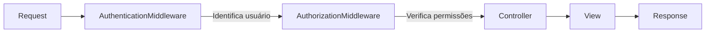
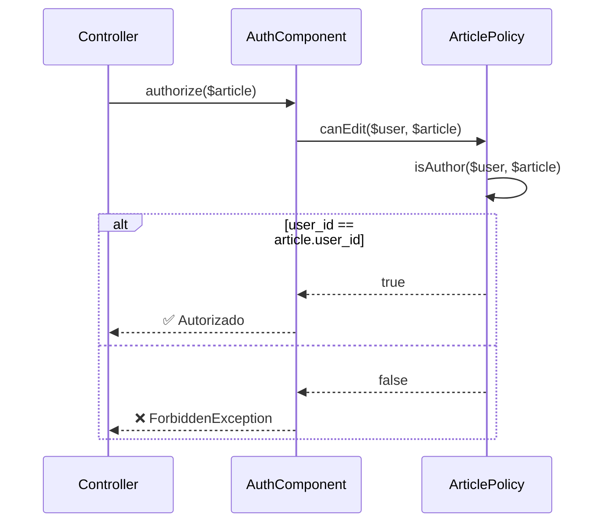

# Tutorial CMS - Autorização (Controle de Acesso)

!!! info "Parte 7 (FINAL) do Tutorial CMS"
    ✅ Pré-requisitos: [Authentication](cms-authentication.md) | [Tags & Users](cms-tags-and-users.md) | [Controller](cms-articles-controller.md)

---

## 📋 O Que Você Vai Aprender

- 🔐 **Instalar** cakephp/authorization plugin
- 🛡️ **Policies** (regras de acesso por recurso)
- 🚫 **Proteger** ações (usuários só editam seus próprios artigos)
- 🎨 **Esconder botões** Edit/Delete baseado em permissões
- 👤 **UserPolicy** (proteger edição de perfis)
- 🔒 **Mass Assignment** avançado (prevenir troca de user_id)
- 💬 **Mensagens customizadas** para erros 403

---

## 🔐 Instalando Authorization Plugin

```bash
cd /home/kromodoro/Documentos/cakephp/app
composer require "cakephp/authorization:^3.0"
```

**Output esperado:**
```
Using version ^3.0 for cakephp/authorization
./composer.json has been updated
Loading composer repositories with package information
Updating dependencies
Package operations: 1 install, 0 updates, 0 removals
  - Installing cakephp/authorization (3.0.0)
Writing lock file
Generating autoload files
```

**Carregar plugin:**

Edite `src/Application.php`:

```php
public function bootstrap(): void
{
    parent::bootstrap();

    // ← ADICIONAR plugin:
    $this->addPlugin('Authorization');
}
```

---

## ⚙️ Configurar Authorization Middleware

### Etapa 1: Imports em Application.php

Edite `src/Application.php`:

```php
<?php
namespace App;

use Authentication\AuthenticationService;
use Authentication\AuthenticationServiceInterface;
use Authentication\AuthenticationServiceProviderInterface;
use Authentication\Middleware\AuthenticationMiddleware;

// ← ADICIONAR novos imports:
use Authorization\AuthorizationService;
use Authorization\AuthorizationServiceInterface;
use Authorization\AuthorizationServiceProviderInterface;
use Authorization\Middleware\AuthorizationMiddleware;
use Authorization\Policy\OrmResolver;

use Cake\Http\BaseApplication;
use Cake\Http\MiddlewareQueue;
use Cake\Routing\Router;
use Psr\Http\Message\ServerRequestInterface;
```

---

### Etapa 2: Implementar Interface

```php
class Application extends BaseApplication
    implements AuthenticationServiceProviderInterface,
               AuthorizationServiceProviderInterface  // ← ADICIONAR
{
    // ...
}
```

---

### Etapa 3: Adicionar Middleware

**IMPORTANTE:** Authorization DEPOIS de Authentication!

```php
public function middleware(MiddlewareQueue $middlewareQueue): MiddlewareQueue
{
    $middlewareQueue
        ->add(new \Cake\Error\Middleware\ErrorHandlerMiddleware(null, $this->config))
        ->add(new \Cake\Http\Middleware\AssetMiddleware([
            'cacheTime' => '+1 year',
        ]))
        ->add(new \Cake\Routing\Middleware\RoutingMiddleware($this))
        ->add(new \Cake\Http\Middleware\BodyParserMiddleware())

        // 1º: Authentication
        ->add(new AuthenticationMiddleware($this))

        // 2º: Authorization (DEPOIS!)
        ->add(new AuthorizationMiddleware($this));

    return $middlewareQueue;
}
```

**Por quê essa ordem?**



---

### Etapa 4: Configurar Service

```php
public function getAuthorizationService(ServerRequestInterface $request): AuthorizationServiceInterface
{
    // OrmResolver mapeia Entities → Policies:
    // Article Entity → ArticlePolicy
    // User Entity → UserPolicy
    $resolver = new OrmResolver();

    return new AuthorizationService($resolver);
}
```

**Como funciona o OrmResolver:**

| Entity | Procura Policy em |
|--------|-------------------|
| `App\Model\Entity\Article` | `App\Policy\ArticlePolicy` |
| `App\Model\Entity\User` | `App\Policy\UserPolicy` |
| `App\Model\Entity\Tag` | `App\Policy\TagPolicy` |

---

## 🎛️ Carregar Authorization Component

Edite `src/Controller/AppController.php`:

```php
public function initialize(): void
{
    parent::initialize();

    $this->loadComponent('RequestHandler');
    $this->loadComponent('Flash');
    $this->loadComponent('Authentication.Authentication');

    // ← ADICIONAR Authorization Component:
    $this->loadComponent('Authorization.Authorization');
}
```

**O que esse Component faz:**

- `$this->Authorization->authorize($entity)` - Verifica permissão
- `$this->Authorization->skipAuthorization()` - Ignora verificação (páginas públicas)
- Lança exceção se esquecer de chamar um dos dois!

---

## 🚫 Proteger UsersController

Edite `src/Controller/UsersController.php`:

```php
public function beforeFilter(\Cake\Event\EventInterface $event): void
{
    parent::beforeFilter($event);

    // Login e registro não requerem autorização:
    $this->Authentication->addUnauthenticatedActions(['login', 'add']);
}

public function login()
{
    // ... código existente ...

    // ← ADICIONAR skip (página pública):
    $this->Authorization->skipAuthorization();
}

public function logout()
{
    $result = $this->Authentication->getResult();

    if ($result && $result->isValid()) {
        $this->Authentication->logout();

        // ← ADICIONAR skip:
        $this->Authorization->skipAuthorization();

        return $this->redirect(['controller' => 'Users', 'action' => 'login']);
    }
}

public function add()
{
    // ... código existente ...

    // ← ADICIONAR skip (registro é público):
    $this->Authorization->skipAuthorization();
}
```

---

## 🛡️ Criar ArticlePolicy

### Gerar com Bake

```bash
bin/cake bake policy --type entity Article
```

**Output:**
```
Baking policy class for Article...

Creating file src/Policy/ArticlePolicy.php
Wrote `src/Policy/ArticlePolicy.php`
Bake is detecting possible fixtures...

Bake is detecting possible tests...
```

---

### Implementar Regras

Edite `src/Policy/ArticlePolicy.php`:

```php
<?php
namespace App\Policy;

use App\Model\Entity\Article;
use Authorization\IdentityInterface;

class ArticlePolicy
{
    /**
     * Qualquer usuário logado pode criar artigos
     */
    public function canAdd(IdentityInterface $user, Article $article)
    {
        return true;
    }

    /**
     * Apenas o autor pode editar
     */
    public function canEdit(IdentityInterface $user, Article $article)
    {
        return $this->isAuthor($user, $article);
    }

    /**
     * Apenas o autor pode deletar
     */
    public function canDelete(IdentityInterface $user, Article $article)
    {
        return $this->isAuthor($user, $article);
    }

    /**
     * Verifica se user é o autor do artigo
     */
    protected function isAuthor(IdentityInterface $user, Article $article)
    {
        return $article->user_id === $user->getIdentifier();
    }
}
```

**Como funciona:**



---

## 🔒 Aplicar Authorization no ArticlesController

Edite `src/Controller/ArticlesController.php`:

### add() - Criar artigo

```php
public function add()
{
    $article = $this->Articles->newEmptyEntity();

    // ✅ ADICIONAR verificação:
    $this->Authorization->authorize($article);

    if ($this->request->is('post')) {
        $article = $this->Articles->patchEntity($article, $this->request->getData());

        // Forçar user_id da sessão:
        $article->user_id = $this->request->getAttribute('identity')->getIdentifier();

        if ($this->Articles->save($article)) {
            $this->Flash->success(__('Artigo salvo com sucesso!'));
            return $this->redirect(['action' => 'index']);
        }
        $this->Flash->error(__('Não foi possível salvar o artigo.'));
    }

    $tags = $this->Articles->Tags->find('list')->all();
    $this->set(compact('article', 'tags'));
}
```

---

### edit() - Editar artigo

```php
public function edit($slug)
{
    $article = $this->Articles
        ->findBySlug($slug)
        ->contain('Tags')
        ->firstOrFail();

    // ✅ ADICIONAR verificação (DEPOIS de carregar!):
    $this->Authorization->authorize($article);

    if ($this->request->is(['post', 'put'])) {
        $this->Articles->patchEntity($article, $this->request->getData(), [
            // ✅ Prevenir mudança de user_id:
            'accessibleFields' => ['user_id' => false]
        ]);

        if ($this->Articles->save($article)) {
            $this->Flash->success(__('Artigo atualizado com sucesso!'));
            return $this->redirect(['action' => 'index']);
        }
        $this->Flash->error(__('Não foi possível atualizar o artigo.'));
    }

    $tags = $this->Articles->Tags->find('list')->all();
    $this->set(compact('article', 'tags'));
}
```

**IMPORTANTE:** `accessibleFields => ['user_id' => false]`

Isso previne o seguinte ataque:

```bash
# Atacante tenta mudar autor do artigo via POST:
curl -X POST http://localhost:8765/articles/edit/meu-artigo \
  -d "user_id=999" \
  -d "title=Artigo Hackeado"

# ❌ SEM accessibleFields: user_id muda para 999!
# ✅ COM accessibleFields: user_id ignorado!
```

---

### delete() - Deletar artigo

```php
public function delete($slug)
{
    $this->request->allowMethod(['post', 'delete']);

    $article = $this->Articles->findBySlug($slug)->firstOrFail();

    // ✅ ADICIONAR verificação:
    $this->Authorization->authorize($article);

    if ($this->Articles->delete($article)) {
        $this->Flash->success(__('Artigo deletado com sucesso!'));
    } else {
        $this->Flash->error(__('Não foi possível deletar o artigo.'));
    }

    return $this->redirect(['action' => 'index']);
}
```

---

### Páginas públicas (index, view, tags)

```php
public function index()
{
    // Página pública - qualquer um pode ver:
    $this->Authorization->skipAuthorization();

    // ... resto do código ...
}

public function view($slug = null)
{
    // Página pública - qualquer um pode ver:
    $this->Authorization->skipAuthorization();

    // ... resto do código ...
}

public function tags(...$tags)
{
    // Página pública - qualquer um pode ver:
    $this->Authorization->skipAuthorization();

    // ... resto do código ...
}
```

---

## 🎨 Atualizar Templates (CRÍTICO!)

### Problema: Botões para Todos

**Situação atual:**

```php
<!-- templates/Articles/index.php -->
<?php foreach ($articles as $article): ?>
    <article>
        <h3><?= $this->Html->link($article->title, ['action' => 'view', $article->slug]) ?></h3>
        <p><?= h($article->body) ?></p>

        <!-- ❌ PROBLEMA: Botões aparecem para TODOS -->
        <?= $this->Html->link('Editar', ['action' => 'edit', $article->slug]) ?>
        <?= $this->Form->postLink('Deletar', ['action' => 'delete', $article->slug]) ?>
    </article>
<?php endforeach; ?>
```

**Resultado:** Usuários veem botões que retornam erro 403!

---

### Solução 1: Verificação Manual

Edite `templates/Articles/index.php`:

```php
<!-- templates/Articles/index.php -->
<?php
$identity = $this->request->getAttribute('identity');
?>

<?php foreach ($articles as $article): ?>
    <article>
        <h4>
            <?= $this->Html->link($article->title, ['action' => 'view', $article->slug]) ?>
        </h4>

        <p><?= h($article->body) ?></p>

        <p class="meta">
            Por: <?= h($article->user->email) ?>
            em <?= $article->created->format('d/m/Y H:i') ?>
        </p>

        <?php
        // ✅ Mostrar botões SOMENTE se for o autor:
        if ($identity && $article->user_id === $identity->getIdentifier()):
        ?>
            <div class="actions">
                <?= $this->Html->link(
                    'Editar',
                    ['action' => 'edit', $article->slug],
                    ['class' => 'button']
                ) ?>

                <?= $this->Form->postLink(
                    'Deletar',
                    ['action' => 'delete', $article->slug],
                    [
                        'confirm' => 'Tem certeza que deseja deletar este artigo?',
                        'class' => 'button button-danger'
                    ]
                ) ?>
            </div>
        <?php endif; ?>
    </article>
<?php endforeach; ?>
```

---

### Solução 2: AuthorizationHelper (RECOMENDADO)

**Configurar Helper:**

Edite `src/View/AppView.php`:

```php
<?php
namespace App\View;

use Cake\View\View;

class AppView extends View
{
    public function initialize(): void
    {
        // ← ADICIONAR Authorization Helper:
        $this->loadHelper('Authorization.Authorization');
    }
}
```

**Usar no Template:**

```php
<!-- templates/Articles/index.php -->
<?php foreach ($articles as $article): ?>
    <article>
        <h4>
            <?= $this->Html->link($article->title, ['action' => 'view', $article->slug]) ?>
        </h4>

        <p><?= h($article->body) ?></p>

        <!-- ✅ Usar can() helper: -->
        <?php if ($this->Authorization->can($article, 'edit')): ?>
            <?= $this->Html->link('Editar', ['action' => 'edit', $article->slug]) ?>
        <?php endif; ?>

        <?php if ($this->Authorization->can($article, 'delete')): ?>
            <?= $this->Form->postLink(
                'Deletar',
                ['action' => 'delete', $article->slug],
                ['confirm' => 'Tem certeza?']
            ) ?>
        <?php endif; ?>
    </article>
<?php endforeach; ?>
```

**Vantagens:**

- ✅ Reutiliza lógica da Policy (DRY)
- ✅ Mais legível
- ✅ Atualiza automaticamente se Policy mudar

---

### Atualizar view.php

Edite `templates/Articles/view.php`:

```php
<!-- File: templates/Articles/view.php -->

<h2><?= h($article->title) ?></h2>

<p><?= h($article->body) ?></p>

<div class="meta">
    <p><strong>Autor:</strong> <?= h($article->user->email) ?></p>
    <p><strong>Criado em:</strong> <?= $article->created->format('d/m/Y H:i') ?></p>

    <?php if (!empty($article->tags)): ?>
        <p>
            <strong>Tags:</strong>
            <?php foreach ($article->tags as $tag): ?>
                <?= $this->Html->link(
                    $tag->title,
                    ['controller' => 'Articles', 'action' => 'tags', $tag->title]
                ) ?>
            <?php endforeach; ?>
        </p>
    <?php endif; ?>
</div>

<!-- ✅ Botões condicionais: -->
<div class="actions">
    <?= $this->Html->link('← Voltar', ['action' => 'index'], ['class' => 'button']) ?>

    <?php if ($this->Authorization->can($article, 'edit')): ?>
        <?= $this->Html->link('Editar', ['action' => 'edit', $article->slug], ['class' => 'button']) ?>
    <?php endif; ?>

    <?php if ($this->Authorization->can($article, 'delete')): ?>
        <?= $this->Form->postLink(
            'Deletar',
            ['action' => 'delete', $article->slug],
            [
                'confirm' => 'Tem certeza que deseja deletar este artigo?',
                'class' => 'button button-danger'
            ]
        ) ?>
    <?php endif; ?>
</div>
```

---

### Remover user_id de edit.php

Edite `templates/Articles/edit.php`:

**ANTES (gerado por Bake):**
```php
<?= $this->Form->create($article) ?>
<fieldset>
    <legend><?= __('Edit Article') ?></legend>
    <?= $this->Form->control('title') ?>
    <?= $this->Form->control('body', ['type' => 'textarea']) ?>

    <!-- ❌ REMOVER ESTA LINHA: -->
    <?= $this->Form->control('user_id', ['options' => $users]) ?>

    <?= $this->Form->control('tags._ids', ['options' => $tags]) ?>
    <?= $this->Form->control('published', ['type' => 'checkbox']) ?>
</fieldset>
<?= $this->Form->button(__('Save Article')) ?>
<?= $this->Form->end() ?>
```

**DEPOIS (correto):**
```php
<?= $this->Form->create($article) ?>
<fieldset>
    <legend><?= __('Editar Artigo') ?></legend>

    <!-- Mostrar autor como READ-ONLY: -->
    <p><strong>Autor:</strong> <?= h($article->user->email) ?></p>

    <?= $this->Form->control('title', ['label' => 'Título']) ?>
    <?= $this->Form->control('body', [
        'type' => 'textarea',
        'label' => 'Conteúdo',
        'rows' => 10
    ]) ?>

    <?= $this->Form->control('tags._ids', [
        'options' => $tags,
        'label' => 'Tags'
    ]) ?>

    <?= $this->Form->control('published', [
        'type' => 'checkbox',
        'label' => 'Publicado'
    ]) ?>
</fieldset>

<?= $this->Form->button(__('Salvar Alterações'), ['class' => 'button']) ?>
<?= $this->Form->end() ?>
```

---

## 👤 Criar UserPolicy (IMPORTANTE!)

### Problema: /users/edit/{id} Vulnerável

**Teste:**

```bash
# Usuário A (ID=1) logado
# Tenta editar perfil do Usuário B (ID=2):
curl http://localhost:8765/users/edit/2

# ❌ Retorna 200 OK (DEVERIA SER 403!)
```

---

### Solução: Criar UserPolicy

```bash
bin/cake bake policy --type entity User
```

Edite `src/Policy/UserPolicy.php`:

```php
<?php
namespace App\Policy;

use App\Model\Entity\User;
use Authorization\IdentityInterface;

class UserPolicy
{
    /**
     * Apenas o próprio usuário pode editar seu perfil
     */
    public function canEdit(IdentityInterface $user, User $resource)
    {
        return $user->getIdentifier() === $resource->id;
    }

    /**
     * Usuários não podem deletar a si mesmos
     */
    public function canDelete(IdentityInterface $user, User $resource)
    {
        return $user->getIdentifier() !== $resource->id;
    }

    /**
     * Perfis são públicos
     */
    public function canView(IdentityInterface $user, User $resource)
    {
        return true;
    }

    /**
     * Registro é público
     */
    public function canAdd(IdentityInterface $user, User $resource)
    {
        return true;
    }
}
```

---

### Aplicar no UsersController

Edite `src/Controller/UsersController.php`:

```php
public function edit($id = null)
{
    $user = $this->Users->get($id);

    // ✅ ADICIONAR verificação:
    $this->Authorization->authorize($user);

    if ($this->request->is(['patch', 'post', 'put'])) {
        $user = $this->Users->patchEntity($user, $this->request->getData(), [
            // Prevenir mudança de email:
            'accessibleFields' => ['email' => false]
        ]);

        if ($this->Users->save($user)) {
            $this->Flash->success(__('Perfil atualizado com sucesso!'));
            return $this->redirect(['action' => 'view', $id]);
        }
        $this->Flash->error(__('Não foi possível atualizar o perfil.'));
    }

    $this->set(compact('user'));
}

public function delete($id = null)
{
    $this->request->allowMethod(['post', 'delete']);
    $user = $this->Users->get($id);

    // ✅ ADICIONAR verificação:
    $this->Authorization->authorize($user);

    if ($this->Users->delete($user)) {
        $this->Flash->success(__('Usuário deletado com sucesso.'));
    } else {
        $this->Flash->error(__('Não foi possível deletar o usuário.'));
    }

    return $this->redirect(['action' => 'index']);
}
```

---

## 💬 Mensagens Customizadas (MELHOR UX)

### Problema: Erros 403 Genéricos

**Mensagem atual:**
```
You are not authorized to access that location.
```

---

### Solução: Result com Mensagem

Edite `src/Policy/ArticlePolicy.php`:

```php
<?php
namespace App\Policy;

use App\Model\Entity\Article;
use Authorization\IdentityInterface;
use Authorization\Policy\Result;

class ArticlePolicy
{
    public function canEdit(IdentityInterface $user, Article $article)
    {
        if ($article->user_id !== $user->getIdentifier()) {
            return new Result(
                false,
                'Você só pode editar seus próprios artigos.'
            );
        }
        return new Result(true);
    }

    public function canDelete(IdentityInterface $user, Article $article)
    {
        if ($article->user_id !== $user->getIdentifier()) {
            return new Result(
                false,
                'Você só pode deletar seus próprios artigos.'
            );
        }
        return new Result(true);
    }

    // ... resto do código ...
}
```

---

### Capturar Mensagem no Controller

Edite `src/Controller/ArticlesController.php`:

```php
public function edit($slug)
{
    $article = $this->Articles
        ->findBySlug($slug)
        ->contain('Tags')
        ->firstOrFail();

    try {
        $this->Authorization->authorize($article);
    } catch (\Authorization\Exception\ForbiddenException $e) {
        // Mostrar mensagem customizada:
        $this->Flash->error($e->getMessage());
        return $this->redirect(['action' => 'index']);
    }

    // ... resto do código ...
}
```

---

## ✅ Testando Autorização

### Teste 1: Usuário Editando Próprio Artigo

1. Login: `admin@example.com` / `senha123`
2. Acesse: [http://localhost:8765/articles](http://localhost:8765/articles)
3. Clique em "Editar" no seu artigo
4. **Resultado:** ✅ Formulário de edição

---

### Teste 2: Usuário Tentando Editar Artigo de Outro

1. Login: `user1@example.com` / `senha123`
2. Acesse: [http://localhost:8765/articles/edit/artigo-do-admin](http://localhost:8765/articles/edit/artigo-do-admin)
3. **Resultado:** ❌ "Você só pode editar seus próprios artigos." + redirect

---

### Teste 3: Botões Condicionais

1. Logout
2. Login: `admin@example.com`
3. Acesse: [http://localhost:8765/articles](http://localhost:8765/articles)
4. **Resultado:**
   - ✅ Botões Edit/Delete nos artigos do admin
   - ❌ Sem botões nos artigos de outros usuários

---

### Teste 4: Mass Assignment Protection

```bash
# Tentar mudar user_id via POST:
curl -X POST http://localhost:8765/articles/edit/meu-artigo \
  -H "Cookie: CAKEPHP=..." \
  -d "user_id=999" \
  -d "title=Artigo Hackeado"

# Verificar no banco:
mysql> SELECT id, user_id, title FROM articles WHERE slug='meu-artigo';
+----+---------+----------------------+
| id | user_id | title                |
+----+---------+----------------------+
|  1 |       1 | Meu Artigo Original  |  ← user_id NÃO mudou!
+----+---------+----------------------+
```

---

## ❓ Problemas Comuns

??? danger "Erro: Authorization was checked twice"
    **Causa:** Chamou `authorize()` e `skipAuthorization()` na mesma action.

    **Solução:** Use APENAS um dos dois por action.

    ```php
    // ❌ ERRADO:
    public function index()
    {
        $this->Authorization->skipAuthorization();
        $this->Authorization->authorize($article);  // ← Duplicado!
    }

    // ✅ CORRETO:
    public function index()
    {
        $this->Authorization->skipAuthorization();  // ← Apenas skip
    }
    ```

---

??? danger "Erro: AuthorizationRequiredException"
    **Causa:** Esqueceu de chamar `authorize()` OU `skipAuthorization()`.

    **Solução:** Toda action DEVE chamar um dos dois:

    ```php
    public function myAction()
    {
        // Opção 1: Verificar permissão
        $this->Authorization->authorize($entity);

        // Opção 2: Ignorar (páginas públicas)
        $this->Authorization->skipAuthorization();

        // ❌ NÃO fazer NADA = erro!
    }
    ```

---

??? danger "Erro: Call to a member function authorize() on null"
    **Causa:** Esqueceu de carregar `Authorization.Authorization` Component.

    **Solução:** Adicionar em `AppController::initialize()`:

    ```php
    $this->loadComponent('Authorization.Authorization');
    ```

---

??? warning "Botões Edit/Delete aparecem para todos"
    **Causa:** Template não usa verificação condicional.

    **Solução:** Usar `Authorization` helper:

    ```php
    <?php if ($this->Authorization->can($article, 'edit')): ?>
        <?= $this->Html->link('Editar', ['action' => 'edit', $article->slug]) ?>
    <?php endif; ?>
    ```

---

??? warning "user_id muda ao editar artigo"
    **Causa:** Faltou `accessibleFields => ['user_id' => false]`.

    **Solução:** Adicionar em `edit()`:

    ```php
    $this->Articles->patchEntity($article, $this->request->getData(), [
        'accessibleFields' => ['user_id' => false]
    ]);
    ```

---

## 🎓 Conceitos Avançados

??? abstract "Authentication vs Authorization"
    | Conceito | O que é? | Pergunta |
    |----------|----------|----------|
    | **Authentication** | Identificação do usuário | Quem é você? |
    | **Authorization** | Permissões de acesso | O que você pode fazer? |

    **Exemplo:**
    ```
    Authentication: "Você é admin@example.com" ← getIdentity()
    Authorization: "Você pode editar este artigo?" ← authorize($article)
    ```

---

??? abstract "Policy vs Component vs Helper"
    | Classe | Onde? | Para quê? |
    |--------|-------|-----------|
    | **ArticlePolicy** | Model Layer | Lógica de negócio (canEdit) |
    | **AuthorizationComponent** | Controller | Verificar permissões (authorize) |
    | **AuthorizationHelper** | View | Esconder botões (can) |

    **Fluxo:**
    ```
    Template → can() → Component → Policy → true/false
    ```

---

??? abstract "OrmResolver vs MapResolver vs ArrayResolver"
    | Resolver | Uso |
    |----------|-----|
    | **OrmResolver** | Entities (Article, User) |
    | **MapResolver** | Custom resources (arquivos, APIs) |
    | **ArrayResolver** | Recursos simples (strings, arrays) |

    **Exemplo MapResolver:**
    ```php
    $resolver = new MapResolver();
    $resolver->map('file', FilePolicy::class);
    ```

---

??? abstract "Scope em Policies"
    **Problema:** Mostrar SOMENTE artigos editáveis em index().

    **Solução:**
    ```php
    // ArticlePolicy.php
    public function scopeIndex(IdentityInterface $user, Query $query)
    {
        // Filtrar apenas artigos do usuário:
        return $query->where(['Articles.user_id' => $user->getIdentifier()]);
    }

    // ArticlesController.php
    public function index()
    {
        $query = $this->Articles->find();
        $query = $this->Authorization->applyScope($query);  // ← Aplica filtro

        $articles = $this->paginate($query);
        $this->set(compact('articles'));
    }
    ```

---

## 🎉 Parabéns! Tutorial CMS Completo!

Você construiu um CMS completo com:

- ✅ **Database** (migrations + seeds)
- ✅ **Models** (validations + associations)
- ✅ **Controllers** (CRUD + pagination)
- ✅ **Views** (templates + helpers)
- ✅ **Bake** (code generation)
- ✅ **Tags** (N:N relationships)
- ✅ **Users** (bcrypt passwords)
- ✅ **Authentication** (login/logout)
- ✅ **Authorization** (policies + access control)

---

## 🚀 Próximos Passos

### Funcionalidades Avançadas

1. **Upload de Imagens**
   - [File Uploads](https://book.cakephp.org/5/en/core-libraries/form.html#file-uploads)
   - Plugin: [josegonzalez/cakephp-upload](https://github.com/josegonzalez/cakephp-upload)

2. **Comentários**
   - Model `Comments` (belongsTo Articles)
   - AJAX para adicionar comentários
   - Moderation system

3. **Admin Panel**
   - [CakeDC/Users](https://github.com/CakeDC/users) - Gerenciamento de usuários
   - [FriendsOfCake/crud](https://github.com/FriendsOfCake/crud) - CRUD genérico

4. **API REST**
   - [API Development](https://book.cakephp.org/5/en/development/rest.html)
   - JSON responses
   - Token authentication

5. **Internacionalização**
   - [I18n](https://book.cakephp.org/5/en/core-libraries/internationalization-and-localization.html)
   - Múltiplos idiomas
   - Traduções

---

### Aprofundar Conhecimento

1. **ORM Avançado**
   - [Complex Queries](https://book.cakephp.org/5/en/orm/query-builder.html)
   - [Behaviors Customizados](https://book.cakephp.org/5/en/orm/behaviors.html)
   - [Events & Callbacks](https://book.cakephp.org/5/en/orm/table-objects.html#events)

2. **Testing**
   - [Testing Guide](https://book.cakephp.org/5/en/development/testing.html)
   - Unit tests
   - Integration tests

3. **Performance**
   - [Caching](https://book.cakephp.org/5/en/core-libraries/caching.html)
   - [Query Optimization](https://book.cakephp.org/5/en/orm/retrieving-data-and-resultsets.html)
   - Profiling

4. **Segurança**
   - [Security Best Practices](https://book.cakephp.org/5/en/security.html)
   - CSRF, XSS, SQL Injection
   - Rate limiting

---

## 📚 Referências

- 🔐 [Authorization Plugin](https://book.cakephp.org/authorization/3/)
- 🛡️ [Policies](https://book.cakephp.org/authorization/3/en/policies.html)
- 🎨 [Authorization Helper](https://book.cakephp.org/authorization/3/en/view-helper.html)
- 🔒 [Security](https://book.cakephp.org/5/en/security.html)

---

**✨ Criado com [Claude Code](https://claude.com/claude-code)**
