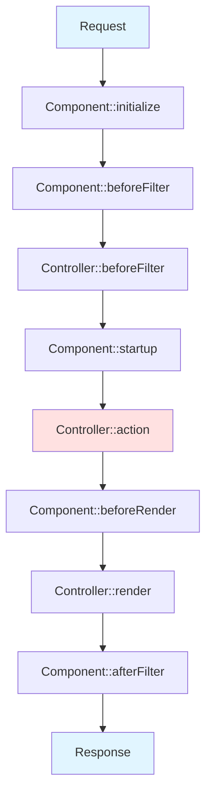

# Components (Componentes Reutilizáveis)

!!! info "Lógica Compartilhada entre Controllers"
    Components são pacotes de lógica que podem ser compartilhados entre múltiplos controllers no CakePHP 5. Eles promovem reutilização de código, mantêm controllers limpos e facilitam a manutenção de funcionalidades comuns.

---

## 📋 Conteúdo

- **Conceito** - O que são e quando usar
- **Built-in Components** - Components nativos do CakePHP
- **Usando Components** - Como carregar e configurar
- **Criando Components** - Desenvolver seus próprios components
- **Callbacks** - Ciclo de vida da requisição
- **Dependency Injection** - Injetar dependências
- **Configuração** - Configurar components em runtime

---

## 🎯 O que são Components?

Components são classes que encapsulam funcionalidades reutilizáveis entre controllers. São úteis para:

- ✅ **Reutilização de código** - Compartilhar lógica entre múltiplos controllers
- ✅ **Separação de responsabilidades** - Manter controllers enxutos
- ✅ **Manutenibilidade** - Centralizar funcionalidades comuns
- ✅ **Testabilidade** - Testar lógica isoladamente

**Exemplos de uso:**
- Autenticação e autorização
- Envio de emails
- Logging customizado
- Integração com APIs externas
- Processamento de uploads
- Geração de PDFs/relatórios

---

## 🧰 Built-in Components

O CakePHP 5 inclui components prontos para uso:

### 1. FlashComponent

Exibe mensagens temporárias ao usuário:

```php
// Mensagens de sucesso
$this->Flash->success('Registro salvo com sucesso!');

// Mensagens de erro
$this->Flash->error('Erro ao salvar o registro.');

// Mensagens de aviso
$this->Flash->warning('Esta ação não pode ser desfeita.');

// Mensagens informativas
$this->Flash->info('Dados atualizados.');

// Mensagem customizada
$this->Flash->set('Mensagem personalizada', [
    'element' => 'custom',
    'params' => ['class' => 'alert-custom']
]);
```

### 2. FormProtectionComponent

Protege contra CSRF e tampering de formulários:

```php
public function initialize(): void
{
    parent::initialize();

    $this->loadComponent('FormProtection', [
        // Actions sem proteção CSRF
        'unlockedActions' => ['index', 'view'],

        // Validar apenas POST
        'validatePost' => true,
    ]);
}
```

### 3. CheckHttpCacheComponent

Implementa cache HTTP com ETags:

```php
public function initialize(): void
{
    parent::initialize();
    $this->loadComponent('CheckHttpCache');
}

public function view($id)
{
    $article = $this->Articles->get($id);

    // Define quando o conteúdo foi modificado
    $this->response = $this->response->withModified($article->modified);

    $this->set(compact('article'));
}
```

---

## 🔧 Usando Components

### Carregar no `initialize()`

```php
<?php
namespace App\Controller;

use App\Controller\AppController;

class ArticlesController extends AppController
{
    public function initialize(): void
    {
        parent::initialize();

        // Carregar component sem configuração
        $this->loadComponent('Flash');

        // Carregar com configuração
        $this->loadComponent('FormProtection', [
            'unlockedActions' => ['index', 'search'],
        ]);

        // Carregar component de plugin
        $this->loadComponent('PluginName.ComponentName');

        // Carregar component customizado
        $this->loadComponent('Math');
    }
}
```

### Carregar em Runtime (durante action)

```php
public function special()
{
    // Carregar component apenas nesta action
    $this->loadComponent('Pdf');

    $pdf = $this->Pdf->generate($data);

    return $this->response->withType('pdf')
        ->withStringBody($pdf);
}
```

!!! warning "Atenção: Callbacks Perdidos"
    Components carregados em runtime NÃO executarão callbacks já ocorridos (como `beforeFilter` e `startup`).

### Usar Propriedade `$components`

```php
class ArticlesController extends AppController
{
    // Alternativa ao loadComponent()
    protected array $components = [
        'Flash',
        'FormProtection' => [
            'unlockedActions' => ['index']
        ]
    ];
}
```

---

## 🛠️ Criando Components Customizados

### Component Simples

```php
<?php
// src/Controller/Component/MathComponent.php
namespace App\Controller\Component;

use Cake\Controller\Component;

class MathComponent extends Component
{
    public function add(int $a, int $b): int
    {
        return $a + $b;
    }

    public function subtract(int $a, int $b): int
    {
        return $a - $b;
    }

    public function multiply(int $a, int $b): int
    {
        return $a * $b;
    }

    public function divide(int $a, int $b): float
    {
        if ($b === 0) {
            throw new \InvalidArgumentException('Divisão por zero.');
        }
        return $a / $b;
    }
}
```

**Usar:**
```php
public function calculate()
{
    $this->loadComponent('Math');

    $sum = $this->Math->add(10, 5);        // 15
    $diff = $this->Math->subtract(10, 5);  // 5
    $prod = $this->Math->multiply(10, 5);  // 50
    $quot = $this->Math->divide(10, 5);    // 2.0

    $this->set(compact('sum', 'diff', 'prod', 'quot'));
}
```

### Component com Configuração

```php
<?php
// src/Controller/Component/LoggerComponent.php
namespace App\Controller\Component;

use Cake\Controller\Component;
use Cake\Log\Log;

class LoggerComponent extends Component
{
    // Configuração padrão
    protected array $_defaultConfig = [
        'logLevel' => 'info',
        'scope' => 'app',
        'prefix' => '',
    ];

    public function log(string $message): void
    {
        $config = $this->getConfig();

        $fullMessage = $config['prefix'] . $message;

        Log::write(
            $config['logLevel'],
            $fullMessage,
            [$config['scope']]
        );
    }
}
```

**Usar com configuração:**
```php
$this->loadComponent('Logger', [
    'logLevel' => 'debug',
    'prefix' => '[CUSTOM] ',
    'scope' => 'custom-logs',
]);

$this->Logger->log('Operação realizada');
// Grava: "[CUSTOM] Operação realizada" no scope "custom-logs"
```

### Component com Dependency Injection

```php
<?php
// src/Controller/Component/EmailNotifierComponent.php
namespace App\Controller\Component;

use Cake\Controller\Component;
use Cake\Mailer\Mailer;

class EmailNotifierComponent extends Component
{
    protected Mailer $mailer;

    public function __construct($collection, array $config = [])
    {
        parent::__construct($collection, $config);

        // Injetar dependência
        $this->mailer = new Mailer('default');
    }

    public function notifyAdmin(string $subject, string $message): void
    {
        $this->mailer
            ->setTo('admin@example.com')
            ->setSubject($subject)
            ->deliver($message);
    }

    public function notifyUser(string $email, string $subject, string $message): void
    {
        $this->mailer
            ->setTo($email)
            ->setSubject($subject)
            ->deliver($message);
    }
}
```

---

## ♻️ Callbacks - Ciclo de Vida da Requisição

Components podem implementar callbacks que são executados em pontos específicos:

```php
<?php
namespace App\Controller\Component;

use Cake\Controller\Component;
use Cake\Event\EventInterface;

class MonitorComponent extends Component
{
    /**
     * Executado após Controller::initialize()
     * ANTES de Controller::beforeFilter()
     */
    public function initialize(array $config): void
    {
        parent::initialize($config);
        // Configuração inicial do component
    }

    /**
     * Executado ANTES de Controller::beforeFilter()
     */
    public function beforeFilter(EventInterface $event): void
    {
        // Lógica antes do filtro do controller
    }

    /**
     * Executado APÓS Controller::beforeFilter()
     * ANTES da action do controller
     */
    public function startup(EventInterface $event): void
    {
        $controller = $this->getController();
        $action = $controller->getRequest()->getParam('action');

        // Log de acesso
        \Cake\Log\Log::info("Action executada: {$action}");
    }

    /**
     * Executado APÓS a action
     * ANTES de renderizar a view
     */
    public function beforeRender(EventInterface $event): void
    {
        // Adicionar variáveis à view
        $controller = $this->getController();
        $controller->set('timestamp', time());
    }

    /**
     * Executado durante shutdown
     * ANTES de enviar resposta ao navegador
     */
    public function afterFilter(EventInterface $event): void
    {
        // Cleanup final
    }

    /**
     * Executado quando controller chama redirect()
     * Permite interceptar ou modificar o redirect
     */
    public function beforeRedirect(EventInterface $event, string $url): void
    {
        // Registrar redirects
        \Cake\Log\Log::debug("Redirect para: {$url}");
    }
}
```

### Ordem de Execução dos Callbacks



---

## 🔀 Redirecionando em Components

### Método 1: Via Controller

```php
public function startup(EventInterface $event): void
{
    $controller = $this->getController();
    $request = $controller->getRequest();

    // Verificar condição
    if (!$request->getSession()->read('Auth.User')) {
        // Redirecionar
        $event->setResult($controller->redirect(['controller' => 'Users', 'action' => 'login']));
        $event->stopPropagation();
    }
}
```

### Método 2: RedirectException (Recomendado)

```php
use Cake\Http\Exception\RedirectException;
use Cake\Routing\Router;

public function startup(EventInterface $event): void
{
    $controller = $this->getController();

    if (!$controller->getRequest()->getSession()->read('Auth.User')) {
        throw new RedirectException(
            Router::url(['controller' => 'Users', 'action' => 'login']),
            302
        );
    }
}
```

---

## 🎯 Exemplo Completo: AuditComponent

```php
<?php
// src/Controller/Component/AuditComponent.php
namespace App\Controller\Component;

use Cake\Controller\Component;
use Cake\Event\EventInterface;
use Cake\ORM\Locator\LocatorAwareTrait;

/**
 * Component para auditar ações dos usuários
 */
class AuditComponent extends Component
{
    use LocatorAwareTrait;

    protected array $_defaultConfig = [
        'enabled' => true,
        'logTable' => 'AuditLogs',
    ];

    /**
     * Registrar acesso após action executar
     */
    public function startup(EventInterface $event): void
    {
        if (!$this->getConfig('enabled')) {
            return;
        }

        $controller = $this->getController();
        $request = $controller->getRequest();

        $data = [
            'user_id' => $request->getSession()->read('Auth.User.id'),
            'controller' => $request->getParam('controller'),
            'action' => $request->getParam('action'),
            'ip_address' => $request->clientIp(),
            'url' => $request->getRequestTarget(),
            'method' => $request->getMethod(),
            'created' => new \DateTime(),
        ];

        $table = $this->fetchTable($this->getConfig('logTable'));
        $log = $table->newEntity($data);
        $table->save($log);
    }
}
```

**Usar no Controller:**
```php
class ArticlesController extends AppController
{
    public function initialize(): void
    {
        parent::initialize();

        $this->loadComponent('Audit', [
            'enabled' => true,
            'logTable' => 'AuditLogs',
        ]);
    }
}
```

---

## 🔧 Acessar Controller de dentro do Component

```php
public function myMethod()
{
    // Obter referência ao controller
    $controller = $this->getController();

    // Acessar request
    $request = $controller->getRequest();
    $userId = $request->getSession()->read('Auth.User.id');

    // Acessar response
    $response = $controller->getResponse();

    // Acessar models
    $articles = $controller->Articles->find('all');

    // Definir variáveis para view
    $controller->set('myVar', 'value');

    // Redirecionar
    return $controller->redirect(['action' => 'index']);
}
```

---

## ⚙️ Configuração Dinâmica

### Ler Configuração

```php
// Ler configuração específica
$level = $this->getConfig('logLevel');

// Ler toda configuração
$allConfig = $this->getConfig();

// Ler com valor padrão
$prefix = $this->getConfig('prefix', '[DEFAULT]');
```

### Definir Configuração

```php
// Definir uma chave
$this->setConfig('logLevel', 'debug');

// Definir múltiplas chaves
$this->setConfig([
    'logLevel' => 'debug',
    'scope' => 'custom',
]);

// Mesclar com configuração existente
$this->setConfig('nested.key', 'value', false);
```

---

## 🚀 Quick Start

**1. Criar component:**
```php
// src/Controller/Component/MyComponent.php
namespace App\Controller\Component;
use Cake\Controller\Component;

class MyComponent extends Component
{
    public function myMethod() {
        return 'Hello from component!';
    }
}
```

**2. Carregar no controller:**
```php
$this->loadComponent('My');
```

**3. Usar:**
```php
$result = $this->My->myMethod();
```

---

## 📚 Referências

- [Components - CakePHP Book](https://book.cakephp.org/5/en/controllers/components.html)
- [Component API](https://api.cakephp.org/5.0/class-Cake.Controller.Component.html)
- [Flash Component](https://book.cakephp.org/5/en/controllers/components/flash.html)
- [Form Protection Component](https://book.cakephp.org/5/en/controllers/components/form-protection.html)

---

**✨ Expandido com [Claude Code](https://claude.com/claude-code)**
