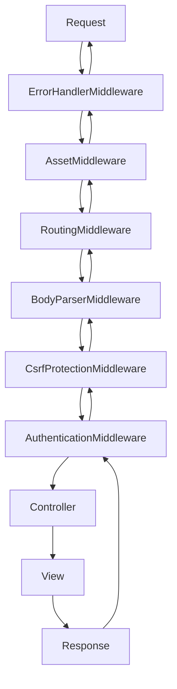
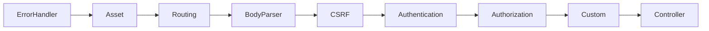

# Middleware (Camadas de Processamento)

!!! info "PSR-7 e PSR-15"
    Middleware no CakePHP segue os padrões **PSR-7** (HTTP Messages) e **PSR-15** (HTTP Handlers).

---

## 📋 O Que Você Vai Aprender

- 🧅 **Conceito de Middleware** - Camadas de "cebola"
- 📦 **Built-in Middleware** - Middleware prontos do CakePHP
- 🔧 **Aplicar Middleware** - Global, routing scope, controller
- 🛠️ **Criar Middleware** - Customizados
- 🔐 **Middleware de Segurança** - CSRF, HTTPS, CSP
- ⚙️ **Ordem de Execução** - Como organizar middleware stack

---

## 🧅 O Que É Middleware?

Middleware são **camadas reutilizáveis** que processam requisições/respostas antes de chegarem ao controller.



**Analogia:** Middleware = camadas de uma cebola 🧅

---

## 📦 Built-in Middleware

| Middleware | O que faz |
|------------|-----------|
| `ErrorHandlerMiddleware` | Captura exceções e renderiza páginas de erro |
| `AssetMiddleware` | Serve arquivos estáticos (CSS, JS, imagens) |
| `RoutingMiddleware` | Converte URL em controller/action |
| `BodyParserMiddleware` | Decodifica JSON/XML no body |
| `CsrfProtectionMiddleware` | Proteção CSRF (double-submit cookie) |
| `SessionCsrfProtectionMiddleware` | Proteção CSRF (session-based) |
| `HttpsEnforcerMiddleware` | Força HTTPS |
| `SecurityHeadersMiddleware` | Adiciona headers de segurança |
| `CspMiddleware` | Content-Security-Policy |
| `EncryptedCookieMiddleware` | Cookies criptografados |
| `LocaleSelectorMiddleware` | Detecta idioma via Accept-Language |

---

## 🔧 Aplicando Middleware

### 1. Global (Application.php)

```php
<?php
// src/Application.php
namespace App;

use Cake\Error\Middleware\ErrorHandlerMiddleware;
use Cake\Http\BaseApplication;
use Cake\Http\MiddlewareQueue;
use Cake\Http\Middleware\BodyParserMiddleware;
use Cake\Routing\Middleware\AssetMiddleware;
use Cake\Routing\Middleware\RoutingMiddleware;

class Application extends BaseApplication
{
    public function middleware(MiddlewareQueue $middlewareQueue): MiddlewareQueue
    {
        $middlewareQueue
            // 1. ErrorHandler (SEMPRE PRIMEIRO!)
            ->add(new ErrorHandlerMiddleware(null, $this->config))

            // 2. Assets (CSS/JS/Images)
            ->add(new AssetMiddleware(['cacheTime' => '+1 year']))

            // 3. Routing (URL → Controller)
            ->add(new RoutingMiddleware($this))

            // 4. BodyParser (JSON/XML)
            ->add(new BodyParserMiddleware())

            // 5. CSRF Protection
            ->add(new \Cake\Http\Middleware\CsrfProtectionMiddleware([
                'httponly' => true,
            ]))

            // 6. Custom Middleware
            ->add(new \App\Middleware\TrackingCookieMiddleware());

        return $middlewareQueue;
    }
}
```

---

### 2. Ordem de Middleware (IMPORTANTE!)



**Regras:**
1. `ErrorHandler` **SEMPRE primeiro** (captura erros de outros middleware)
2. `Asset` antes de `Routing` (evita processar assets como rotas)
3. `Routing` antes de `BodyParser` (precisa saber a rota para decodificar)
4. `Authentication` antes de `Authorization` (precisa saber quem é antes de verificar permissões)

---

### 3. Manipulando a Fila

```php
$middlewareQueue
    // Adicionar no final:
    ->add($middleware)

    // Adicionar no início:
    ->prepend($middleware)

    // Inserir em posição específica:
    ->insertAt(2, $middleware)

    // Inserir ANTES de outro:
    ->insertBefore('Cake\Error\Middleware\ErrorHandlerMiddleware', $middleware)

    // Inserir DEPOIS de outro:
    ->insertAfter('Cake\Routing\Middleware\RoutingMiddleware', $middleware);
```

---

### 4. Middleware em Plugins

```php
<?php
// plugins/ContactManager/src/Plugin.php
namespace ContactManager;

use Cake\Core\BasePlugin;
use Cake\Http\MiddlewareQueue;

class Plugin extends BasePlugin
{
    public function middleware(MiddlewareQueue $middlewareQueue): MiddlewareQueue
    {
        $middlewareQueue->add(new \ContactManager\Middleware\ContactManagerContextMiddleware());
        return $middlewareQueue;
    }
}
```

---

## 🛠️ Criando Middleware Customizado

### Estrutura

```
src/Middleware/
├── TrackingCookieMiddleware.php
├── RateLimitMiddleware.php
└── LoggingMiddleware.php
```

**Convenções:**
- Localização: `src/Middleware/`
- Sufixo: `Middleware`
- Interface: `Psr\Http\Server\MiddlewareInterface`

---

### Exemplo 1: Tracking Cookie

```php
<?php
// src/Middleware/TrackingCookieMiddleware.php
namespace App\Middleware;

use Cake\Http\Cookie\Cookie;
use Cake\I18n\DateTime;
use Psr\Http\Message\ResponseInterface;
use Psr\Http\Message\ServerRequestInterface;
use Psr\Http\Server\MiddlewareInterface;
use Psr\Http\Server\RequestHandlerInterface;

class TrackingCookieMiddleware implements MiddlewareInterface
{
    public function process(
        ServerRequestInterface $request,
        RequestHandlerInterface $handler
    ): ResponseInterface
    {
        // Chamar próximo middleware na fila:
        $response = $handler->handle($request);

        // Se não tem cookie de landing page, criar:
        if (!$request->getCookie('landing_page')) {
            $response = $response->withCookie(new Cookie(
                'landing_page',
                $request->getRequestTarget(),
                new DateTime('+ 1 year')
            ));
        }

        return $response;
    }
}
```

**Como funciona:**
1. Chama `$handler->handle($request)` (próximo middleware)
2. Modifica a resposta (adiciona cookie)
3. Retorna resposta modificada

---

### Exemplo 2: Rate Limiting

```php
<?php
// src/Middleware/RateLimitMiddleware.php
namespace App\Middleware;

use Cake\Cache\Cache;
use Cake\Http\Response;
use Psr\Http\Message\ResponseInterface;
use Psr\Http\Message\ServerRequestInterface;
use Psr\Http\Server\MiddlewareInterface;
use Psr\Http\Server\RequestHandlerInterface;

class RateLimitMiddleware implements MiddlewareInterface
{
    public function process(
        ServerRequestInterface $request,
        RequestHandlerInterface $handler
    ): ResponseInterface
    {
        $ip = $request->clientIp();
        $key = "rate_limit_{$ip}";

        // Contar requisições:
        $count = Cache::read($key, 'default') ?: 0;
        $count++;

        if ($count > 100) {
            // Limite excedido - retornar 429 SEM chamar $handler:
            $response = new Response();
            $response = $response->withStatus(429);
            $response = $response->withStringBody('Too Many Requests');
            return $response;
        }

        // Atualizar contador:
        Cache::write($key, $count, 'default');

        // Continuar processamento:
        return $handler->handle($request);
    }
}
```

**Diferença:**
- ✅ Tracking: sempre chama `$handler->handle()`
- ❌ Rate Limit: pode retornar resposta SEM chamar próximo middleware

---

### Exemplo 3: Logging

```php
<?php
// src/Middleware/LoggingMiddleware.php
namespace App\Middleware;

use Cake\Log\Log;
use Psr\Http\Message\ResponseInterface;
use Psr\Http\Message\ServerRequestInterface;
use Psr\Http\Server\MiddlewareInterface;
use Psr\Http\Server\RequestHandlerInterface;

class LoggingMiddleware implements MiddlewareInterface
{
    public function process(
        ServerRequestInterface $request,
        RequestHandlerInterface $handler
    ): ResponseInterface
    {
        $start = microtime(true);

        // Processar requisição:
        $response = $handler->handle($request);

        // Calcular tempo:
        $duration = microtime(true) - $start;

        // Log:
        Log::write('info', sprintf(
            '%s %s - %d - %.2fms',
            $request->getMethod(),
            $request->getRequestTarget(),
            $response->getStatusCode(),
            $duration * 1000
        ));

        return $response;
    }
}
```

**Output:**
```
GET /articles/view/1 - 200 - 45.23ms
POST /articles/add - 302 - 123.45ms
```

---

## 🔐 Middleware de Segurança

### HTTPS Enforcer

```php
use Cake\Http\Middleware\HttpsEnforcerMiddleware;

$middlewareQueue->add(new HttpsEnforcerMiddleware([
    'redirect' => true,      // Redirecionar HTTP → HTTPS
    'statusCode' => 301,     // Permanent redirect
]));
```

---

### CSRF Protection

```php
use Cake\Http\Middleware\CsrfProtectionMiddleware;

$middlewareQueue->add(new CsrfProtectionMiddleware([
    'httponly' => true,
    'secure' => true,        // Apenas HTTPS
]));
```

---

### Security Headers

```php
use Cake\Http\Middleware\SecurityHeadersMiddleware;

$security = new SecurityHeadersMiddleware();
$security
    ->setCrossDomainPolicy()
    ->setReferrerPolicy()
    ->setXFrameOptions()
    ->setXssProtection()
    ->noOpen()
    ->noSniff();

$middlewareQueue->add($security);
```

**Headers adicionados:**
```
X-Frame-Options: SAMEORIGIN
X-Content-Type-Options: nosniff
X-XSS-Protection: 1; mode=block
Referrer-Policy: same-origin
```

---

### Content Security Policy

```php
use Cake\Http\Middleware\CspMiddleware;

$csp = new CspMiddleware();
$csp
    ->addDirective('default-src', ['self'])
    ->addDirective('script-src', ['self', 'https://cdn.example.com'])
    ->addDirective('style-src', ['self', 'unsafe-inline'])
    ->addDirective('img-src', ['*'])
    ->addDirective('font-src', ['self', 'data:']);

$middlewareQueue->add($csp);
```

---

## 🔧 Middleware Especializados

### Encrypted Cookies

```php
use Cake\Http\Middleware\EncryptedCookieMiddleware;

$cookies = new EncryptedCookieMiddleware(
    ['secrets', 'protected'],  // Cookies para criptografar
    Configure::read('Security.cookieKey')
);

$middlewareQueue->add($cookies);
```

---

### Body Parser (JSON/XML)

```php
use Cake\Http\Middleware\BodyParserMiddleware;

// Apenas JSON (padrão):
$middlewareQueue->add(new BodyParserMiddleware());

// JSON + XML:
$middlewareQueue->add(new BodyParserMiddleware(['xml' => true]));

// Custom parser (CSV):
$bodies = new BodyParserMiddleware();
$bodies->addParser(['text/csv'], function ($body, $request) {
    return str_getcsv($body);
});
$middlewareQueue->add($bodies);
```

---

### Locale Selector

```php
use Cake\I18n\Middleware\LocaleSelectorMiddleware;

$middlewareQueue->add(new LocaleSelectorMiddleware([
    'locales' => ['pt_BR', 'en_US', 'es_ES'],
    'default' => 'pt_BR',
]));
```

**Detecta idioma via:**
1. Query string (`?lang=pt_BR`)
2. Cookie
3. Header `Accept-Language`

---

## 🧪 Testando Middleware

```php
<?php
namespace App\Test\TestCase\Middleware;

use App\Middleware\TrackingCookieMiddleware;
use Cake\Http\Response;
use Cake\Http\ServerRequest;
use Cake\TestSuite\TestCase;
use Laminas\Diactoros\Response as DiactorosResponse;
use Psr\Http\Server\RequestHandlerInterface;

class TrackingCookieMiddlewareTest extends TestCase
{
    public function testSetsLandingPageCookie()
    {
        $request = new ServerRequest([
            'url' => '/articles/view/1',
        ]);

        $handler = $this->createMock(RequestHandlerInterface::class);
        $handler->method('handle')
            ->willReturn(new DiactorosResponse());

        $middleware = new TrackingCookieMiddleware();
        $response = $middleware->process($request, $handler);

        // Verificar cookie:
        $this->assertTrue($response->hasHeader('Set-Cookie'));
        $cookies = $response->getHeader('Set-Cookie');
        $this->assertStringContainsString('landing_page', $cookies[0]);
    }

    public function testDoesNotOverwriteExistingCookie()
    {
        $request = (new ServerRequest([
            'url' => '/articles/view/2',
        ]))->withCookieParams(['landing_page' => '/home']);

        $handler = $this->createMock(RequestHandlerInterface::class);
        $handler->method('handle')
            ->willReturn(new DiactorosResponse());

        $middleware = new TrackingCookieMiddleware();
        $response = $middleware->process($request, $handler);

        // Cookie NÃO deve ser setado novamente:
        $this->assertFalse($response->hasHeader('Set-Cookie'));
    }
}
```

---

## ❓ Problemas Comuns

??? danger "Erro: Cannot modify cookies after headers sent"
    **Causa:** Middleware tentando modificar cookies DEPOIS de response enviado.

    **Solução:** Garantir que middleware está ANTES do controller na fila.

---

??? danger "Erro: Class not found"
    **Causa:** Namespace incorreto ou arquivo em local errado.

    **Solução:**
    ```
    src/Middleware/MyMiddleware.php
    namespace App\Middleware;  // ← Verificar namespace!
    ```

---

??? warning "Middleware não executando"
    **Causa:** Esqueceu de adicionar à fila.

    **Solução:**
    ```php
    // src/Application.php
    $middlewareQueue->add(new MyMiddleware());  // ← Adicionar!
    ```

---

## 📚 Referências

- 📖 [Middleware - CakePHP Book](https://book.cakephp.org/5/en/controllers/middleware.html)
- 🔐 [Security Middleware](https://book.cakephp.org/5/en/security.html)
- 🌐 [PSR-7: HTTP Messages](https://www.php-fig.org/psr/psr-7/)
- 🌐 [PSR-15: HTTP Handlers](https://www.php-fig.org/psr/psr-15/)

---

**✨ Criado com [Claude Code](https://claude.com/claude-code)**
