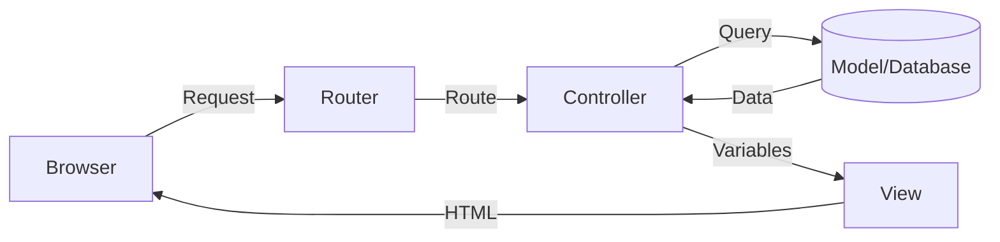
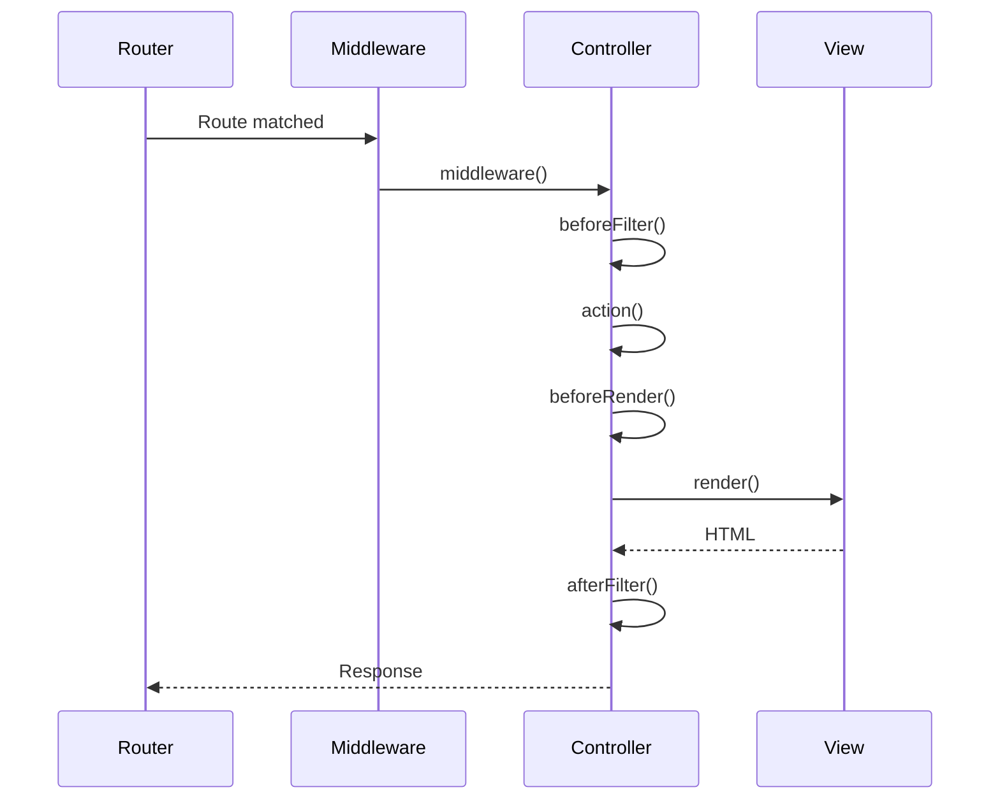

# Controllers (Controladores)

!!! info "Camada 'C' do MVC"
    Controllers são responsáveis por **interpretar requisições**, **chamar Models** e **renderizar Views**.

---

## 📋 O Que Você Vai Aprender

- 🎮 **Controllers** - Camada de controle do MVC
- 🏛️ **AppController** - Controlador base
- ⚡ **Actions** - Métodos que respondem requisições
- 📊 **set() e compact()** - Passar dados para Views
- 🎨 **viewBuilder() e render()** - Customizar renderização
- 🔄 **Redirects** - Navegação entre páginas
- 📡 **Content-Type Negotiation** - APIs (JSON/XML)
- 🔁 **Lifecycle Callbacks** - beforeFilter, beforeRender, afterFilter
- 🧩 **Components** - Funcionalidades reutilizáveis
- 📄 **Pagination** - Listagens paginadas

---

## 🎓 O Que São Controllers?

Controllers são a **camada intermediária** entre Models (dados) e Views (apresentação).



### Princípios Importantes

!!! quote "Keep Controllers Thin, Models Fat"
    **Controllers Thin (Magros):**
    - Apenas lógica de requisição/resposta
    - Validação de entrada
    - Chamadas aos Models
    - Preparação de dados para Views

    **Models Fat (Gordos):**
    - Lógica de negócio
    - Validações complexas
    - Cálculos
    - Relacionamentos

---

## 📂 Convenções de Nomenclatura

| Model | Controller | URL |
|-------|------------|-----|
| `Article` | `ArticlesController` | `/articles` |
| `User` | `UsersController` | `/users` |
| `BlogPost` | `BlogPostsController` | `/blog-posts` |

**Regras:**
- Controllers em **plural**
- Arquivo: `src/Controller/{Nome}Controller.php`
- Classe: `{Nome}Controller extends AppController`

---

## 🏛️ AppController - Controlador Base

Todos os controllers herdam de `AppController`, que herda de `Cake\Controller\Controller`.

**Localização:** `src/Controller/AppController.php`

```php
<?php
namespace App\Controller;

use Cake\Controller\Controller;

class AppController extends Controller
{
    public function initialize(): void
    {
        parent::initialize();

        // Components usados em TODOS os controllers:
        $this->loadComponent('Flash');
        $this->loadComponent('FormProtection');
    }

    public function beforeFilter(\Cake\Event\EventInterface $event): void
    {
        parent::beforeFilter($event);

        // Código executado ANTES de todas as actions
        // Ex: verificar permissões globais
    }
}
```

**Quando usar AppController:**
- Carregar components/helpers globais
- Configurar comportamento padrão
- Aplicar lógica comum a todos os controllers

---

## ⚡ Actions (Ações)

**Actions** são métodos públicos do controller que respondem a requisições.

### Exemplo Básico

```php
<?php
// src/Controller/ArticlesController.php
namespace App\Controller;

class ArticlesController extends AppController
{
    // Action: /articles/view/1
    public function view($id)
    {
        $article = $this->Articles->get($id);
        $this->set(compact('article'));
        // Renderiza automaticamente: templates/Articles/view.php
    }

    // Action: /articles/search?q=cakephp
    public function search()
    {
        $query = $this->request->getQuery('q');
        $articles = $this->Articles
            ->find('all')
            ->where(['title LIKE' => "%{$query}%"])
            ->all();

        $this->set(compact('articles', 'query'));
        // Renderiza: templates/Articles/search.php
    }
}
```

---

## 📊 Passando Dados para Views

### Método 1: set() - Individual

```php
public function index()
{
    $articles = $this->Articles->find('all')->all();
    $this->set('articles', $articles);
    $this->set('title', 'Lista de Artigos');
}
```

### Método 2: set() - Array Associativo

```php
public function index()
{
    $articles = $this->Articles->find('all')->all();
    $this->set([
        'articles' => $articles,
        'title' => 'Lista de Artigos',
        'count' => $articles->count(),
    ]);
}
```

### Método 3: compact() - **RECOMENDADO** ✅

```php
public function index()
{
    $articles = $this->Articles->find('all')->all();
    $title = 'Lista de Artigos';
    $count = $articles->count();

    // Cria automaticamente:
    // 'articles' => $articles
    // 'title' => $title
    // 'count' => $count
    $this->set(compact('articles', 'title', 'count'));
}
```

**Vantagens do compact():**
- ✅ Menos código
- ✅ Variáveis têm mesmo nome no controller e view
- ✅ Padrão mais comum no CakePHP

---

## 🎨 Customizando Renderização

### viewBuilder() - Configurar View

```php
public function admin()
{
    $this->viewBuilder()
        ->setLayout('admin')           // Layout diferente
        ->setTheme('AdminLTE')         // Tema customizado
        ->addHelper('Chart')           // Helper adicional
        ->setClassName('Admin.Dashboard');  // View class customizada
}
```

### render() - Renderizar Template Específico

**Automático (padrão):**
```php
public function search()
{
    // Renderiza automaticamente: templates/Articles/search.php
}
```

**Manual:**
```php
public function search()
{
    if ($this->request->is('ajax')) {
        return $this->render('search_ajax');  // templates/Articles/search_ajax.php
    }
    // Padrão: templates/Articles/search.php
}
```

**Renderizar template de outro controller:**
```php
public function special()
{
    return $this->render('Posts/custom');  // templates/Posts/custom.php
}
```

**Renderizar element:**
```php
public function ajaxLoad()
{
    return $this->render('/element/product_list');
}
```

---

## 🔄 Redirects (Redirecionamentos)

### Sintaxe 1: Routing Array (RECOMENDADO)

```php
public function add()
{
    // ... salvar artigo ...

    $this->Flash->success('Artigo salvo!');

    return $this->redirect([
        'controller' => 'Articles',
        'action' => 'view',
        $article->id
    ]);
    // Redireciona para: /articles/view/123
}
```

### Sintaxe 2: URL Relativo

```php
return $this->redirect('/articles/index');
```

### Sintaxe 3: Referer (Voltar)

```php
return $this->redirect($this->referer());
// Volta para a página anterior
```

### Sintaxe 4: Query String e Fragment

```php
return $this->redirect([
    'controller' => 'Products',
    'action' => 'search',
    '?' => [
        'category' => 'electronics',
        'price_max' => 1000
    ],
    '#' => 'results'
]);
// /products/search?category=electronics&price_max=1000#results
```

### Status Codes de Redirect

```php
// 302 (default - temporary)
return $this->redirect('/new-url');

// 301 (permanent - SEO)
return $this->redirect('/new-url', 301);

// 303 (see other - after POST)
return $this->redirect('/new-url', 303);

// 307 (temporary - preserva método HTTP)
return $this->redirect('/new-url', 307);
```

**Quando usar cada um:**

| Code | Uso |
|------|-----|
| 301 | URL mudou permanentemente (SEO) |
| 302 | Redirect temporário (padrão) |
| 303 | Após POST (PRG pattern) |
| 307 | Preservar método HTTP original |

---

## 📄 Pagination (Paginação)

### Controller

```php
public function index()
{
    // Opção 1: Paginação simples
    $articles = $this->paginate($this->Articles);
    $this->set(compact('articles'));
}
```

```php
public function index()
{
    // Opção 2: Com query customizada
    $query = $this->Articles
        ->find('all')
        ->contain(['Users', 'Tags'])
        ->where(['published' => true]);

    $articles = $this->paginate($query);
    $this->set(compact('articles'));
}
```

```php
// Opção 3: Configuração no controller
class ArticlesController extends AppController
{
    protected array $paginate = [
        'limit' => 20,
        'order' => ['Articles.created' => 'DESC'],
        'contain' => ['Users'],
    ];

    public function index()
    {
        $articles = $this->paginate($this->Articles);
        $this->set(compact('articles'));
    }
}
```

### Template

```php
<!-- templates/Articles/index.php -->

<?php foreach ($articles as $article): ?>
    <article>
        <h3><?= h($article->title) ?></h3>
        <p><?= h($article->body) ?></p>
    </article>
<?php endforeach; ?>

<!-- Controles de paginação: -->
<div class="paginator">
    <ul class="pagination">
        <?= $this->Paginator->first('<< ' . __('primeira')) ?>
        <?= $this->Paginator->prev('< ' . __('anterior')) ?>
        <?= $this->Paginator->numbers() ?>
        <?= $this->Paginator->next(__('próxima') . ' >') ?>
        <?= $this->Paginator->last(__('última') . ' >>') ?>
    </ul>

    <p><?= $this->Paginator->counter('Página {{page}} de {{pages}}, mostrando {{current}} de {{count}} artigos') ?></p>
</div>
```

---

## 📡 APIs e Content-Type Negotiation

### JSON API

```php
<?php
namespace App\Controller;

use Cake\View\JsonView;

class ArticlesController extends AppController
{
    public function initialize(): void
    {
        parent::initialize();

        // Habilitar JSON para todas as actions:
        $this->addViewClasses([JsonView::class]);
    }

    public function index()
    {
        $articles = $this->Articles->find('all')->all();

        // Especificar o que serializar:
        $this->set('articles', $articles);
        $this->viewBuilder()->setOption('serialize', 'articles');
    }
}
```

**Requisição:**
```bash
GET /articles/index.json
# ou com Accept header:
curl -H "Accept: application/json" http://localhost/articles
```

**Resposta:**
```json
{
  "articles": [
    {"id": 1, "title": "Artigo 1", "body": "..."},
    {"id": 2, "title": "Artigo 2", "body": "..."}
  ]
}
```

### XML API

```php
use Cake\View\XmlView;

$this->addViewClasses([XmlView::class]);
```

```bash
GET /articles/index.xml
```

### API com Múltiplos Formatos

```php
public function initialize(): void
{
    parent::initialize();
    $this->addViewClasses([JsonView::class, XmlView::class]);
}

public function export()
{
    $articles = $this->Articles->find('all')->all();
    $this->set('articles', $articles);
    $this->viewBuilder()->setOption('serialize', 'articles');

    // Funciona para .json OU .xml dependendo da extensão!
}
```

### AJAX Requests

```php
public function load()
{
    if ($this->request->is('ajax')) {
        $this->viewBuilder()->setClassName('Ajax');
        // Usa layout 'ajax' (minimal)
    }

    $products = $this->Products->find('all')->all();
    $this->set(compact('products'));
}
```

---

## 🔁 Lifecycle Callbacks (Ciclo de Vida)



### beforeFilter() - Antes da Action

```php
public function beforeFilter(\Cake\Event\EventInterface $event): void
{
    parent::beforeFilter($event);

    // ✅ Uso comum: Verificar autenticação
    if (!$this->Authentication->getResult()->isValid()) {
        return $this->redirect(['controller' => 'Users', 'action' => 'login']);
    }
}
```

### beforeRender() - Antes de Renderizar

```php
public function beforeRender(\Cake\Event\EventInterface $event): void
{
    parent::beforeRender($event);

    // ✅ Uso comum: Setar variáveis globais
    $this->set('currentUser', $this->Authentication->getIdentity());
    $this->set('menu', $this->_buildMenu());
}
```

### afterFilter() - Após Tudo

```php
public function afterFilter(\Cake\Event\EventInterface $event): void
{
    parent::afterFilter($event);

    // ✅ Uso comum: Logging
    Log::write('debug', sprintf(
        'Action %s::%s completed',
        $this->request->getParam('controller'),
        $this->request->getParam('action')
    ));
}
```

---

## 🧩 Components (Componentes)

Components são **funcionalidades reutilizáveis** entre controllers.

### Components Built-in

```php
public function initialize(): void
{
    parent::initialize();

    // Flash messages
    $this->loadComponent('Flash');

    // CSRF protection
    $this->loadComponent('FormProtection');

    // Pagination
    $this->loadComponent('Paginator');

    // Authentication
    $this->loadComponent('Authentication.Authentication');

    // Authorization
    $this->loadComponent('Authorization.Authorization');
}
```

### Usando Components

```php
public function delete($id)
{
    $this->request->allowMethod(['post', 'delete']);
    $article = $this->Articles->get($id);

    if ($this->Articles->delete($article)) {
        // ✅ Usando FlashComponent:
        $this->Flash->success('Artigo deletado!');
    } else {
        $this->Flash->error('Erro ao deletar artigo.');
    }

    return $this->redirect(['action' => 'index']);
}
```

---

## 📚 Exemplo Completo: CRUD Controller

```php
<?php
// src/Controller/ArticlesController.php
namespace App\Controller;

class ArticlesController extends AppController
{
    protected array $paginate = [
        'limit' => 10,
        'order' => ['Articles.created' => 'DESC'],
        'contain' => ['Users'],
    ];

    public function initialize(): void
    {
        parent::initialize();
        $this->loadComponent('Paginator');
        $this->loadComponent('Flash');
    }

    // LIST - GET /articles
    public function index()
    {
        $articles = $this->paginate($this->Articles);
        $this->set(compact('articles'));
    }

    // READ - GET /articles/view/1
    public function view($id = null)
    {
        $article = $this->Articles->get($id, contain: ['Users', 'Tags']);
        $this->set(compact('article'));
    }

    // CREATE - GET/POST /articles/add
    public function add()
    {
        $article = $this->Articles->newEmptyEntity();

        if ($this->request->is('post')) {
            $article = $this->Articles->patchEntity($article, $this->request->getData());

            // Associar ao usuário logado:
            $article->user_id = $this->Authentication->getIdentity()->getIdentifier();

            if ($this->Articles->save($article)) {
                $this->Flash->success(__('Artigo salvo com sucesso!'));
                return $this->redirect(['action' => 'view', $article->id]);
            }
            $this->Flash->error(__('Não foi possível salvar o artigo.'));
        }

        $tags = $this->Articles->Tags->find('list')->all();
        $this->set(compact('article', 'tags'));
    }

    // UPDATE - GET/POST /articles/edit/1
    public function edit($id = null)
    {
        $article = $this->Articles->get($id, contain: ['Tags']);

        if ($this->request->is(['patch', 'post', 'put'])) {
            $article = $this->Articles->patchEntity($article, $this->request->getData());

            if ($this->Articles->save($article)) {
                $this->Flash->success(__('Artigo atualizado com sucesso!'));
                return $this->redirect(['action' => 'view', $article->id]);
            }
            $this->Flash->error(__('Não foi possível atualizar o artigo.'));
        }

        $tags = $this->Articles->Tags->find('list')->all();
        $this->set(compact('article', 'tags'));
    }

    // DELETE - POST/DELETE /articles/delete/1
    public function delete($id = null)
    {
        $this->request->allowMethod(['post', 'delete']);
        $article = $this->Articles->get($id);

        if ($this->Articles->delete($article)) {
            $this->Flash->success(__('Artigo deletado com sucesso!'));
        } else {
            $this->Flash->error(__('Não foi possível deletar o artigo.'));
        }

        return $this->redirect(['action' => 'index']);
    }
}
```

---

## 🔧 Trabalhando com Múltiplos Models

### fetchTable() - Carregar Outro Model

```php
public function dashboard()
{
    // Model principal do controller: Articles
    $articles = $this->Articles->find('all')->all();

    // Carregar outros models:
    $users = $this->fetchTable('Users')->find('all')->all();
    $comments = $this->fetchTable('Comments')->find('all')->all();

    $this->set(compact('articles', 'users', 'comments'));
}
```

---

## ❓ Perguntas Frequentes

??? question "Diferença entre render() e redirect()?"
    **render():** Renderiza um template e retorna HTML
    ```php
    return $this->render('custom');  // Mostra página
    ```

    **redirect():** Envia header `Location` e redireciona
    ```php
    return $this->redirect(['action' => 'index']);  // Navega para outra página
    ```

---

??? question "Quando usar beforeFilter() vs initialize()?"
    **initialize():**
    - Carregar components/helpers
    - Configuração do controller
    - Executado 1 vez (constructor)

    **beforeFilter():**
    - Verificar permissões
    - Modificar request
    - Executado ANTES de cada action

---

??? question "Como desabilitar auto-render?"
    ```php
    public function api()
    {
        $this->autoRender = false;
        echo json_encode(['status' => 'ok']);
    }
    ```

    **OU (melhor):**
    ```php
    public function api()
    {
        $response = $this->response->withStringBody(json_encode(['status' => 'ok']));
        $response = $response->withType('application/json');
        return $response;
    }
    ```

---

??? question "Como criar action privada (não acessível por URL)?"
    ```php
    // Protected method = NÃO é action
    protected function _buildMenu()
    {
        return $this->Menu->find('all')->all();
    }

    // Public method = action acessível via URL
    public function index()
    {
        $menu = $this->_buildMenu();
        $this->set(compact('menu'));
    }
    ```

---

## 📚 Referências

- 📖 [Controllers - CakePHP Book](https://book.cakephp.org/5/en/controllers.html)
- 🔧 [Components](https://book.cakephp.org/5/en/controllers/components.html)
- 📄 [Pagination](https://book.cakephp.org/5/en/controllers/pagination.html)
- 🌐 [Request & Response](https://book.cakephp.org/5/en/controllers/request-response.html)

---

**✨ Criado com [Claude Code](https://claude.com/claude-code)**
