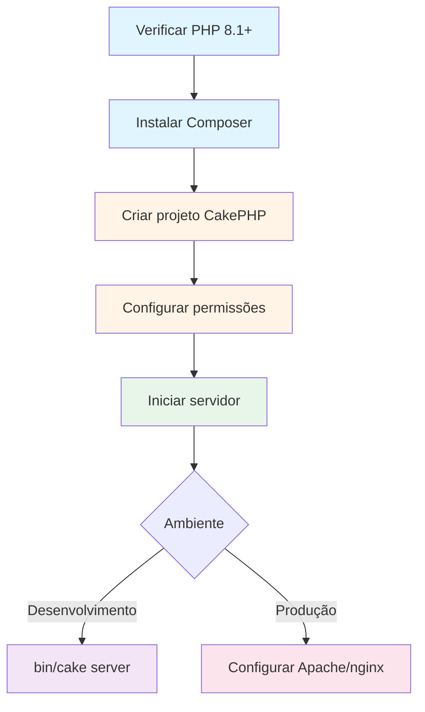
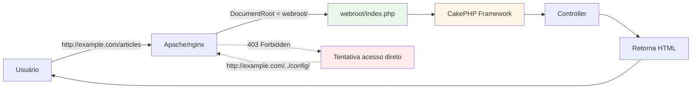

# Instalação

Como instalar o CakePHP 5 no seu ambiente de desenvolvimento ou produção.

---

## 🎯 O que você vai aprender

Após este guia, você saberá:

- ✅ Verificar se seu sistema atende os requisitos
- ✅ Instalar o Composer (gerenciador de dependências PHP)
- ✅ Criar um novo projeto CakePHP
- ✅ Configurar permissões de diretórios corretamente
- ✅ Usar o servidor de desenvolvimento embutido
- ✅ Configurar Apache, nginx ou IIS para produção
- ✅ Resolver problemas comuns de instalação

!!! tip "Tempo estimado"
    - **Instalação básica:** 10-15 minutos
    - **Configuração produção:** 30-60 minutos
    - **Nível de dificuldade:** ⭐ Iniciante a ⭐⭐ Intermediário

---

## 📋 Requisitos de Sistema

Antes de instalar o CakePHP, certifique-se de que seu sistema atende aos requisitos mínimos.

### PHP

**Versão mínima:** PHP 8.1

**Versão recomendada:** PHP 8.2 ou superior

!!! info "Verificar versão do PHP"
    ```bash
    php -v
    ```

    Saída esperada:
    ```
    PHP 8.2.10 (cli) (built: Aug 16 2023 10:45:23) (NTS)
    ```

    ⚠️ **IMPORTANTE:** A versão do PHP no terminal (CLI) e no servidor web devem ser a mesma!

### Extensões PHP Obrigatórias

O CakePHP requer as seguintes extensões PHP:

| Extensão | Função | Verificar |
|----------|--------|-----------|
| **mbstring** | Manipulação de strings multibyte (UTF-8, etc) | `php -m \| grep mbstring` |
| **intl** | Internacionalização (datas, moedas, traduções) | `php -m \| grep intl` |
| **simplexml** | Parsing de arquivos XML | `php -m \| grep simplexml` |
| **pdo** | Abstração de banco de dados | `php -m \| grep pdo` |

!!! success "Verificar todas de uma vez"
    ```bash
    php -m | grep -E '(mbstring|intl|simplexml|pdo)'
    ```

    Você deve ver as 4 extensões listadas.

#### Habilitando extensões

=== "Ubuntu/Debian"
    ```bash
    # Instalar extensões (PHP 8.2)
    sudo apt update
    sudo apt install php8.2-mbstring php8.2-intl php8.2-xml php8.2-mysql

    # Verificar instalação
    php -m | grep -E '(mbstring|intl|simplexml|pdo)'
    ```

=== "CentOS/RHEL"
    ```bash
    # Instalar extensões (PHP 8.2)
    sudo yum install php82-mbstring php82-intl php82-xml php82-pdo

    # Reiniciar PHP-FPM
    sudo systemctl restart php-fpm
    ```

=== "macOS (Homebrew)"
    ```bash
    # Instalar PHP via Homebrew (já inclui extensões)
    brew install php@8.2

    # Verificar
    php -m | grep intl
    ```

=== "Windows (XAMPP)"
    1. Abrir arquivo `C:\xampp\php\php.ini` no Notepad
    2. Procurar pelas linhas:
       ```ini
       ;extension=intl
       ;extension=mbstring
       ```
    3. Remover o ponto-e-vírgula (`;`) no início:
       ```ini
       extension=intl
       extension=mbstring
       ```
    4. Salvar arquivo
    5. Reiniciar Apache pelo XAMPP Control Panel

    !!! warning "WAMP: Problema com intl"
        No WAMP, a extensão `intl` pode aparecer ativada mas não funcionar.

        **Solução:**

        1. Ir para `C:\wamp\bin\php\php8.2.x\` (substitua `x` pela sua versão)
        2. Copiar **todos** os arquivos `icu*.dll`
        3. Colar em `C:\wamp\bin\apache\apache2.x.x\bin\`
        4. Reiniciar todos os serviços WAMP

---

### Bancos de Dados Suportados

Embora não seja obrigatório ter um banco de dados para **instalar** o CakePHP, a maioria das aplicações utilizará um.

O CakePHP suporta os seguintes bancos de dados:

| Banco de Dados | Versão Mínima | Driver PDO |
|----------------|---------------|------------|
| **MySQL** | 5.7 ou superior | `pdo_mysql` |
| **MariaDB** | 10.1 ou superior | `pdo_mysql` |
| **PostgreSQL** | 9.6 ou superior | `pdo_pgsql` |
| **Microsoft SQL Server** | 2012 ou superior | `pdo_sqlsrv` |
| **SQLite** | 3.x | `pdo_sqlite` |

!!! info "Oracle Database"
    Oracle é suportado através do plugin da comunidade:
    [Driver for Oracle Database](https://github.com/CakeDC/cakephp-oracle-driver)

!!! warning "Verificar driver PDO"
    Todos os drivers acima requerem a extensão **PDO** correspondente instalada.

    Exemplo para MySQL:
    ```bash
    php -m | grep pdo_mysql
    ```

---

## 🚀 Instalação

### Visão Geral do Processo



---

### Passo 1: Verificar Versão do PHP

Antes de começar, confirme que você tem PHP 8.1 ou superior:

```bash
php -v
```

✅ **Se mostrar PHP 8.1+:** Continue para o próximo passo

❌ **Se mostrar PHP < 8.1:** Atualize o PHP primeiro

=== "Ubuntu/Debian"
    ```bash
    # Adicionar repositório PPA (se necessário)
    sudo add-apt-repository ppa:ondrej/php
    sudo apt update

    # Instalar PHP 8.2
    sudo apt install php8.2 php8.2-cli php8.2-common

    # Verificar
    php -v
    ```

=== "macOS"
    ```bash
    # Via Homebrew
    brew install php@8.2

    # Adicionar ao PATH (adicione ao ~/.zshrc ou ~/.bash_profile)
    echo 'export PATH="/usr/local/opt/php@8.2/bin:$PATH"' >> ~/.zshrc
    source ~/.zshrc

    # Verificar
    php -v
    ```

=== "Windows"
    1. Baixar XAMPP mais recente: [https://www.apachefriends.org](https://www.apachefriends.org)
    2. Instalar e iniciar
    3. Abrir terminal e verificar:
       ```cmd
       C:\xampp\php\php.exe -v
       ```

---

### Passo 2: Instalar Composer

[Composer](https://getcomposer.org) é o gerenciador de dependências oficial do PHP e a maneira recomendada de instalar o CakePHP.

#### 2.1 Instalação do Composer

=== "Linux / macOS"
    ```bash
    # 1. Baixar instalador
    php -r "copy('https://getcomposer.org/installer', 'composer-setup.php');"

    # 2. Verificar instalador (opcional mas recomendado)
    php -r "if (hash_file('sha384', 'composer-setup.php') === file_get_contents('https://composer.github.io/installer.sig')) { echo 'Installer verified'; } else { echo 'Installer corrupt'; unlink('composer-setup.php'); } echo PHP_EOL;"

    # 3. Executar instalador
    php composer-setup.php

    # 4. Remover instalador
    php -r "unlink('composer-setup.php');"

    # 5. Mover para diretório global
    sudo mv composer.phar /usr/local/bin/composer

    # 6. Verificar instalação
    composer --version
    ```

    ✅ Saída esperada: `Composer version 2.x.x`

=== "Windows"
    **Opção 1: Instalador Windows (Recomendado)**

    1. Baixar: [Composer-Setup.exe](https://getcomposer.org/Composer-Setup.exe)
    2. Executar instalador
    3. Seguir wizard de instalação
    4. Abrir novo terminal (cmd ou PowerShell)
    5. Verificar:
       ```cmd
       composer --version
       ```

    **Opção 2: Manual**

    ```cmd
    # Baixar composer.phar para C:\bin\composer
    php -r "copy('https://getcomposer.org/installer', 'composer-setup.php');"
    php composer-setup.php --install-dir=C:\bin --filename=composer
    php -r "unlink('composer-setup.php');"

    # Adicionar C:\bin ao PATH do sistema
    # Reiniciar terminal
    composer --version
    ```

!!! tip "Composer já instalado?"
    Atualize para a versão mais recente:
    ```bash
    composer self-update
    ```

---

### Passo 3: Criar Projeto CakePHP

Agora vamos criar um novo projeto CakePHP usando o Composer.

#### 3.1 Comando de criação

```bash
composer create-project --prefer-dist cakephp/app my_app_name
```

**Onde:**
- `create-project` = Cria novo projeto a partir de um template
- `--prefer-dist` = Baixa versão distribuída (mais rápida)
- `cakephp/app` = Template oficial do CakePHP
- `my_app_name` = Nome da pasta do seu projeto (substitua!)

!!! example "Exemplo prático"
    Criar um blog:
    ```bash
    composer create-project --prefer-dist cakephp/app meu-blog
    cd meu-blog
    ```

#### 3.2 O que acontece durante a instalação?

```
composer create-project cakephp/app meu-blog
↓
1. Composer baixa skeleton application (estrutura base)
2. Composer instala CakePHP framework core
3. Composer instala dependências (migrations, plugins, etc)
4. Script pós-instalação ajusta permissões
5. Gera arquivo .env com Security.salt aleatório
↓
✅ Projeto criado em ./meu-blog/
```

#### 3.3 Estrutura de diretórios criada

Após instalação, você terá:

```
meu-blog/
├── bin/                # Executáveis (cake console)
│   └── cake           # CLI do CakePHP
├── config/             # Arquivos de configuração
│   ├── app.php        # Config principal
│   ├── bootstrap.php  # Inicialização
│   └── routes.php     # Rotas da aplicação
├── logs/               # Logs da aplicação
├── plugins/            # Plugins customizados
├── resources/          # Arquivos não-PHP (locales, etc)
├── src/                # Código da aplicação
│   ├── Controller/
│   ├── Model/
│   └── View/
├── templates/          # Templates de views
│   ├── layout/
│   └── Pages/
├── tests/              # Testes automatizados
├── tmp/                # Arquivos temporários e cache
│   ├── cache/
│   └── sessions/
├── vendor/             # Dependências (Composer)
├── webroot/            # Raiz pública (DOCUMENT ROOT)
│   ├── css/
│   ├── js/
│   ├── img/
│   └── index.php      # Entry point
├── .htaccess           # Regras Apache (redireciona para webroot/)
├── composer.json       # Dependências do projeto
└── README.md
```

!!! warning "Estrutura de diretórios é importante!"
    O CakePHP segue **Convention over Configuration**. Manter a estrutura padrão garante que tudo funcione automaticamente.

---

#### 3.4 Controle de Versões

O arquivo `composer.json` controla qual versão do CakePHP será instalada:

```json
{
    "require": {
        "cakephp/cakephp": "5.2.*"
    }
}
```

##### Entendendo constraints de versão

| Constraint | Significa | Atualizações permitidas |
|------------|-----------|-------------------------|
| `5.2.*` | Qualquer versão 5.2.x | Patches: 5.2.0 → 5.2.1 → 5.2.2 |
| `^5.0` | Compatível com 5.0 | Minor + Patches: 5.0 → 5.1 → 5.2 |
| `~5.2` | Versão aproximada 5.2 | Patches: 5.2.0 → 5.2.9 |
| (sem constraint) | Última versão stable | Qualquer atualização |

!!! tip "Qual usar?"
    - **Desenvolvimento:** `^5.0` (recebe melhorias)
    - **Produção:** `5.2.*` (apenas correções de bugs)

    ```bash
    # Atualizar para versões permitidas
    composer update
    ```

##### Instalando versão específica

```bash
# Última versão 5.x
composer create-project cakephp/app:^5.0 meu-app

# Versão 5.2.x específica
composer create-project cakephp/app:~5.2 meu-app

# Deixar Composer escolher (recomendado)
composer create-project cakephp/app meu-app
```

---

### Passo 4: Configurar Permissões

O CakePHP precisa **escrever** em alguns diretórios para funcionar corretamente.

#### 4.1 Diretórios que precisam permissão de escrita

```
tmp/               ← Cache, sessions, arquivos temporários
├── cache/
├── sessions/
└── tests/

logs/              ← Arquivos de log
```

!!! danger "O que acontece se não configurar?"
    - ❌ Cache não funciona → Aplicação lenta
    - ❌ Sessions não salvam → Usuários não conseguem fazer login
    - ❌ Logs não são gravados → Dificulta debugging

#### 4.2 Configurando permissões (UNIX/Linux/macOS)

##### Método 1: ACL (Recomendado)

Access Control Lists (ACL) permitem permissões granulares.

```bash
# 1. Descobrir usuário do servidor web
HTTPDUSER=`ps aux | grep -E '[a]pache|[h]ttpd|[_]www|[w]ww-data|[n]ginx' | grep -v root | head -1 | cut -d\  -f1`

# 2. Dar permissão de leitura/escrita/execução
setfacl -R -m u:${HTTPDUSER}:rwx tmp
setfacl -R -d -m u:${HTTPDUSER}:rwx tmp

setfacl -R -m u:${HTTPDUSER}:rwx logs
setfacl -R -d -m u:${HTTPDUSER}:rwx logs

# 3. Verificar
getfacl tmp
```

!!! info "Flags explicadas"
    - `-R` = Recursivo (subpastas também)
    - `-m` = Modificar ACL
    - `-d` = ACL padrão (novos arquivos herdam)
    - `u:${HTTPDUSER}:rwx` = Usuário:Permissões (read/write/execute)

##### Método 2: chown + chmod

Se `setfacl` não estiver disponível:

```bash
# Descobrir usuário web
HTTPDUSER=`ps aux | grep -E '[a]pache|[h]ttpd|[_]www|[w]ww-data|[n]ginx' | grep -v root | head -1 | cut -d\  -f1`

# Alterar dono dos diretórios
sudo chown -R ${HTTPDUSER}:${HTTPDUSER} tmp logs

# Dar permissões
sudo chmod -R 775 tmp logs
```

##### Método 3: chmod 777 (APENAS DESENVOLVIMENTO!)

```bash
# ⚠️ INSEGURO - Use apenas em ambiente local
chmod -R 777 tmp logs
```

!!! danger "Nunca use chmod 777 em produção!"
    Qualquer usuário do sistema poderá ler, escrever e executar arquivos nestes diretórios.

#### 4.3 bin/cake executável

O script `bin/cake` precisa ser executável:

```bash
chmod +x bin/cake

# Testar
./bin/cake --version
```

✅ Saída esperada: `CakePHP 5.2.x`

Se não conseguir dar permissão de execução, pode usar:

```bash
php bin/cake.php --version
```

---

## 🔧 Servidor de Desenvolvimento

Para desenvolvimento local, o CakePHP inclui um servidor web embutido (baseado no servidor nativo do PHP).

!!! warning "Nunca use em produção!"
    O servidor de desenvolvimento é apenas para testar localmente. Para produção, use Apache ou nginx.

### Iniciar servidor

```bash
# No diretório do projeto
bin/cake server
```

✅ **Servidor iniciado em:** `http://localhost:8765`

### Acessar aplicação

Abra o navegador em: **http://localhost:8765**

Você verá a página inicial do CakePHP com:

- ✅ Logo do CakePHP
- ✅ Verificações de ambiente (PHP, extensões, permissões)
- ✅ Status da conexão com banco de dados

### Customizar host e porta

```bash
# Servidor em IP específico e porta 5000
bin/cake server -H 192.168.1.100 -p 5000
```

Agora acesse: `http://192.168.1.100:5000`

!!! tip "Servidor inacessível de outros dispositivos?"
    Use `-H 0.0.0.0` para aceitar conexões de qualquer IP:
    ```bash
    bin/cake server -H 0.0.0.0
    ```

    Acesse de outro dispositivo na mesma rede: `http://[IP_DO_SEU_PC]:8765`

### Parar servidor

Pressione `Ctrl+C` no terminal.

---

## 🏭 Configuração para Produção

Para ambientes de produção, você deve configurar um servidor web real (Apache, nginx, IIS).

### Por que não usar bin/cake server?

| Servidor Desenvolvimento | Servidor Produção (Apache/nginx) |
|--------------------------|-----------------------------------|
| ❌ Performance limitada | ✅ Otimizado para alta performance |
| ❌ Um request por vez | ✅ Múltiplas conexões simultâneas |
| ❌ Sem SSL/HTTPS | ✅ Suporte completo a SSL |
| ❌ Sem cache | ✅ Cache de assets (CSS/JS/imagens) |
| ❌ Sem compressão | ✅ Gzip/Brotli compression |
| ❌ Sem logs estruturados | ✅ Logs de acesso/erro detalhados |

---

### Conceito: DocumentRoot

**Problema de segurança:**

Se você configurar o DocumentRoot para a raiz do projeto:

```
DocumentRoot /var/www/meu-app/
```

Usuários poderão acessar diretamente:
- ❌ `http://example.com/config/app.php` → Expõe senhas de banco!
- ❌ `http://example.com/composer.json` → Expõe dependências
- ❌ `http://example.com/src/` → Expõe código-fonte

**Solução:**

Configure DocumentRoot para `webroot/`:

```
DocumentRoot /var/www/meu-app/webroot/
```

Agora:
- ✅ `http://example.com/` → Acessa `webroot/index.php`
- ✅ `http://example.com/css/app.css` → Acessa `webroot/css/app.css`
- ❌ `http://example.com/../config/app.php` → BLOQUEADO!



---

### Apache

#### Requisitos

- Apache 2.4+
- Módulo `mod_rewrite` habilitado

#### Habilitar mod_rewrite

=== "Ubuntu/Debian"
    ```bash
    sudo a2enmod rewrite
    sudo systemctl restart apache2
    ```

=== "CentOS/RHEL"
    Editar `/etc/httpd/conf/httpd.conf`:
    ```apache
    # Descomentar ou adicionar:
    LoadModule rewrite_module modules/mod_rewrite.so
    ```

    Reiniciar:
    ```bash
    sudo systemctl restart httpd
    ```

=== "macOS"
    Editar `/etc/apache2/httpd.conf`:
    ```apache
    # Descomentar (remover #):
    LoadModule rewrite_module libexec/apache2/mod_rewrite.so
    ```

    Reiniciar:
    ```bash
    sudo apachectl restart
    ```

#### Configuração VirtualHost

Criar arquivo `/etc/apache2/sites-available/meusite.conf`:

```apache
<VirtualHost *:80>
    ServerName meusite.com.br
    ServerAlias www.meusite.com.br

    # DocumentRoot aponta para webroot/
    DocumentRoot /var/www/meusite/webroot

    <Directory /var/www/meusite/webroot>
        Options FollowSymLinks
        AllowOverride All
        Require all granted
    </Directory>

    # Logs
    ErrorLog ${APACHE_LOG_DIR}/meusite-error.log
    CustomLog ${APACHE_LOG_DIR}/meusite-access.log combined
</VirtualHost>
```

Ativar site:

```bash
sudo a2ensite meusite.conf
sudo systemctl reload apache2
```

#### Arquivos .htaccess

O CakePHP usa dois arquivos `.htaccess` para URL rewriting.

##### 1. `.htaccess` (raiz do projeto)

```apache
# Uncomment the following to prevent the httpoxy vulnerability
# See: https://httpoxy.org/
#<IfModule mod_headers.c>
#    RequestHeader unset Proxy
#</IfModule>

<IfModule mod_rewrite.c>
    RewriteEngine on

    # Permite acesso ao diretório .well-known (Let's Encrypt, etc)
    RewriteRule ^(\.well-known/.*)$ $1 [L]

    # Redireciona tudo para webroot/
    RewriteRule ^$ webroot/ [L]
    RewriteRule (.*) webroot/$1 [L]
</IfModule>
```

##### 2. `webroot/.htaccess`

```apache
<IfModule mod_rewrite.c>
    RewriteEngine On

    # Se arquivo não existe fisicamente
    RewriteCond %{REQUEST_FILENAME} !-f

    # Redireciona para index.php
    RewriteRule ^ index.php [L]
</IfModule>
```

!!! tip "Como funciona o URL Rewriting?"
    ```
    User acessa: http://example.com/articles/view/123
    ↓
    1. Apache recebe request
    2. Procura arquivo físico: webroot/articles/view/123
    3. Não encontra (Rewrite Cond !-f)
    4. Reescreve para: webroot/index.php
    5. index.php inicializa CakePHP
    6. Router do CakePHP interpreta: ArticlesController::view(123)
    ```

#### Problemas comuns Apache

??? question "URLs retornam 404"
    **Causa:** `mod_rewrite` não habilitado ou `.htaccess` não permitido

    **Solução:**
    ```bash
    # Habilitar mod_rewrite
    sudo a2enmod rewrite

    # Editar /etc/apache2/apache2.conf
    # Verificar que AllowOverride está como "All":
    <Directory /var/www/>
        AllowOverride All
    </Directory>

    # Reiniciar
    sudo systemctl restart apache2
    ```

??? question "CSS/JS não carregam"
    **Causa:** DocumentRoot não aponta para `webroot/`

    **Solução:**
    Verificar VirtualHost:
    ```apache
    DocumentRoot /var/www/meusite/webroot
    #                                ^^^^^^^^ Importante!
    ```

??? question "Erro 403 Forbidden"
    **Causa:** Permissões incorretas

    **Solução:**
    ```bash
    # Dar permissão ao Apache
    sudo chown -R www-data:www-data /var/www/meusite
    sudo chmod -R 755 /var/www/meusite

    # Permissões especiais para tmp/ e logs/
    sudo chmod -R 775 /var/www/meusite/tmp
    sudo chmod -R 775 /var/www/meusite/logs
    ```

---

### nginx

#### Configuração

Criar arquivo `/etc/nginx/sites-available/meusite`:

```nginx
server {
    listen 80;
    listen [::]:80;

    server_name meusite.com.br www.meusite.com.br;

    # DocumentRoot = webroot/
    root /var/www/meusite/webroot;
    index index.php;

    # Logs
    access_log /var/log/nginx/meusite-access.log;
    error_log /var/log/nginx/meusite-error.log;

    # URL Rewriting
    location / {
        try_files $uri $uri/ /index.php?$args;
    }

    # PHP via FastCGI
    location ~ \.php$ {
        try_files $uri =404;
        include fastcgi_params;

        # Socket UNIX (recomendado)
        fastcgi_pass unix:/var/run/php/php8.2-fpm.sock;

        # Ou porta TCP (alternativa)
        # fastcgi_pass 127.0.0.1:9000;

        fastcgi_index index.php;
        fastcgi_intercept_errors on;
        fastcgi_param SCRIPT_FILENAME $document_root$fastcgi_script_name;
    }
}
```

Ativar site:

```bash
sudo ln -s /etc/nginx/sites-available/meusite /etc/nginx/sites-enabled/
sudo nginx -t  # Testar configuração
sudo systemctl reload nginx
```

!!! info "Socket UNIX vs TCP"
    **Socket UNIX** (`unix:/var/run/php/php8.2-fpm.sock`):
    - ✅ Mais rápido (comunicação local)
    - ✅ Mais seguro
    - ✅ Recomendado

    **TCP** (`127.0.0.1:9000`):
    - ⚠️ Útil se PHP-FPM estiver em servidor separado
    - ⚠️ Levemente mais lento

#### Descobrir socket correto

```bash
# Procurar socket do PHP-FPM
ls -la /var/run/php/

# Saída típica:
# php8.2-fpm.sock
# php-fpm.sock
```

Use o socket encontrado no `fastcgi_pass`.

#### nginx com HTTPS (Let's Encrypt)

```bash
# Instalar Certbot
sudo apt install certbot python3-certbot-nginx

# Obter certificado SSL
sudo certbot --nginx -d meusite.com.br -d www.meusite.com.br

# Certbot automaticamente:
# 1. Obtém certificado
# 2. Modifica configuração nginx
# 3. Adiciona redirect HTTP → HTTPS
# 4. Configura renovação automática
```

Após Certbot, sua configuração terá:

```nginx
server {
    listen 443 ssl;
    server_name meusite.com.br;

    ssl_certificate /etc/letsencrypt/live/meusite.com.br/fullchain.pem;
    ssl_certificate_key /etc/letsencrypt/live/meusite.com.br/privkey.pem;

    # ... resto da configuração
}

# Redirect HTTP → HTTPS
server {
    listen 80;
    server_name meusite.com.br;
    return 301 https://$server_name$request_uri;
}
```

---

### IIS7 (Windows Server)

#### Requisitos

1. IIS 7+ instalado
2. URL Rewrite Module 2.0

#### Instalar URL Rewrite Module

**Opção 1: Web Platform Installer**

1. Baixar: [Microsoft Web Platform Installer](https://www.microsoft.com/web/downloads/platform.aspx)
2. Executar
3. Buscar "URL Rewrite 2.0"
4. Instalar

**Opção 2: Download direto**

- [32-bit](https://download.microsoft.com/download/D/8/1/D81E5DD6-1ABB-46B0-9B4B-21894E18B77F/rewrite_x86_en-US.msi)
- [64-bit](https://download.microsoft.com/download/1/2/8/128E2E22-C1B9-44A4-BE2A-5859ED1D4592/rewrite_amd64_en-US.msi)

#### Criar web.config

Criar arquivo `web.config` na **raiz do projeto** (não no webroot!):

```xml
<?xml version="1.0" encoding="UTF-8"?>
<configuration>
    <system.webServer>
        <rewrite>
            <rules>
                <!-- Não processar acesso direto a webroot/ -->
                <rule name="Exclude direct access to webroot/*" stopProcessing="true">
                    <match url="^webroot/(.*)$" ignoreCase="false" />
                    <action type="None" />
                </rule>

                <!-- Reescrever assets para webroot/ -->
                <rule name="Rewrite assets" stopProcessing="true">
                    <match url="^(font|img|css|files|js|favicon.ico)(.*)$" />
                    <action type="Rewrite" url="webroot/{R:1}{R:2}" appendQueryString="false" />
                </rule>

                <!-- Reescrever tudo mais para index.php -->
                <rule name="Rewrite to index.php" stopProcessing="true">
                    <match url="^(.*)$" ignoreCase="false" />
                    <action type="Rewrite" url="index.php" appendQueryString="true" />
                </rule>
            </rules>
        </rewrite>
    </system.webServer>
</configuration>
```

#### Configurar site no IIS

1. Abrir **IIS Manager**
2. Clicar com botão direito em **Sites** → **Add Website**
3. Preencher:
   - **Site name:** MeuSiteCakePHP
   - **Physical path:** `C:\inetpub\wwwroot\meusite\webroot`
   - **Binding:** Porta 80, hostname (opcional)
4. OK

---

## 🐳 Instalação via DDEV (Docker)

[DDEV](https://ddev.com) é uma ferramenta de desenvolvimento baseada em Docker que simplifica a configuração de ambientes.

!!! warning "Apenas para desenvolvimento!"
    DDEV é uma ferramenta de desenvolvimento local. **NÃO** use em produção.

### Instalar DDEV

=== "macOS"
    ```bash
    brew install ddev/ddev/ddev
    ```

=== "Linux"
    ```bash
    curl -fsSL https://ddev.com/install.sh | bash
    ```

=== "Windows"
    ```powershell
    choco install ddev
    ```

### Criar novo projeto com DDEV

```bash
# 1. Criar diretório
mkdir meu-blog
cd meu-blog

# 2. Configurar DDEV para CakePHP
ddev config --project-type=cakephp --docroot=webroot

# 3. Criar projeto CakePHP via DDEV
ddev composer create --prefer-dist cakephp/app

# 4. Iniciar ambiente
ddev start

# 5. Abrir no navegador
ddev launch
```

### Projeto existente com DDEV

```bash
# 1. Clonar repositório
git clone https://github.com/usuario/meu-projeto.git
cd meu-projeto

# 2. Configurar DDEV
ddev config --project-type=cakephp --docroot=webroot

# 3. Instalar dependências
ddev composer install

# 4. Iniciar
ddev start

# 5. Abrir
ddev launch
```

### Comandos úteis DDEV

```bash
# SSH no container
ddev ssh

# Executar bin/cake
ddev exec bin/cake --version

# Ver logs
ddev logs

# Parar ambiente
ddev stop

# Deletar ambiente (mantém código)
ddev delete
```

---

## ❓ FAQ - Problemas Comuns

### Instalação

??? question "Erro: 'composer' não encontrado"
    **Causa:** Composer não está no PATH

    **Solução:**
    ```bash
    # Verificar onde está instalado
    which composer

    # Se não mostrar nada, reinstalar:
    # Linux/Mac:
    sudo mv composer.phar /usr/local/bin/composer

    # Windows: Reinstalar via Composer-Setup.exe
    ```

??? question "Erro: Your requirements could not be resolved to an installable set of packages"
    **Causa:** Versão do PHP incompatível ou extensões faltando

    **Solução:**
    ```bash
    # Verificar versão PHP
    php -v  # Deve ser 8.1+

    # Verificar extensões
    php -m | grep -E '(mbstring|intl|pdo|simplexml)'

    # Instalar extensões faltantes (Ubuntu):
    sudo apt install php8.2-mbstring php8.2-intl php8.2-xml
    ```

??? question "Instalação muito lenta"
    **Causa:** Composer baixando sources do GitHub

    **Solução:**
    Use `--prefer-dist` para baixar zips (mais rápido):
    ```bash
    composer create-project --prefer-dist cakephp/app meu-app
    ```

### Permissões

??? question "Erro: Unable to write to tmp/cache/"
    **Causa:** Permissões incorretas

    **Solução:**
    ```bash
    # Método 1: ACL (recomendado)
    HTTPDUSER=`ps aux | grep -E '[a]pache|[h]ttpd|[_]www|[w]ww-data|[n]ginx' | grep -v root | head -1 | cut -d\  -f1`
    setfacl -R -m u:${HTTPDUSER}:rwx tmp logs

    # Método 2: chmod (desenvolvimento)
    chmod -R 777 tmp logs
    ```

??? question "Erro: bin/cake: Permission denied"
    **Causa:** Arquivo não é executável

    **Solução:**
    ```bash
    chmod +x bin/cake

    # Ou use:
    php bin/cake.php --version
    ```

### Servidor Web

??? question "Todas URLs retornam 404 (Apache)"
    **Causa:** mod_rewrite não habilitado ou AllowOverride incorreto

    **Soluções:**

    1. Habilitar mod_rewrite:
       ```bash
       sudo a2enmod rewrite
       sudo systemctl restart apache2
       ```

    2. Verificar AllowOverride em `/etc/apache2/apache2.conf`:
       ```apache
       <Directory /var/www/>
           AllowOverride All  # ← Importante!
       </Directory>
       ```

    3. Verificar que arquivos `.htaccess` existem:
       ```bash
       ls -la .htaccess webroot/.htaccess
       ```

??? question "CSS/JS não carregam"
    **Causa:** DocumentRoot incorreto

    **Solução:**
    Verificar VirtualHost aponta para `webroot/`:
    ```apache
    DocumentRoot /var/www/meusite/webroot
    #                                ^^^^^^^ Importante!
    ```

??? question "502 Bad Gateway (nginx)"
    **Causa:** PHP-FPM não está rodando ou socket incorreto

    **Soluções:**

    1. Verificar PHP-FPM:
       ```bash
       sudo systemctl status php8.2-fpm
       # Se não estiver rodando:
       sudo systemctl start php8.2-fpm
       ```

    2. Verificar socket correto:
       ```bash
       ls /var/run/php/
       # Usar o socket que existir no fastcgi_pass
       ```

    3. Testar se PHP-FPM responde:
       ```bash
       sudo netstat -pl | grep php
       ```

??? question "Erro 500 Internal Server Error"
    **Causa:** Múltiplas possíveis

    **Diagnóstico:**

    1. Ver logs:
       ```bash
       # Apache
       tail -f /var/log/apache2/error.log

       # nginx
       tail -f /var/log/nginx/error.log

       # CakePHP
       tail -f logs/error.log
       ```

    2. Habilitar debug em `config/app.php`:
       ```php
       'debug' => true,
       ```

    3. Verificar permissões de `tmp/` e `logs/`

---

## ✅ Checklist Pós-Instalação

Após instalar, verifique cada item:

### 1. Requisitos

- [ ] PHP 8.1+ instalado (`php -v`)
- [ ] Extensão mbstring (`php -m | grep mbstring`)
- [ ] Extensão intl (`php -m | grep intl`)
- [ ] Extensão simplexml (`php -m | grep simplexml`)
- [ ] Extensão pdo (`php -m | grep pdo`)
- [ ] Composer instalado (`composer --version`)

### 2. Projeto Criado

- [ ] Projeto criado via Composer
- [ ] Diretórios existem: `bin/`, `config/`, `src/`, `webroot/`
- [ ] Arquivo `composer.json` existe
- [ ] Pasta `vendor/` existe (dependências instaladas)

### 3. Permissões

- [ ] `tmp/` é escribível
- [ ] `logs/` é escribível
- [ ] `bin/cake` é executável (`chmod +x bin/cake`)

### 4. Servidor Funcional

- [ ] `bin/cake server` inicia sem erros
- [ ] Página padrão carrega em `http://localhost:8765`
- [ ] Logo CakePHP aparece
- [ ] Verificações de ambiente estão verdes

### 5. Banco de Dados (Opcional)

- [ ] Banco de dados criado
- [ ] Configuração em `config/app.php` ajustada
- [ ] Teste de conexão verde na página inicial

### 6. Produção (se aplicável)

- [ ] DocumentRoot aponta para `webroot/`
- [ ] mod_rewrite habilitado (Apache)
- [ ] Arquivos `.htaccess` existem
- [ ] URL rewriting funciona (URLs sem `index.php`)
- [ ] SSL configurado (HTTPS)

---

## 🚀 Próximos Passos

Instalação concluída! Agora você pode:

1. **📖 Tutorial:** Siga o [Quickstart](quickstart.md) para criar seu primeiro aplicativo
2. **🗄️ Banco de Dados:** Configure conexão em [Configuração de Banco de Dados](database.md)
3. **🎨 Primeiro Controller:** Aprenda em [Controllers](controllers.md)
4. **📚 Documentação Completa:** Explore [CakePHP Book](https://book.cakephp.org)

---

## 📚 Recursos Adicionais

- [Documentação Oficial](https://book.cakephp.org/5/en/installation.html)
- [CakePHP no GitHub](https://github.com/cakephp/cakephp)
- [Fórum da Comunidade](https://discourse.cakephp.org)
- [Stack Overflow Tag](https://stackoverflow.com/questions/tagged/cakephp)

---

!!! success "Parabéns! 🎉"
    Você instalou com sucesso o CakePHP 5. Agora está pronto para criar aplicações web modernas e eficientes!
