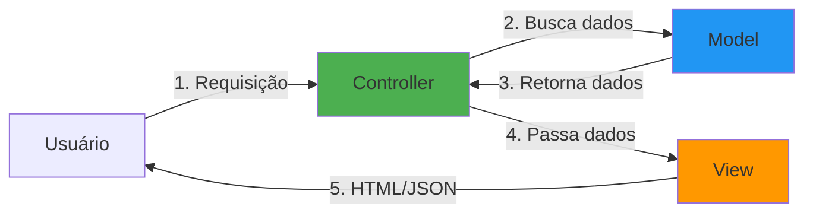
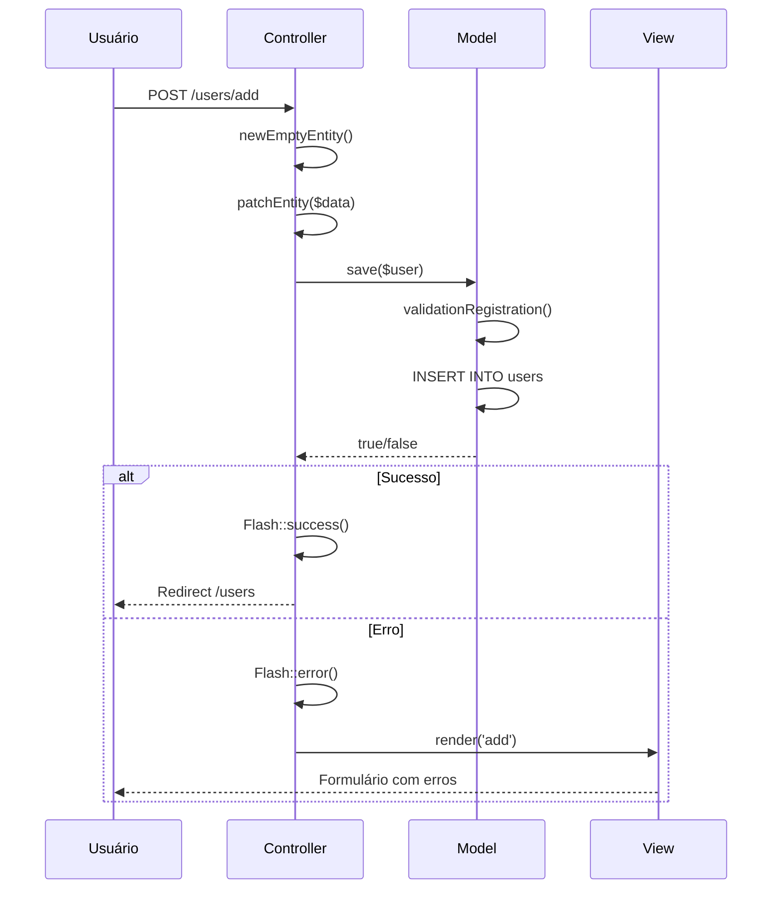
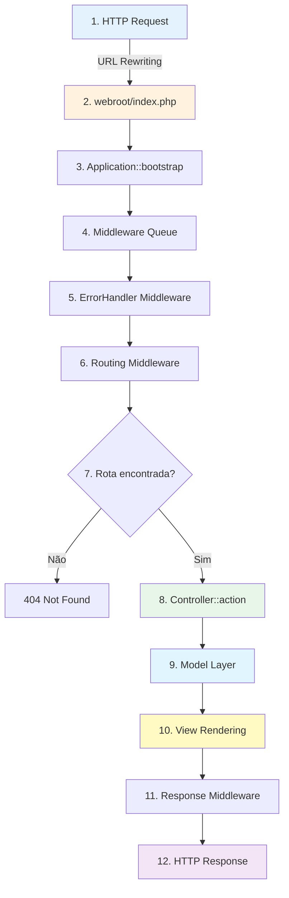

# CakePHP: Visão Geral

!!! info "Sobre esta página"
    Esta página apresenta os conceitos fundamentais do CakePHP e como eles funcionam juntos para criar aplicações web modernas. Se você está ansioso para começar a programar, pode [iniciar com o tutorial](../tutorials-and-examples/cms/installation.md) ou [mergulhar na documentação](../topics.md).

---

## :material-lightbulb: Introdução

O CakePHP foi projetado para tornar tarefas comuns de desenvolvimento web **simples e fáceis**. Ao fornecer uma caixa de ferramentas completa para você começar, as várias partes do CakePHP funcionam bem juntas ou separadamente.

**Objetivo desta visão geral:**
- Apresentar os conceitos gerais do CakePHP
- Mostrar como esses conceitos são implementados no framework
- Preparar você para construir sua primeira aplicação

---

## :material-cog: Convenção sobre Configuração

!!! tip "Filosofia central do CakePHP"
    **Convention over Configuration (CoC)** significa que você gasta menos tempo configurando e mais tempo programando.

### O que são Convenções?

O CakePHP fornece uma estrutura organizacional básica que abrange:

- :material-code-tags: **Nomes de classes** → `UsersController`, `ArticlesTable`
- :material-file: **Nomes de arquivos** → `UsersController.php`, `ArticlesTable.php`
- :material-database: **Nomes de tabelas** → `users`, `articles`
- :material-folder: **Estrutura de diretórios** → `src/Controller/`, `src/Model/Table/`

### Por que usar Convenções?

!!! success "Benefícios"
    - ✅ **Menos configuração** → Evita arquivos XML ou YAML extensos
    - ✅ **Estrutura uniforme** → Facilita trabalhar em múltiplos projetos
    - ✅ **Produtividade** → Você já sabe onde encontrar cada coisa
    - ✅ **Onboarding rápido** → Novos desenvolvedores entendem o código rapidamente

!!! example "Exemplo prático"
    Se você criar uma tabela chamada `users` no banco de dados:

    - CakePHP espera uma classe `UsersTable` em `src/Model/Table/UsersTable.php`
    - CakePHP espera uma classe `User` (entity) em `src/Model/Entity/User.php`
    - CakePHP espera um controller `UsersController` em `src/Controller/UsersController.php`
    - CakePHP espera views em `templates/Users/` (index.php, add.php, edit.php, view.php)

**Resultado:** Você pode começar a usar a tabela `users` **sem escrever nenhuma configuração!**

!!! info "Aprendendo as convenções"
    As convenções levam algum tempo para aprender, mas ao segui-las você evita configurações desnecessárias e cria uma estrutura uniforme. Consulte o [capítulo de convenções](conventions.md) para conhecer todas as regras.

---

## :material-layers: Arquitetura MVC

O CakePHP utiliza o padrão **Model-View-Controller (MVC)**, que separa sua aplicação em 3 camadas principais:



---

## :material-database: A Camada Model

!!! abstract "Responsabilidade"
    A camada Model representa a parte da sua aplicação que implementa a **lógica de negócio**. É responsável por recuperar dados e convertê-los nos conceitos primários da sua aplicação.

### O que o Model faz?

- :material-database-search: **Recuperar dados** do banco
- :material-check-circle: **Validar dados** antes de salvar
- :material-link: **Gerenciar associações** entre entidades
- :material-code-braces: **Processar regras de negócio**

### Exemplo prático: Rede Social

Em uma rede social, a camada Model cuidaria de:

- ✅ Salvar dados do usuário
- ✅ Gerenciar associações de amizade
- ✅ Armazenar e recuperar fotos
- ✅ Encontrar sugestões de novos amigos

Os objetos do Model podem ser pensados como **"Friend"**, **"User"**, **"Comment"**, ou **"Photo"**.

### Carregando dados (sem configuração!)

!!! example "Exemplo 1: Buscar todos os usuários"
    ```php
    use Cake\ORM\Locator\LocatorAwareTrait;

    // Buscar a tabela Users (CakePHP cria a classe automaticamente se não existir)
    $users = $this->fetchTable('Users');

    // Buscar todos os registros
    $resultset = $users->find()->all();

    // Iterar sobre os resultados
    foreach ($resultset as $row) {
        echo $row->username;
    }
    ```

!!! tip "Magia das convenções"
    Perceba que **não escrevemos nenhum código** antes de começar a trabalhar com os dados! Ao usar convenções, o CakePHP usa classes padrão para tabelas e entities que ainda não foram definidas.

### Criando e salvando dados

!!! example "Exemplo 2: Criar um novo usuário"
    === "Método moderno (recomendado)"
        ```php
        use Cake\ORM\Locator\LocatorAwareTrait;

        $users = $this->fetchTable('Users');

        // Criar entity vazia
        $user = $users->newEmptyEntity();

        // Popular com dados (mass assignment seguro)
        $user = $users->patchEntity($user, [
            'email' => 'mark@example.com',
            'username' => 'mark'
        ]);

        // Salvar (com validação automática)
        if ($users->save($user)) {
            echo "Usuário salvo!";
        } else {
            echo "Erro ao salvar.";
        }
        ```

    === "Método alternativo (válido)"
        ```php
        $users = $this->fetchTable('Users');

        // Criar entity já populada
        $user = $users->newEntity([
            'email' => 'mark@example.com',
            'username' => 'mark'
        ]);

        // Salvar
        $users->save($user);
        ```

!!! info "newEmptyEntity() vs newEntity()"
    **Qual usar?**

    - **`newEmptyEntity()`** → Use quando for popular dados via formulário (com `patchEntity()`)
    - **`newEntity($data)`** → Use quando já tiver os dados prontos (ex: seeds, APIs)

    Ambos aplicam **validação** e **proteção contra mass assignment**.

### Estrutura completa de uma Table Class

!!! example "Exemplo 3: UsersTable completa"
    ```php
    <?php
    declare(strict_types=1);

    namespace App\Model\Table;

    use Cake\ORM\Table;
    use Cake\Validation\Validator;

    /**
     * Tabela de Usuários
     *
     * Gerencia dados de usuários, validações e associações.
     */
    class UsersTable extends Table
    {
        /**
         * Inicialização da tabela
         */
        public function initialize(array $config): void
        {
            parent::initialize($config);

            // Configurações básicas
            $this->setTable('users');
            $this->setDisplayField('username');
            $this->setPrimaryKey('id');

            // Adicionar comportamentos (behaviors)
            $this->addBehavior('Timestamp'); // created, modified automáticos

            // Associações
            $this->hasMany('Articles', [
                'foreignKey' => 'user_id'
            ]);
        }

        /**
         * Validação padrão
         */
        public function validationDefault(Validator $validator): Validator
        {
            $validator
                ->integer('id')
                ->allowEmptyString('id', null, 'create');

            $validator
                ->notEmptyString('username', 'Por favor, informe um nome de usuário')
                ->minLength('username', 3, 'Mínimo de 3 caracteres');

            $validator
                ->email('email', false, 'E-mail inválido')
                ->notEmptyString('email', 'E-mail é obrigatório');

            return $validator;
        }

        /**
         * Validação customizada para registro
         *
         * Usada em: $users->save($user, ['validate' => 'registration'])
         */
        public function validationRegistration(Validator $validator): Validator
        {
            // Herda validações padrão
            $validator = $this->validationDefault($validator);

            // Adiciona regras específicas de registro
            $validator
                ->notEmptyString('password', 'Senha é obrigatória')
                ->minLength('password', 8, 'Senha deve ter no mínimo 8 caracteres');

            return $validator;
        }
    }
    ```

!!! tip "Conceitos importantes"
    - **Behaviors** → Reutilizam lógica comum (Timestamp, Translate, etc)
    - **Validation sets** → Permitem regras diferentes para contextos diferentes
    - **Associations** → Definem relacionamentos entre tabelas

---

## :material-eye: A Camada View

!!! abstract "Responsabilidade"
    A camada View renderiza uma **apresentação** dos dados do Model. Sendo separada dos objetos Model, ela é responsável por usar as informações disponíveis para produzir qualquer interface de apresentação que sua aplicação necessite.

### O que a View faz?

- :material-code-tags: **Renderizar HTML** a partir de templates
- :material-file-code: **Gerar JSON/XML** para APIs
- :material-puzzle: **Usar Helpers** para funcionalidades comuns
- :material-view-grid: **Organizar layouts** e elements

### Exemplo prático: Renderizar lista de usuários

!!! example "Exemplo 4: View template"
    ```php
    <!-- templates/Users/index.php -->

    <h2>Lista de Usuários</h2>

    <ul class="users-list">
        <?php foreach ($users as $user): ?>
            <li class="user">
                <?= $this->element('user_info', ['user' => $user]) ?>
            </li>
        <?php endforeach; ?>
    </ul>
    ```

!!! example "Exemplo 5: Element reutilizável"
    ```php
    <!-- templates/element/user_info.php -->

    <div class="user-card">
        <h3><?= h($user->username) ?></h3>
        <p><?= h($user->email) ?></p>
        <small>Membro desde: <?= $user->created->format('d/m/Y') ?></small>
    </div>
    ```

!!! tip "Função h()"
    A função `h()` escapa HTML para prevenir ataques XSS. **Sempre use** ao exibir dados do usuário!

### Pontos de extensão da View

A camada View fornece vários pontos de extensão:

| Recurso | Descrição | Uso |
|---------|-----------|-----|
| **View Templates** | Arquivos `.php` principais | Renderizar páginas completas |
| **View Elements** | Componentes reutilizáveis | Blocos de HTML que se repetem |
| **View Cells** | Mini-controllers para widgets | Componentes com lógica própria |
| **Helpers** | Funções auxiliares | `$this->Html->link()`, `$this->Form->create()` |

### Não apenas HTML!

!!! info "Formatos suportados"
    A View Layer não está limitada a HTML. Pode entregar:

    - :material-code-json: **JSON** → APIs REST
    - :material-code-xml: **XML** → Feeds, SOAP
    - :material-file-delimited: **CSV** → Exportações
    - :material-file-pdf-box: **PDF** → Relatórios
    - Qualquer formato via arquitetura plugável!

---

## :material-directions: A Camada Controller

!!! abstract "Responsabilidade"
    A camada Controller **manipula requisições** dos usuários. É responsável por renderizar uma resposta com a ajuda das camadas Model e View.

### O que o Controller faz?

Um controller pode ser visto como um **gerente** que garante que todos os recursos necessários para completar uma tarefa sejam delegados aos trabalhadores corretos.

**Responsabilidades:**

1. :material-shield-check: **Validar requisições** → Autenticação, autorização
2. :material-database-arrow-down: **Buscar dados** → Delegar ao Model
3. :material-format-list-bulleted: **Processar dados** → Aplicar regras de negócio
4. :material-eye: **Selecionar apresentação** → Delegar à View
5. :material-arrow-left: **Retornar resposta** → HTML, JSON, redirect, etc.

### Exemplo prático: Registro de usuário

!!! example "Exemplo 6: Action de registro completa"
    ```php
    <?php
    declare(strict_types=1);

    namespace App\Controller;

    /**
     * Controller de Usuários
     */
    class UsersController extends AppController
    {
        /**
         * Action de registro de novos usuários
         *
         * GET  /users/add → Exibe formulário
         * POST /users/add → Processa registro
         */
        public function add()
        {
            // 1. Criar entity vazia
            $user = $this->Users->newEmptyEntity();

            // 2. Verificar se é requisição POST
            if ($this->request->is('post')) {
                // 3. Popular entity com dados do formulário (mass assignment seguro)
                $user = $this->Users->patchEntity($user, $this->request->getData());

                // 4. Tentar salvar com validação customizada
                if ($this->Users->save($user, ['validate' => 'registration'])) {
                    // 5a. Sucesso → Flash message e redirect
                    $this->Flash->success(__('Você foi registrado com sucesso!'));
                    return $this->redirect(['action' => 'index']);
                } else {
                    // 5b. Erro → Flash message (formulário será reexibido)
                    $this->Flash->error(__('Houve problemas ao salvar. Tente novamente.'));
                }
            }

            // 6. Passar dados para a view
            $this->set('user', $user);

            // 7. CakePHP renderiza automaticamente templates/Users/add.php
        }
    }
    ```

!!! tip "Auto-rendering"
    Perceba que **nunca renderizamos explicitamente uma view**. As convenções do CakePHP cuidam de selecionar a view correta e renderizá-la com os dados que preparamos via `set()`.

    **Como funciona:**
    - Action `add()` → Renderiza `templates/Users/add.php`
    - Action `index()` → Renderiza `templates/Users/index.php`
    - Action `view($id)` → Renderiza `templates/Users/view.php`

### Anatomia do código

Vamos detalhar cada parte do exemplo:

!!! info "1. Criando entity vazia"
    ```php
    $user = $this->Users->newEmptyEntity();
    ```
    - Cria objeto User sem dados
    - Pronto para receber input do formulário
    - Já tem campos padrão definidos

!!! info "2. Detectando método HTTP"
    ```php
    if ($this->request->is('post')) {
    ```
    - `GET` → Exibe formulário vazio
    - `POST` → Processa dados enviados
    - Também aceita: `put`, `patch`, `delete`, `ajax`

!!! info "3. Mass assignment seguro"
    ```php
    $user = $this->Users->patchEntity($user, $this->request->getData());
    ```
    - `patchEntity()` protege contra mass assignment
    - Apenas campos listados em `$_accessible` são populados
    - Validação é aplicada automaticamente

!!! info "4. Salvando com validação customizada"
    ```php
    if ($this->Users->save($user, ['validate' => 'registration'])) {
    ```
    - Usa `validationRegistration()` em vez de `validationDefault()`
    - Permite regras diferentes para contextos diferentes
    - Retorna `true` em sucesso, `false` em falha

!!! info "5. Flash messages"
    ```php
    $this->Flash->success(__('Você foi registrado!'));
    $this->Flash->error(__('Houve problemas.'));
    ```
    - Flash Component carregado em `AppController`
    - `__()` marca string para tradução (i18n)
    - Messages aparecem na próxima página

!!! info "6. Passando dados para view"
    ```php
    $this->set('user', $user);
    ```
    - Variável `$user` fica disponível no template
    - Equivalente a: `$this->viewBuilder()->setVar('user', $user)`

### Fluxo completo da requisição



---

## :material-rotate-right: Ciclo de Requisição CakePHP

Agora que você conhece as diferentes camadas do CakePHP, vamos revisar como um ciclo de requisição funciona:

### Diagrama do fluxo



### Passo a passo detalhado

!!! abstract "Etapas do ciclo de requisição"

**1. Requisição do usuário**
```
Usuário acessa: https://exemplo.com.br/users/add
```

**2. Rewrite rules → webroot/index.php**
```apache
# .htaccess redireciona tudo para webroot/index.php
RewriteRule ^(.*)$ webroot/index.php [L]
```

**3. Application é carregada**
```php
// webroot/index.php
$server = new Server(new Application(dirname(__DIR__) . '/config'));
```

**4. Middleware é inicializado**
```php
// src/Application.php
public function middleware(MiddlewareQueue $middlewareQueue): MiddlewareQueue
{
    return $middlewareQueue
        ->add(new ErrorHandlerMiddleware(...))
        ->add(new AssetMiddleware(...))
        ->add(new RoutingMiddleware(...))
        ->add(new BodyParserMiddleware(...))
        ->add(new CsrfProtectionMiddleware(...));
}
```

**5. Request/Response atravessa middleware PSR-7**
- ErrorHandlerMiddleware captura exceções
- AssetMiddleware serve arquivos estáticos
- RoutingMiddleware encontra controller/action
- BodyParserMiddleware parseia JSON/XML
- CsrfProtectionMiddleware valida tokens

**6. Controller e action são selecionados**
```php
// Rota: /users/add
// Controller: UsersController
// Action: add()
```

**7. Controller interage com Model/Components**
```php
$user = $this->Users->newEmptyEntity();
$this->Users->save($user);
$this->Flash->success('Salvo!');
```

**8. Controller delega criação de resposta à View**
```php
// Auto-rendering de templates/Users/add.php
```

**9. View usa Helpers e Cells**
```php
<?= $this->Form->create($user) ?>
<?= $this->Form->control('username') ?>
<?= $this->Form->button('Salvar') ?>
<?= $this->Form->end() ?>
```

**10. Response atravessa middleware (ordem reversa)**
```
Response → CSRF → BodyParser → Routing → Asset → ErrorHandler → Cliente
```

**11. HttpServer emite response**
```php
// webroot/index.php
$server->emit($server->run());
```

### Ordem do Middleware Stack

!!! warning "Importante: A ordem importa!"
    Middleware é executado como uma **pilha (stack)**:

    - **Request:** Top → Bottom (primeiro adicionado executa primeiro)
    - **Response:** Bottom → Top (último adicionado executa primeiro)

**Exemplo de execução:**

```
REQUEST →  ErrorHandler → Asset → Routing → BodyParser → CSRF → [Controller]
RESPONSE ← ErrorHandler ← Asset ← Routing ← BodyParser ← CSRF ← [Controller]
```

---

## :material-star: Apenas o Começo

Esperamos que esta visão geral rápida tenha despertado seu interesse! Aqui estão outros recursos poderosos do CakePHP:

### :material-cached: Sistema de Cache

Framework de cache que se integra com **Memcached**, **Redis**, **APCu** e outros backends.

!!! example "Exemplo de uso"
    ```php
    use Cake\Cache\Cache;

    // Salvar no cache
    Cache::write('meus_dados', $dados, 'default');

    // Ler do cache
    $dados = Cache::read('meus_dados', 'default');

    // Lembrar (busca do cache ou executa callback)
    $resultado = Cache::remember('usuarios_ativos', function () {
        return $this->Users->find('ativos')->toArray();
    });
    ```

[Saiba mais sobre Caching →](../core-libraries/caching.md)

### :material-auto-fix: Bake: Geração de Código

Ferramenta de linha de comando para gerar **controllers**, **models**, **views** e mais instantaneamente.

!!! example "Exemplo de uso"
    ```bash
    # Gerar model completo (Table + Entity + Fixtures + Tests)
    bin/cake bake model Users

    # Gerar controller com todas as actions CRUD
    bin/cake bake controller Users

    # Gerar todas as views (index, add, edit, view)
    bin/cake bake template Users

    # Gerar tudo de uma vez!
    bin/cake bake all Users
    ```

[Saiba mais sobre Bake →](../bake/usage.md)

### :material-test-tube: Framework de Testes

Framework de testes integrado para garantir que seu código funcione perfeitamente.

!!! example "Exemplo de teste"
    ```php
    <?php
    namespace App\Test\TestCase\Model\Table;

    use App\Model\Table\UsersTable;
    use Cake\TestSuite\TestCase;

    class UsersTableTest extends TestCase
    {
        protected $fixtures = ['app.Users'];

        public function testValidationRegistration()
        {
            $users = $this->getTableLocator()->get('Users');

            $user = $users->newEntity([
                'username' => 'ab', // Muito curto!
                'email' => 'invalido',
                'password' => '123' // Muito curta!
            ], ['validate' => 'registration']);

            $this->assertFalse($users->save($user));
            $this->assertNotEmpty($user->getErrors());
        }
    }
    ```

[Saiba mais sobre Testing →](../development/testing.md)

### :material-translate: Internacionalização (i18n)

Suporte completo para múltiplos idiomas e locales.

!!! example "Exemplo de uso"
    ```php
    // No código
    echo __('Hello, {0}!', $username);

    // Criar arquivo de tradução: resources/locales/pt_BR/default.po
    msgid "Hello, {0}!"
    msgstr "Olá, {0}!"

    // No template
    <?= __('Você tem {0} novas mensagens', $count) ?>
    ```

### :material-security: Segurança Integrada

- **CSRF Protection** → Token automático em formulários
- **SQL Injection Prevention** → Query Builder seguro
- **XSS Prevention** → Função `h()` para escapar HTML
- **Password Hashing** → Bcrypt automático
- **Security Headers** → X-Frame-Options, CSP, etc.

---

## :material-rocket: Próximos Passos

### 1. Instalar CakePHP

[:material-download: Como instalar CakePHP](../installation.md){ .md-button .md-button--primary }

### 2. Fazer o Tutorial

[:material-school: Tutorial CMS (20 minutos)](../tutorials-and-examples/cms/installation.md){ .md-button }

### 3. Explorar a Documentação

[:material-book-open-variant: Navegar todos os tópicos](../topics.md){ .md-button }

---

## :material-text-box-multiple: Leitura Adicional

Aprofunde-se nos conceitos fundamentais:

<div class="grid cards" markdown>

- :material-lifebuoy:{ .lg .middle } **Onde Obter Ajuda**

    ---

    Comunidade, fóruns, Slack e recursos de suporte.

    [:octicons-arrow-right-24: Obter ajuda](where-to-get-help.md)

- :material-format-list-checks:{ .lg .middle } **Convenções do CakePHP**

    ---

    Guia completo de todas as convenções de nomenclatura.

    [:octicons-arrow-right-24: Ver convenções](conventions.md)

- :material-folder-open:{ .lg .middle } **Estrutura de Pastas**

    ---

    Entenda a organização de diretórios do CakePHP.

    [:octicons-arrow-right-24: Explorar estrutura](cakephp-folder-structure.md)

</div>

---

## :material-comment-quote: FAQ Rápido

??? question "Preciso seguir TODAS as convenções?"
    **Não!** As convenções são **configuráveis**. Se você precisar usar uma tabela legada com nome diferente, basta sobrescrever:

    ```php
    class UsersTable extends Table
    {
        public function initialize(array $config): void
        {
            $this->setTable('legacy_user_data'); // ← Sobrescreve convenção
            $this->setPrimaryKey('user_id');     // ← Sobrescreve convenção
        }
    }
    ```

??? question "CakePHP é só para bancos de dados relacionais?"
    **Não!** Embora o ORM seja otimizado para SQL, você pode:

    - Usar **datasources customizados** (MongoDB, Elasticsearch, APIs REST)
    - Integrar com **Redis**, **Memcached** via Cache
    - Consumir **APIs externas** via HTTP Client
    - Usar **filas de mensagens** (RabbitMQ, AWS SQS)

??? question "Posso usar CakePHP para APIs REST?"
    **Sim!** CakePHP é excelente para APIs:

    ```php
    // Habilitar JSON automaticamente
    $this->loadComponent('RequestHandler');

    public function index()
    {
        $users = $this->Users->find()->all();
        $this->set('users', $users);
        $this->viewBuilder()->setOption('serialize', ['users']);
        // Retorna JSON automaticamente!
    }
    ```

??? question "CakePHP é rápido?"
    **Sim!** O CakePHP 5 é otimizado para performance:

    - ✅ ORM com **lazy loading** e **eager loading**
    - ✅ **Query caching** integrado
    - ✅ **OpCode caching** via OPcache
    - ✅ **Data caching** com Redis/Memcached
    - ✅ **Compiled routes** para produção

    Benchmarks mostram CakePHP 5 competitivo com Laravel e Symfony.

??? question "Posso usar com frontend moderno (React, Vue)?"
    **Sim!** Duas abordagens:

    **1. API Backend:**
    ```php
    // CakePHP retorna JSON
    // React/Vue consome a API
    ```

    **2. Integração via Vite:**
    ```php
    // CakePHP renderiza HTML
    // Vite compila JS/CSS
    // Melhor de dois mundos!
    ```

---

!!! success "Você está pronto!"
    Agora você entende os conceitos fundamentais do CakePHP:

    - ✅ **Convenção sobre Configuração** → Menos config, mais código
    - ✅ **Model Layer** → Lógica de negócio e dados
    - ✅ **View Layer** → Apresentação e templates
    - ✅ **Controller Layer** → Gerenciamento de requisições
    - ✅ **Request Cycle** → Como tudo funciona junto

    **Próximo passo:** [Instalar CakePHP](../installation.md) e começar a construir!

---

<div class="grid" markdown>

!!! tip "Dica para iniciantes"
    Não tente aprender tudo de uma vez! Comece com:

    1. Tutorial CMS (20 min)
    2. Criar um CRUD simples
    3. Adicionar validações
    4. Adicionar associações

    O resto virá naturalmente! 🚀

!!! info "Para quem vem de outros frameworks"
    **Laravel:** Muito similar! Eloquent ≈ ORM, Blade ≈ Templates

    **Symfony:** CakePHP é mais "batteries included"

    **CodeIgniter:** CakePHP é mais estruturado e moderno

    **Rails:** CakePHP foi inspirado no Rails! Muitos conceitos são iguais

</div>

---

**Última atualização:** 2025-11-15
**Versão do CakePHP:** 5.x
**Compatibilidade:** PHP 8.1+
