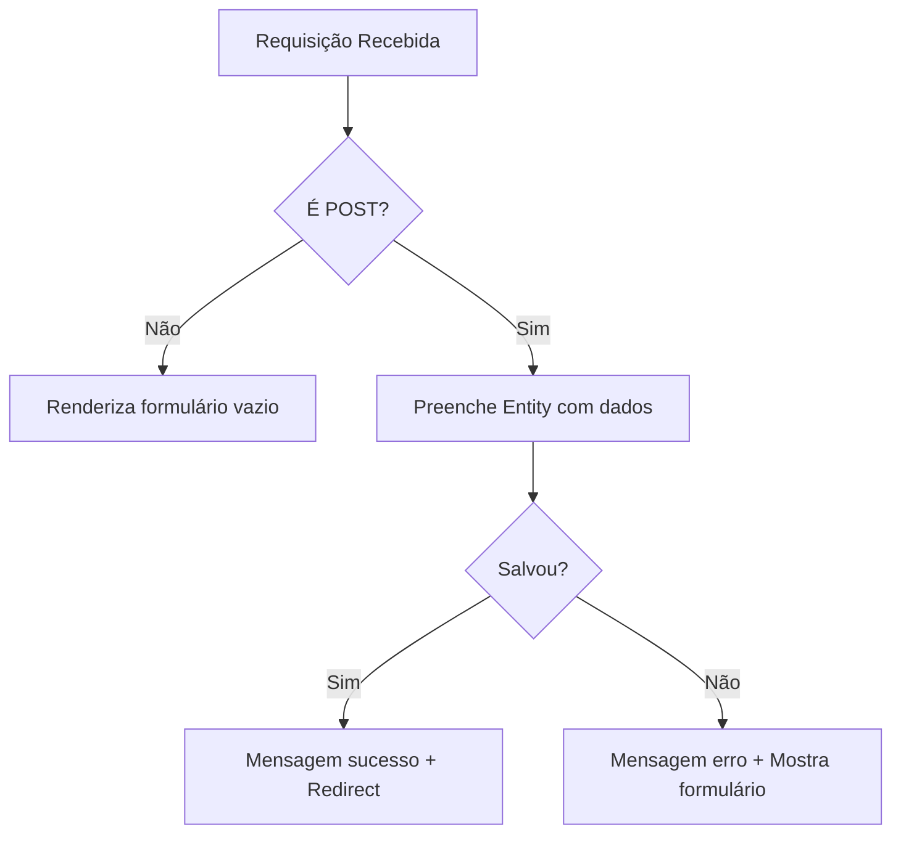

# Guia de Início Rápido

## 📚 Visão Geral

A melhor maneira de aprender CakePHP é colocando a mão na massa! Neste tutorial, você construirá uma aplicação **Sistema de Gerenciamento de Conteúdo (CMS)** simples, mas completa.

Ao final deste guia, você será capaz de:

- ✅ Instalar e configurar o CakePHP
- ✅ Criar e configurar banco de dados
- ✅ Desenvolver um CRUD completo (Create, Read, Update, Delete)
- ✅ Entender o padrão MVC no CakePHP
- ✅ Trabalhar com Models, Controllers e Views
- ✅ Implementar validação de dados
- ✅ Usar Helpers para criação de interfaces

!!! tip "Código Completo Disponível"
    Se você se perder durante o tutorial, pode ver o resultado final no repositório [cakephp/cms-tutorial](https://github.com/cakephp/cms-tutorial) no GitHub.

---

## 🛠️ Requisitos do Sistema

Antes de começar, certifique-se de ter:

### Requisitos Obrigatórios

| Componente | Versão Mínima | Descrição |
|-----------|---------------|-----------|
| **PHP** | 8.1+ | Linguagem de programação |
| **MySQL** ou **MariaDB** | 5.7+ / 10.3+ | Banco de dados relacional |
| **Composer** | 2.0+ | Gerenciador de dependências PHP |
| **pdo_mysql** | - | Extensão PHP para MySQL |

### Conhecimentos Recomendados

- Conhecimento básico de PHP
- Familiaridade com SQL
- Conceitos básicos de programação orientada a objetos

### Verificando a Versão do PHP

```bash
php -v
```

**Saída esperada:**
```
PHP 8.1.x (cli) (built: ...)
```

!!! warning "Atenção: Versões do PHP"
    A versão do PHP CLI (linha de comando) e do servidor web devem ser iguais e atender ao requisito mínimo.

---

## 📥 Instalação do CakePHP

### Passo 1: Instalar o Composer

Se você ainda não tem o Composer instalado:

=== "Linux/macOS"
    ```bash
    curl -s https://getcomposer.org/installer | php
    ```

=== "Windows"
    Baixe e execute o [Composer Windows Installer](https://getcomposer.org/Composer-Setup.exe)

### Passo 2: Criar o Projeto CakePHP

Navegue até o diretório onde deseja criar o projeto e execute:

=== "Linux/macOS"
    ```bash
    php composer.phar create-project cakephp/app:5.* cms
    ```

=== "Windows"
    ```bash
    composer create-project cakephp/app:5.* cms
    ```

!!! info "O que o Composer faz?"
    O Composer irá:

    - Baixar o skeleton do CakePHP 5
    - Instalar todas as dependências
    - Configurar permissões de arquivos
    - Criar o arquivo `config/app.php`

### Passo 3: Estrutura de Diretórios

Após a instalação, sua estrutura de pastas deve estar assim:

```
cms/
├── bin/              # Comandos console (cake)
├── config/           # Arquivos de configuração
├── plugins/          # Plugins da aplicação
├── resources/        # Recursos (locales, templates)
├── src/              # Código da aplicação
│   ├── Controller/   # Controllers
│   ├── Model/        # Models (Table e Entity)
│   └── View/         # Classes de View
├── templates/        # Templates de view (.php)
├── tests/            # Testes automatizados
├── tmp/              # Arquivos temporários e cache
├── vendor/           # Dependências do Composer
├── webroot/          # Arquivos públicos (CSS, JS, imagens)
├── composer.json     # Configuração de dependências
├── index.php         # Ponto de entrada
└── README.md         # Documentação do projeto
```

!!! tip "Entenda a Estrutura"
    - **src/** - Toda a lógica da aplicação fica aqui
    - **templates/** - Arquivos de visualização (HTML + PHP)
    - **webroot/** - Único diretório acessível publicamente
    - **tmp/** - Cache e logs (precisa permissão de escrita)

📖 **Leia mais:** [Estrutura de Pastas do CakePHP](../intro/cakephp-folder-structure.md)

---

## 🚀 Verificando a Instalação

### Iniciar o Servidor de Desenvolvimento

Navegue até o diretório do projeto:

```bash
cd cms
```

Inicie o servidor embutido do PHP:

=== "Linux/macOS"
    ```bash
    bin/cake server
    ```

=== "Windows"
    ```bash
    bin\cake server
    ```

**Saída esperada:**
```
Welcome to CakePHP v5.x.x Console
App : src
Path: /path/to/cms/
DocumentRoot: /path/to/cms/webroot
Ini Path: /etc/php/8.1/cli/php.ini
built-in server is running in http://localhost:8765/
```

### Acessar a Aplicação

Abra seu navegador e acesse: **http://localhost:8765**

Você verá a página de boas-vindas do CakePHP com vários indicadores de status:

✅ **Indicadores que devem estar verdes:**
- ✅ PHP version
- ✅ Temporary directory writable
- ✅ Logs directory writable
- ✅ Debug mode
- ✅ App encoding

⚠️ **Indicadores que podem estar amarelos/vermelhos (por enquanto):**
- ⚠️ Database connection (vamos configurar a seguir)

!!! warning "Extensões PHP Necessárias"
    Se algum indicador estiver vermelho, verifique se as extensões PHP necessárias estão instaladas:

    - **mbstring** - Manipulação de strings multibyte
    - **intl** - Internacionalização
    - **pdo_mysql** - Conexão com MySQL

---

## 💾 Criando o Banco de Dados

### Passo 1: Criar o Banco de Dados

Acesse o MySQL:

```bash
mysql -u root -p
```

Execute os comandos SQL:

```sql
CREATE DATABASE cake_cms CHARACTER SET utf8mb4 COLLATE utf8mb4_unicode_ci;
```

### Passo 2: Criar as Tabelas

```sql
USE cake_cms;

-- Tabela de usuários
CREATE TABLE users (
    id INT AUTO_INCREMENT PRIMARY KEY,
    email VARCHAR(255) NOT NULL,
    password VARCHAR(255) NOT NULL,
    created DATETIME,
    modified DATETIME
);

-- Tabela de artigos
CREATE TABLE articles (
    id INT AUTO_INCREMENT PRIMARY KEY,
    user_id INT NOT NULL,
    title VARCHAR(255) NOT NULL,
    slug VARCHAR(191) NOT NULL,
    body TEXT,
    published BOOLEAN DEFAULT FALSE,
    created DATETIME,
    modified DATETIME,
    UNIQUE KEY (slug),
    FOREIGN KEY user_key (user_id) REFERENCES users(id)
) CHARSET=utf8mb4;

-- Tabela de tags
CREATE TABLE tags (
    id INT AUTO_INCREMENT PRIMARY KEY,
    title VARCHAR(191),
    created DATETIME,
    modified DATETIME,
    UNIQUE KEY (title)
) CHARSET=utf8mb4;

-- Tabela de relacionamento artigos-tags
CREATE TABLE articles_tags (
    article_id INT NOT NULL,
    tag_id INT NOT NULL,
    PRIMARY KEY (article_id, tag_id),
    FOREIGN KEY tag_key(tag_id) REFERENCES tags(id),
    FOREIGN KEY article_key(article_id) REFERENCES articles(id)
);
```

!!! info "Sobre o Schema"
    **Por que `slug` tem tamanho 191?**

    No MySQL com charset utf8mb4, índices UNIQUE têm limite de 767 bytes. Como cada caractere utf8mb4 ocupa 4 bytes: 191 × 4 = 764 bytes (dentro do limite).

### Passo 3: Inserir Dados Iniciais

```sql
-- Usuário de teste
INSERT INTO users (email, password, created, modified)
VALUES ('cakephp@example.com', 'secret', NOW(), NOW());

-- Artigo de exemplo
INSERT INTO articles (user_id, title, slug, body, published, created, modified)
VALUES (1, 'Primeiro Post', 'primeiro-post', 'Este é o primeiro post.', 1, NOW(), NOW());
```

!!! danger "⚠️ SEGURANÇA: Senhas em Texto Puro"
    Este exemplo usa senha em texto puro (`'secret'`) **apenas para fins didáticos**.

    Em produção, SEMPRE use hashing de senhas (bcrypt/argon2). Vamos implementar isso mais tarde no tutorial de autenticação.

---

## ⚙️ Configuração da Conexão com Banco de Dados

Edite o arquivo **`config/app_local.php`** e localize a seção `Datasources.default`:

```php
<?php
// config/app_local.php
return [
    // ... outras configurações ...

    'Datasources' => [
        'default' => [
            'host' => 'localhost',
            //'port' => 'non_standard_port_number',
            'username' => 'cakephp',
            'password' => 'AngelF00dC4k3~',
            'database' => 'cake_cms',
            'url' => env('DATABASE_URL', null),
        ],
    ],

    // ... mais configurações ...
];
```

**Substitua** os valores de acordo com sua configuração:

| Parâmetro | Descrição | Exemplo |
|-----------|-----------|---------|
| `host` | Servidor do banco | `localhost` ou `127.0.0.1` |
| `username` | Usuário do MySQL | `root` ou seu usuário |
| `password` | Senha do MySQL | Sua senha |
| `database` | Nome do banco | `cake_cms` |

### Verificar a Conexão

Após salvar o arquivo, recarregue **http://localhost:8765** e verifique que o indicador **"CakePHP is able to connect to the database"** está verde ✅.

!!! tip "Arquivo app_local.php"
    O arquivo `app_local.php` é uma sobrescrita local de `app.php`. Ele NÃO deve ser commitado no controle de versão (já está no .gitignore) pois contém credenciais sensíveis.

---

## 🎲 Alternativa: Usando Migrations

Em vez de executar SQL manualmente, você pode usar o **Migrations Plugin**:

```bash
bin/cake bake migration CreateUsers email:string password:string created modified
bin/cake bake migration CreateArticles user_id:integer title:string slug:string[191]:unique body:text published:boolean created modified
bin/cake bake migration CreateTags title:string[191]:unique created modified
bin/cake bake migration CreateArticlesTags article_id:integer:primary tag_id:integer:primary
```

!!! warning "Ajustes Necessários"
    As migrations geradas podem definir `autoIncrement => true` nas chaves primárias compostas de `articles_tags`. Remova essas linhas antes de executar.

### Executar as Migrations

```bash
bin/cake migrations migrate
```

### Criar Seeds (Dados Iniciais)

```bash
bin/cake bake seed Users
bin/cake bake seed Articles
```

Edite os arquivos gerados em `config/Seeds/` e adicione os dados de exemplo, então execute:

```bash
bin/cake migrations seed
```

📖 **Leia mais:** [Plugin Migrations](https://book.cakephp.org/migrations/4/)

---

## 🗂️ Criando o Primeiro Model

Models são o **coração** das aplicações CakePHP. Eles permitem:

- Ler e modificar dados
- Definir relacionamentos entre dados
- Validar dados
- Aplicar regras de negócio

Os Models do CakePHP são compostos por dois tipos de objetos:

| Tipo | Localização | Responsabilidade |
|------|-------------|------------------|
| **Table** | `src/Model/Table/` | Representa uma coleção (tabela inteira) |
| **Entity** | `src/Model/Entity/` | Representa um registro individual |

### Criar ArticlesTable

Crie o arquivo **`src/Model/Table/ArticlesTable.php`**:

```php
<?php
// src/Model/Table/ArticlesTable.php
declare(strict_types=1);

namespace App\Model\Table;

use Cake\ORM\Table;

class ArticlesTable extends Table
{
    public function initialize(array $config): void
    {
        parent::initialize($config);

        // Adiciona behavior de timestamp automático
        $this->addBehavior('Timestamp');
    }
}
```

**O que isso faz?**

- ✅ **Convenção de nomenclatura:** `ArticlesTable` → tabela `articles`
- ✅ **TimestampBehavior:** Preenche automaticamente `created` e `modified`
- ✅ **Chave primária:** CakePHP assume que existe coluna `id`

!!! tip "Geração Automática via Bake"
    Você pode gerar este arquivo automaticamente:
    ```bash
    bin/cake bake model Articles
    ```

### Criar Article Entity

Crie o arquivo **`src/Model/Entity/Article.php`**:

```php
<?php
// src/Model/Entity/Article.php
declare(strict_types=1);

namespace App\Model\Entity;

use Cake\ORM\Entity;

class Article extends Entity
{
    protected array $_accessible = [
        'user_id' => true,
        'title' => true,
        'slug' => true,
        'body' => true,
        'published' => true,
        'created' => true,
        'modified' => true,
        'user' => true,
        'tags' => true,
    ];
}
```

**O que isso faz?**

- ✅ **`_accessible`:** Define quais campos podem ser modificados via mass assignment
- ✅ **Proteção:** Campos não listados serão ignorados em `patchEntity()`
- ✅ **Segurança:** Previne que usuários modifiquem campos sensíveis (como `id`)

!!! info "Mass Assignment Protection"
    Quando você faz `$this->Articles->patchEntity($article, $this->request->getData())`, apenas os campos listados em `$_accessible` serão atualizados, protegendo contra ataques de mass assignment.

---

## 🎮 Criando o Controller

Controllers no CakePHP:

- Tratam requisições HTTP
- Executam lógica de negócio
- Preparare dados para a View
- Gerenciam o fluxo da aplicação

### Criar ArticlesController

Crie o arquivo **`src/Controller/ArticlesController.php`**:

```php
<?php
// src/Controller/ArticlesController.php
declare(strict_types=1);

namespace App\Controller;

class ArticlesController extends AppController
{
}
```

Por enquanto, é só isso! Vamos adicionar as actions (ações) agora.

### Action: index (Listar Artigos)

Adicione o método `index()`:

```php
public function index()
{
    $articles = $this->paginate($this->Articles);
    $this->set(compact('articles'));
}
```

**O que isso faz?**

1. `$this->Articles` - Carrega o ArticlesTable automaticamente
2. `$this->paginate()` - Busca artigos com paginação
3. `$this->set()` - Passa variável `$articles` para a View

!!! info "Auto-loading de Models"
    O CakePHP carrega automaticamente o Model baseado no nome do Controller:

    `ArticlesController` → `ArticlesTable`

### Action: view (Visualizar Artigo)

```php
public function view($slug = null)
{
    $article = $this->Articles->findBySlug($slug)->firstOrFail();
    $this->set(compact('article'));
}
```

**O que isso faz?**

1. `findBySlug($slug)` - **Dynamic Finder**: busca por coluna `slug`
2. `firstOrFail()` - Retorna primeiro resultado ou lança exceção 404
3. Parâmetro `$slug` vem da URL: `/articles/view/primeiro-post`

!!! tip "Dynamic Finders"
    O CakePHP cria automaticamente métodos `findBy{Campo}()` para todas as colunas:

    - `findByEmail()`
    - `findByTitle()`
    - `findByPublished()`

### Action: add (Adicionar Artigo)

```php
public function add()
{
    $article = $this->Articles->newEmptyEntity();

    if ($this->request->is('post')) {
        $article = $this->Articles->patchEntity($article, $this->request->getData());

        // Temporário: usuário fixo (será removido após implementar autenticação)
        $article->user_id = 1;

        if ($this->Articles->save($article)) {
            $this->Flash->success(__('Seu artigo foi salvo.'));
            return $this->redirect(['action' => 'index']);
        }
        $this->Flash->error(__('Não foi possível adicionar seu artigo.'));
    }

    $this->set('article', $article);
}
```

**Fluxo da Action:**



**Componentes usados:**

- `$this->request->is('post')` - Verifica se é requisição POST
- `patchEntity()` - Preenche Entity com dados do formulário
- `save()` - Persiste no banco de dados
- `Flash->success()` - Mensagem de sucesso na sessão
- `redirect()` - Redireciona para outra action

!!! warning "FlashComponent já está carregado"
    O `FlashComponent` já foi carregado no `AppController.php` (linha 44), por isso podemos usá-lo diretamente com `$this->Flash`.

### Action: edit (Editar Artigo)

```php
public function edit($slug)
{
    $article = $this->Articles->findBySlug($slug)->firstOrFail();

    if ($this->request->is(['post', 'put'])) {
        $this->Articles->patchEntity($article, $this->request->getData());

        if ($this->Articles->save($article)) {
            $this->Flash->success(__('Seu artigo foi atualizado.'));
            return $this->redirect(['action' => 'index']);
        }
        $this->Flash->error(__('Não foi possível atualizar seu artigo.'));
    }

    $this->set('article', $article);
}
```

**Diferenças em relação ao `add()`:**

- ✅ Carrega artigo existente antes
- ✅ Aceita POST ou PUT
- ✅ Usa `patchEntity()` em entidade existente (não cria nova)

### Action: delete (Excluir Artigo)

```php
public function delete($slug)
{
    $this->request->allowMethod(['post', 'delete']);

    $article = $this->Articles->findBySlug($slug)->firstOrFail();

    if ($this->Articles->delete($article)) {
        $this->Flash->success(__('O artigo {0} foi excluído.', $article->title));
        return $this->redirect(['action' => 'index']);
    }
}
```

**Recursos de segurança:**

- `allowMethod(['post', 'delete'])` - Bloqueia requisições GET
- Previne que crawlers excluam conteúdo acidentalmente
- Lança exceção `MethodNotAllowedException` se for GET

!!! danger "⚠️ NUNCA permita DELETE via GET"
    Permitir exclusão via GET é **extremamente perigoso**:

    - Web crawlers podem seguir links e excluir dados
    - Pré-carregamento de navegadores pode acionar exclusões
    - Sempre use POST ou DELETE

### Controller Completo

<details>
<summary>Clique para ver o código completo do ArticlesController</summary>

```php
<?php
// src/Controller/ArticlesController.php
declare(strict_types=1);

namespace App\Controller;

class ArticlesController extends AppController
{
    public function index()
    {
        $articles = $this->paginate($this->Articles);
        $this->set(compact('articles'));
    }

    public function view($slug = null)
    {
        $article = $this->Articles->findBySlug($slug)->firstOrFail();
        $this->set(compact('article'));
    }

    public function add()
    {
        $article = $this->Articles->newEmptyEntity();

        if ($this->request->is('post')) {
            $article = $this->Articles->patchEntity($article, $this->request->getData());
            $article->user_id = 1;

            if ($this->Articles->save($article)) {
                $this->Flash->success(__('Seu artigo foi salvo.'));
                return $this->redirect(['action' => 'index']);
            }
            $this->Flash->error(__('Não foi possível adicionar seu artigo.'));
        }

        $this->set('article', $article);
    }

    public function edit($slug)
    {
        $article = $this->Articles->findBySlug($slug)->firstOrFail();

        if ($this->request->is(['post', 'put'])) {
            $this->Articles->patchEntity($article, $this->request->getData());

            if ($this->Articles->save($article)) {
                $this->Flash->success(__('Seu artigo foi atualizado.'));
                return $this->redirect(['action' => 'index']);
            }
            $this->Flash->error(__('Não foi possível atualizar seu artigo.'));
        }

        $this->set('article', $article);
    }

    public function delete($slug)
    {
        $this->request->allowMethod(['post', 'delete']);

        $article = $this->Articles->findBySlug($slug)->firstOrFail();

        if ($this->Articles->delete($article)) {
            $this->Flash->success(__('O artigo {0} foi excluído.', $article->title));
            return $this->redirect(['action' => 'index']);
        }
    }
}
```

</details>

!!! tip "Geração via Bake"
    Você pode gerar o controller automaticamente:
    ```bash
    bin/cake bake controller Articles
    ```

    **Nota:** O Bake NÃO gera os templates automaticamente.

---

## 🎨 Criando as Views (Templates)

Views são a camada de apresentação. Elas contém código PHP focado em exibir dados.

**Localização:** `templates/{ControllerName}/{action_name}.php`

### Convenção de Nomenclatura

| Controller | Action | Template |
|-----------|--------|----------|
| `ArticlesController` | `index()` | `templates/Articles/index.php` |
| `ArticlesController` | `view()` | `templates/Articles/view.php` |
| `ArticlesController` | `add()` | `templates/Articles/add.php` |
| `ArticlesController` | `edit()` | `templates/Articles/edit.php` |

### Template: index.php (Lista de Artigos)

Crie a pasta `templates/Articles/` e o arquivo **`index.php`**:

```php
<!-- File: templates/Articles/index.php -->
<h1>Artigos</h1>
<?= $this->Html->link('Adicionar Artigo', ['action' => 'add']) ?>

<table>
    <tr>
        <th>Título</th>
        <th>Criado em</th>
        <th>Ações</th>
    </tr>

    <?php foreach ($articles as $article): ?>
    <tr>
        <td>
            <?= $this->Html->link($article->title, ['action' => 'view', $article->slug]) ?>
        </td>
        <td>
            <?= $article->created->format(DATE_RFC850) ?>
        </td>
        <td>
            <?= $this->Html->link('Editar', ['action' => 'edit', $article->slug]) ?>
            <?= $this->Form->deleteLink(
                'Excluir',
                ['action' => 'delete', $article->slug],
                ['confirm' => 'Tem certeza?']
            ) ?>
        </td>
    </tr>
    <?php endforeach; ?>
</table>
```

**Helpers usados:**

- `$this->Html->link()` - Cria links usando routing reverso
- `$this->Form->deleteLink()` - Cria link que faz requisição DELETE
- `$article->created->format()` - Objeto `FrozenTime` do CakePHP

!!! info "HtmlHelper"
    O HtmlHelper está disponível automaticamente em todas as views.

    ```php
    // Em vez de:
    <a href="/articles/view/primeiro-post">Título</a>

    // Use:
    <?= $this->Html->link('Título', ['action' => 'view', 'primeiro-post']) ?>
    ```

    **Vantagem:** Se você mudar as rotas, os links atualizam automaticamente!

### Template: view.php (Detalhes do Artigo)

```php
<!-- File: templates/Articles/view.php -->
<h1><?= h($article->title) ?></h1>
<p><?= h($article->body) ?></p>
<p><small>Criado em: <?= $article->created->format(DATE_RFC850) ?></small></p>
<p><?= $this->Html->link('Editar', ['action' => 'edit', $article->slug]) ?></p>
```

!!! danger "Sempre use h() para output"
    A função `h()` faz escape de HTML, prevenindo ataques XSS:

    ```php
    // ❌ PERIGOSO:
    <?= $article->title ?>

    // ✅ SEGURO:
    <?= h($article->title) ?>
    ```

### Template: add.php (Adicionar Artigo)

```php
<!-- File: templates/Articles/add.php -->
<h1>Adicionar Artigo</h1>
<?php
    echo $this->Form->create($article);
    echo $this->Form->control('user_id', ['type' => 'hidden', 'value' => 1]);
    echo $this->Form->control('title', ['label' => 'Título']);
    echo $this->Form->control('body', ['label' => 'Conteúdo', 'rows' => '3']);
    echo $this->Form->button(__('Salvar Artigo'));
    echo $this->Form->end();
?>
```

**O que o FormHelper faz:**

```php
$this->Form->create($article)
```

Gera:
```html
<form method="post" action="/articles/add">
    <input type="hidden" name="_csrfToken" value="...">
```

- ✅ Adiciona proteção CSRF automaticamente
- ✅ Define action baseado na URL atual
- ✅ Configura `enctype` se houver upload de arquivo

```php
$this->Form->control('title')
```

Gera:
```html
<div class="input text">
    <label for="title">Title</label>
    <input type="text" name="title" id="title" />
</div>
```

- ✅ Detecta tipo do campo baseado no schema do banco
- ✅ Gera label automaticamente (com inflexão)
- ✅ Adiciona mensagens de erro se houver validação

!!! tip "Customizando Labels"
    ```php
    echo $this->Form->control('title', [
        'label' => 'Título do Artigo',
        'placeholder' => 'Digite um título incrível'
    ]);
    ```

### Template: edit.php (Editar Artigo)

```php
<!-- File: templates/Articles/edit.php -->
<h1>Editar Artigo</h1>
<?php
    echo $this->Form->create($article);
    echo $this->Form->control('user_id', ['type' => 'hidden']);
    echo $this->Form->control('title', ['label' => 'Título']);
    echo $this->Form->control('body', ['label' => 'Conteúdo', 'rows' => '3']);
    echo $this->Form->button(__('Salvar Artigo'));
    echo $this->Form->end();
?>
```

**Diferença entre add e edit:**

- `add.php` - Cria formulário vazio
- `edit.php` - Cria formulário preenchido com dados existentes

O FormHelper detecta automaticamente se é criação ou edição!

### Testando as Views

Acesse:

- **Lista:** http://localhost:8765/articles
- **Detalhes:** http://localhost:8765/articles/view/primeiro-post
- **Adicionar:** http://localhost:8765/articles/add
- **Editar:** http://localhost:8765/articles/edit/primeiro-post

---

## 🔧 Adicionando Recursos Avançados

### 1. Geração Automática de Slug

Atualmente, se tentarmos salvar um artigo, receberemos erro pois `slug` é `NOT NULL` mas não estamos preenchendo.

Vamos adicionar um callback no **ArticlesTable** para gerar o slug automaticamente:

```php
<?php
// src/Model/Table/ArticlesTable.php
namespace App\Model\Table;

use Cake\ORM\Table;
use Cake\Utility\Text;
use Cake\Event\EventInterface;

class ArticlesTable extends Table
{
    public function initialize(array $config): void
    {
        parent::initialize($config);
        $this->addBehavior('Timestamp');
    }

    public function beforeSave(EventInterface $event, $entity, $options): void
    {
        if ($entity->isNew() && !$entity->slug) {
            $sluggedTitle = Text::slug($entity->title);
            // Limita ao tamanho máximo definido no schema
            $entity->slug = substr($sluggedTitle, 0, 191);
        }
    }
}
```

**O que isso faz:**

1. Verifica se é uma entidade nova (`isNew()`)
2. Verifica se o slug não foi preenchido manualmente
3. Gera slug a partir do título usando `Text::slug()`
4. Limita a 191 caracteres (tamanho da coluna)

**Exemplo de transformação:**

| Título | Slug Gerado |
|--------|-------------|
| "Meu Primeiro Artigo" | `meu-primeiro-artigo` |
| "Tutorial CakePHP 5" | `tutorial-cakephp-5` |
| "Artigo com Acentuação" | `artigo-com-acentuacao` |

!!! info "beforeSave Callback"
    O ORM do CakePHP fornece vários callbacks:

    - `beforeSave()` - Antes de salvar
    - `afterSave()` - Após salvar
    - `beforeDelete()` - Antes de excluir
    - `afterDelete()` - Após excluir

📖 **Leia mais:** [Table Callbacks](../orm/table-objects.md#callbacks)

### 2. Validação de Dados

Vamos adicionar regras de validação para garantir dados consistentes:

```php
<?php
// src/Model/Table/ArticlesTable.php
namespace App\Model\Table;

use Cake\ORM\Table;
use Cake\Validation\Validator;
use Cake\Utility\Text;
use Cake\Event\EventInterface;

class ArticlesTable extends Table
{
    // ... initialize() e beforeSave() ...

    public function validationDefault(Validator $validator): Validator
    {
        $validator
            ->notEmptyString('title', 'O título é obrigatório')
            ->minLength('title', 10, 'O título deve ter no mínimo 10 caracteres')
            ->maxLength('title', 255, 'O título deve ter no máximo 255 caracteres')

            ->notEmptyString('body', 'O conteúdo é obrigatório')
            ->minLength('body', 10, 'O conteúdo deve ter no mínimo 10 caracteres');

        return $validator;
    }
}
```

**Regras aplicadas:**

| Campo | Regras |
|-------|--------|
| **title** | Obrigatório, 10-255 caracteres |
| **body** | Obrigatório, mínimo 10 caracteres |

**Como funciona:**

1. Quando `save()` é chamado, validação é executada automaticamente
2. Se houver erros, `save()` retorna `false`
3. Erros ficam disponíveis em `$entity->getErrors()`
4. FormHelper exibe erros automaticamente nos formulários

**Teste a validação:**

Tente adicionar um artigo com título vazio ou muito curto. Você verá mensagens de erro aparecerem nos formulários!

!!! tip "Validação Customizada"
    Você pode criar regras de validação personalizadas:

    ```php
    $validator->add('title', 'custom', [
        'rule' => function ($value, $context) {
            return !str_contains($value, 'spam');
        },
        'message' => 'Título contém palavras proibidas'
    ]);
    ```

📖 **Leia mais:** [Validação](../core-libraries/validation.md)

---

## 🎯 Resumo do que Aprendemos

Parabéns! Você construiu uma aplicação CMS funcional com CakePHP. Aqui está o que cobrimos:

### ✅ Instalação e Configuração
- Instalar CakePHP via Composer
- Configurar banco de dados
- Entender estrutura de diretórios

### ✅ Banco de Dados
- Criar tabelas com SQL
- Configurar conexão
- Usar Migrations (alternativa)

### ✅ Arquitetura MVC

**Model (Modelo):**
- Table objects (ArticlesTable)
- Entities (Article)
- Behaviors (Timestamp)
- Callbacks (beforeSave)
- Validação

**Controller (Controlador):**
- Actions (index, view, add, edit, delete)
- Request handling
- Redirect e Flash messages
- Paginação

**View (Visão):**
- Templates PHP
- Helpers (Html, Form)
- Layouts
- Escape de dados (h())

### ✅ Recursos do CakePHP
- Convenções sobre configuração
- Auto-loading de classes
- Dynamic Finders
- Mass Assignment Protection
- CSRF Protection automático
- Paginação
- Slug generation
- Validação de dados

---

## 🚀 Próximos Passos

Este é apenas o começo! Continue sua jornada:

### Próximos Tutoriais

1. **[Autenticação](cms/authentication.md)** - Sistema de login
2. **[Autorização](cms/authorization.md)** - Controle de permissões
3. **[Tags e Relacionamentos](cms/tags-and-users.md)** - Associações BelongsToMany

### Aprenda Mais

- **[Controllers Avançados](../controllers.md)** - Componentes, Middleware
- **[ORM Avançado](../orm.md)** - Queries complexas, Eager loading
- **[Testing](../development/testing.md)** - Testes automatizados
- **[Deployment](../deployment.md)** - Publicar em produção

### Recursos Adicionais

- 📘 [Documentação Oficial](https://book.cakephp.org/5/pt/)
- 💬 [Fórum da Comunidade](https://discourse.cakephp.org/)
- 💻 [GitHub - cakephp/cakephp](https://github.com/cakephp/cakephp)
- 🎓 [Awesome CakePHP](https://github.com/FriendsOfCake/awesome-cakephp)

---

## 🤔 Perguntas Frequentes

??? question "Posso usar outro banco de dados além do MySQL?"
    Sim! CakePHP suporta:

    - MySQL/MariaDB
    - PostgreSQL
    - SQLite
    - SQL Server

    Basta configurar o driver correto em `app_local.php`.

??? question "Como adiciono CSS/JavaScript?"
    Coloque arquivos em `webroot/css/` e `webroot/js/`, então use:

    ```php
    // No template
    <?= $this->Html->css('mystyle') ?>
    <?= $this->Html->script('myjavascript') ?>
    ```

??? question "Posso usar Bootstrap/Tailwind?"
    Sim! Você pode usar qualquer framework CSS. Basta incluir os arquivos ou CDN no seu layout.

??? question "O Bake substitui trabalho manual?"
    O Bake é ótimo para scaffolding rápido, mas é recomendado entender o código gerado e customizá-lo conforme necessário.

??? question "Como faço deploy em produção?"
    Veja o guia completo de [Deployment](../deployment.md). Resumo:

    - Configure `DEBUG` para `false`
    - Use servidor web real (Apache/Nginx)
    - Configure cache
    - Use HTTPS

---

**Pronto para continuar?** Vá para o próximo tutorial: [Autenticação →](cms/authentication.md)
