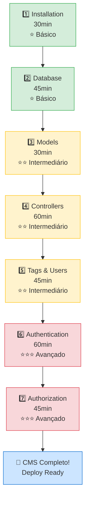

# Tutoriais e Exemplos Práticos

**🎯 Aprenda CakePHP construindo um projeto completo do zero**

---

## 📖 Sobre Esta Seção

Nesta seção, você vai **construir aplicações CakePHP reais** passo a passo, vendo como todas as peças do framework se encaixam na prática.

Diferente da documentação de referência, aqui você coloca a mão no código e cria um **CMS (Content Management System) completo e funcional**, incluindo autenticação, autorização, CRUD de artigos, sistema de tags e muito mais.

---

## 🎯 O Que Você Vai Construir

### 📝 CMS Tutorial - Projeto Principal

Um sistema de gerenciamento de conteúdo completo com:

<div class="grid cards" markdown>

-   :material-file-document-edit:{ .lg .middle } **CRUD de Artigos**

    ---

    Criar, ler, atualizar e deletar artigos

    ✅ Formulários de criação/edição
    ✅ Validação de dados
    ✅ Slugs únicos auto-gerados
    ✅ Status publicado/rascunho

-   :material-tag-multiple:{ .lg .middle } **Sistema de Tags**

    ---

    Categorize artigos com tags reutilizáveis

    ✅ Relacionamento many-to-many
    ✅ Junction table (articles_tags)
    ✅ Busca por tag
    ✅ Auto-complete de tags

-   :material-shield-account:{ .lg .middle } **Autenticação**

    ---

    Login e logout de usuários

    ✅ Hash seguro de senhas
    ✅ Sessões persistentes
    ✅ AuthenticationPlugin
    ✅ Proteção de rotas

-   :material-shield-lock:{ .lg .middle } **Autorização**

    ---

    Controle de permissões baseado em recursos

    ✅ Policies (regras de negócio)
    ✅ Resource-based authorization
    ✅ Ownership checks (só autor edita)
    ✅ AuthorizationPlugin

-   :material-database:{ .lg .middle } **Banco de Dados**

    ---

    Schema profissional e migrations

    ✅ MySQL e PostgreSQL
    ✅ Foreign keys e índices
    ✅ Migrations versionadas
    ✅ Seeders de dados

-   :material-clock-time-eight:{ .lg .middle } **Timestamps Automáticos**

    ---

    Rastreio automático de datas

    ✅ `created` e `modified`
    ✅ TimestampBehavior
    ✅ Soft deletes (opcional)
    ✅ Audit trail

</div>

---

## ⏱️ Quanto Tempo Leva?

| Perfil | Tempo Estimado | Observações |
|--------|---------------|-------------|
| **🟢 Dev Experiente** | 1-2 horas | Já conhece MVC, foca em sintaxe CakePHP |
| **🟡 Dev PHP Intermediário** | 3-5 horas | Conhece PHP OOP, aprende padrões CakePHP |
| **🟠 Iniciante em Frameworks** | 6-8 horas | Primeira vez com MVC, estuda conceitos |
| **🔴 Estudante/Aprendendo PHP** | 8-12 horas | Inclui tempo para pesquisa e experimentação |

!!! tip "Dica: Você não precisa fazer tudo de uma vez!"
    Cada etapa do tutorial é independente. Você pode pausar e voltar depois sem problemas.

---

## ✅ Pré-Requisitos

Antes de começar, certifique-se que possui:

### 🖥️ Software

- [x] **PHP 8.1+** instalado
  ```bash
  php -v  # Verifique sua versão
  ```

- [x] **Composer** instalado
  ```bash
  composer -V  # Verifique se está instalado
  ```

- [x] **MySQL 8.0+** OU **PostgreSQL 14+** OU **SQLite 3**
  ```bash
  mysql --version
  # ou
  psql --version
  ```

- [x] **Terminal/Linha de comando** (Bash, PowerShell, etc.)

### 🧠 Conhecimentos

- [x] **PHP Orientado a Objetos**
  - Classes, namespaces, herança
  - Type hints e strict types

- [x] **SQL Básico**
  - `CREATE TABLE`, `INSERT`, `SELECT`
  - Foreign keys e joins

- [x] **Pattern MVC** (desejável, mas não obrigatório)
  - Model, View, Controller
  - Se não conhece, veja [Intro to CakePHP](../intro/intro.md)

- [x] **Git Básico** (opcional, mas recomendado)
  - `clone`, `commit`, `push`

!!! warning "Primeira vez com frameworks MVC?"
    Recomendamos ler primeiro:

    - 📖 [Introdução ao CakePHP](../intro/intro.md) - Entenda MVC e Request Cycle
    - 📖 [Convenções do CakePHP](../intro/conventions.md) - Regras de nomenclatura
    - 📖 [Estrutura de Diretórios](../intro/cakephp-folder-structure.md) - Onde fica cada arquivo

---

## 🗺️ Roadmap do Tutorial CMS

O tutorial é dividido em **7 etapas progressivas**, cada uma construindo sobre a anterior:



### Detalhamento das Etapas

=== "Etapa 1: Instalação"

    **⏱️ Tempo:** 30 minutos
    **🎯 Nível:** ⭐ Básico

    **O que você vai fazer:**

    - Instalar CakePHP via Composer
    - Configurar servidor de desenvolvimento
    - Verificar checklist de instalação
    - Entender estrutura de diretórios

    **Conceitos aprendidos:**

    - Skeleton application
    - Composer (gerenciador de dependências)
    - Built-in development server (`bin/cake server`)
    - Welcome page e troubleshooting inicial

    [:octicons-arrow-right-24: Iniciar Etapa 1](cms/installation.md)

=== "Etapa 2: Database"

    **⏱️ Tempo:** 45 minutos
    **🎯 Nível:** ⭐ Básico

    **O que você vai fazer:**

    - Criar banco de dados `cake_cms`
    - Executar schema SQL (tables users, articles, tags)
    - Configurar conexão em `config/app_local.php`
    - (Opcional) Usar Migrations em vez de SQL direto

    **Conceitos aprendidos:**

    - Database configuration
    - Naming conventions (tables, foreign keys)
    - Composite primary keys (articles_tags)
    - Migrations vs SQL raw
    - Charset utf8mb4 (suporte a emoji)

    [:octicons-arrow-right-24: Iniciar Etapa 2](cms/database.md)

=== "Etapa 3: Models"

    **⏱️ Tempo:** 30 minutos
    **🎯 Nível:** ⭐⭐ Intermediário

    **O que você vai fazer:**

    - Criar `ArticlesTable` (collection)
    - Criar `Article` Entity (single record)
    - Adicionar TimestampBehavior
    - Configurar mass assignment (`$_accessible`)

    **Conceitos aprendidos:**

    - Table objects (collections)
    - Entity objects (rows)
    - Behaviors (TimestampBehavior)
    - Mass assignment protection
    - Conventions (ArticlesTable → articles table)

    [:octicons-arrow-right-24: Iniciar Etapa 3](cms/articles-model.md)

=== "Etapa 4: Controllers"

    **⏱️ Tempo:** 60 minutos
    **🎯 Nível:** ⭐⭐ Intermediário

    **O que você vai fazer:**

    - Criar `ArticlesController`
    - Implementar actions: `index`, `view`, `add`, `edit`, `delete`
    - Criar templates correspondentes
    - Validar formulários

    **Conceitos aprendidos:**

    - Controller actions (CRUD completo)
    - Templates (Views)
    - `find()`, `get()`, `save()`, `delete()`
    - Flash messages
    - Redirects

    [:octicons-arrow-right-24: Iniciar Etapa 4](cms/articles-controller.md)

=== "Etapa 5: Tags & Users"

    **⏱️ Tempo:** 45 minutos
    **🎯 Nível:** ⭐⭐ Intermediário

    **O que você vai fazer:**

    - Criar `TagsTable` e `UsersTable`
    - Configurar associations (belongsTo, belongsToMany)
    - Implementar formulário de tags
    - Exibir autor do artigo

    **Conceitos aprendidos:**

    - Associations (relacionamentos)
    - `belongsTo` (Articles → Users)
    - `belongsToMany` (Articles ↔ Tags)
    - Junction tables (articles_tags)
    - `contain()` (eager loading)

    [:octicons-arrow-right-24: Iniciar Etapa 5](cms/tags-and-users.md)

=== "Etapa 6: Authentication"

    **⏱️ Tempo:** 60 minutos
    **🎯 Nível:** ⭐⭐⭐ Avançado

    !!! warning "Plugin Necessário"
        Esta etapa requer o plugin `cakephp/authentication`.

        **Instale antes de começar:**
        ```bash
        composer require cakephp/authentication
        ```

    **O que você vai fazer:**

    - Instalar `cakephp/authentication`
    - Criar `UsersController` com login/logout
    - Configurar middleware de autenticação
    - Hash de senhas com `DefaultPasswordHasher`
    - Proteger rotas (exceto login)

    **Conceitos aprendidos:**

    - AuthenticationPlugin
    - Middleware stack
    - Password hashing (bcrypt)
    - Identity interface
    - Session persistence
    - Login/logout flow

    [:octicons-arrow-right-24: Iniciar Etapa 6](cms/authentication.md)

=== "Etapa 7: Authorization"

    **⏱️ Tempo:** 45 minutos
    **🎯 Nível:** ⭐⭐⭐ Avançado

    !!! warning "Plugin Necessário"
        Esta etapa requer o plugin `cakephp/authorization`.

        **Instale antes de começar:**
        ```bash
        composer require cakephp/authorization
        ```

    **O que você vai fazer:**

    - Instalar `cakephp/authorization`
    - Criar `ArticlesPolicy` (regras de negócio)
    - Implementar ownership check (só autor edita)
    - Autorizar actions edit/delete
    - Testar permissões

    **Conceitos aprendidos:**

    - AuthorizationPlugin
    - Policies (regras de autorização)
    - Resource-based authorization
    - `can()` helper
    - Ownership verification (user_id check)

    [:octicons-arrow-right-24: Iniciar Etapa 7](cms/authorization.md)

---

## 🎓 O Que Você Vai Aprender

Ao completar este tutorial, você dominará:

### 🏗️ Arquitetura MVC

- [x] **Models:** Table objects, Entities, Behaviors
- [x] **Views:** Templates, Forms, Helpers
- [x] **Controllers:** Actions, Request/Response, Redirects

### 💾 ORM (Object-Relational Mapping)

- [x] **CRUD Operations:** Create, Read, Update, Delete
- [x] **Query Builder:** `find()`, `where()`, `contain()`
- [x] **Associations:** belongsTo, hasMany, belongsToMany
- [x] **Behaviors:** Timestamp, SoftDelete (conceito)
- [x] **Validation:** Rules, custom validators

### 🗄️ Database

- [x] **Migrations:** Versionamento de schema
- [x] **Seeders:** Dados de teste/desenvolvimento
- [x] **Naming Conventions:** tables, columns, foreign keys
- [x] **Composite Primary Keys:** Junction tables

### 🔐 Segurança

- [x] **Authentication:** Login, logout, sessions
- [x] **Authorization:** Policies, permissions
- [x] **Password Hashing:** bcrypt (DefaultPasswordHasher)
- [x] **Mass Assignment Protection:** `$_accessible`
- [x] **CSRF Protection:** Form tokens (implícito)

### 🛠️ Ferramentas

- [x] **Bake:** Code generation (`bin/cake bake`)
- [x] **Console:** Commands (`bin/cake`)
- [x] **Dev Server:** Built-in webserver
- [x] **Composer:** Dependency management

---

## 🚀 Como Usar Este Tutorial

### Opção 1: Passo a Passo (Recomendado para Iniciantes)

**Melhor para:** Aprender conceitos profundamente

1. Leia cada etapa com atenção
2. Digite o código manualmente (não copie/cole)
3. Teste cada funcionalidade antes de avançar
4. Experimente variações (mude nomes, adicione campos)

**Vantagens:**
- ✅ Aprende conceitos fundamentais
- ✅ Desenvolve muscle memory
- ✅ Entende o "por quê" de cada decisão

**Desvantagens:**
- ⏱️ Mais demorado (6-12 horas para iniciantes)

---

### Opção 2: Clone e Explore (Para Devs Experientes)

**Melhor para:** Ver código pronto e adaptar para seu projeto

1. Clone o repositório final do GitHub
2. Leia o código pronto
3. Execute localmente
4. Adapte para suas necessidades

```bash
# Clone o repositório
git clone https://github.com/cakephp/cms-tutorial.git
cd cms-tutorial

# Instale dependências
composer install

# Configure database
cp config/app_local.example.php config/app_local.php
# Edite config/app_local.php com suas credenciais

# Rode migrations
bin/cake migrations migrate

# Inicie servidor
bin/cake server
```

**Vantagens:**
- ✅ Rápido (30min-1h para setup)
- ✅ Vê código production-ready
- ✅ Pode focar em partes específicas

**Desvantagens:**
- ❌ Pode não entender conceitos profundamente
- ❌ Requer debugging se algo quebrar

🐙 **Repositório oficial:** [github.com/cakephp/cms-tutorial](https://github.com/cakephp/cms-tutorial)

---

### Opção 3: Híbrida (Recomendado para Intermediários)

**Melhor para:** Balance entre aprendizado e velocidade

1. Leia as etapas 1-3 (fundamentos)
2. Use `bin/cake bake` para gerar código nas etapas 4-5
3. Leia código gerado para entender
4. Faça etapas 6-7 manualmente (auth/authz são críticos)

**Vantagens:**
- ✅ Aprende conceitos críticos
- ✅ Economiza tempo em CRUD boilerplate
- ✅ Entende poder do Bake

**Desvantagens:**
- ⚠️ Pode não entender 100% do código Bake gerado

---

## 💡 Dicas Para Aproveitar Melhor

### Antes de Começar

!!! tip "Prepare seu Ambiente"
    - ✅ Tenha um editor com autocomplete PHP (VS Code, PHPStorm)
    - ✅ Instale extensão PHP Intelephense (VS Code)
    - ✅ Configure Xdebug para debugging (opcional mas útil)
    - ✅ Tenha cliente MySQL (TablePlus, DBeaver, phpMyAdmin)

### Durante o Tutorial

!!! tip "Boas Práticas"
    - 🐛 **Use `debug()`:** CakePHP tem função `debug()` excelente
    - 📝 **Leia mensagens de erro:** Errors do CakePHP são descritivos
    - 🔍 **Use DebugKit:** Plugin incluído, acesse `/_debug` no browser
    - 💾 **Commite no Git:** Faça commits a cada etapa concluída
    - 🧪 **Teste no browser:** Não confie apenas no código, veja funcionando

### Se Travar

!!! warning "Não Desista!"
    Se você encontrar um erro ou não entender algo:

    1. **Leia a mensagem de erro completa** (não apenas primeira linha)
    2. **Verifique o código final no GitHub** - compare com seu código
    3. **Use DebugKit** - veja queries SQL executadas
    4. **Busque no Stack Overflow** - tag `[cakephp]`
    5. **Pergunte no Slack CakePHP** - canal #support (resposta em horas)

    📚 **Recursos de Suporte:**

    - 💬 [Slack CakePHP](https://cakesf.slack.com) - Chat em tempo real
    - 📝 [Forum Discourse](https://discourse.cakephp.org) - Discussões assíncronas
    - 📚 [Stack Overflow](https://stackoverflow.com/questions/tagged/cakephp) - Q&A indexado
    - 🐙 [GitHub Issues](https://github.com/cakephp/cakephp/issues) - Apenas bugs do core

    🇧🇷 **Em português:**

    - Canal Slack `#portuguese`
    - [CakePHP Brasil](https://cakephp.com.br) (comunidade)

---

## 🌐 Vindo de Outros Frameworks?

Se você já conhece outro framework PHP, veja as equivalências:

=== "Laravel → CakePHP"

    | Laravel | CakePHP 5 | Observações |
    |---------|-----------|------------|
    | **Eloquent Model** | **Table + Entity** | CakePHP separa collection (Table) de row (Entity) |
    | `php artisan make:model` | `bin/cake bake model` | Bake gera Table + Entity + Tests |
    | **Traits** | **Behaviors** | Behaviors são mais configuráveis |
    | **Guards** (Auth) | **AuthenticationPlugin** | Plugin separado do core (CakePHP 5+) |
    | **Policies** | **Policies** | Mesmo conceito! (AuthorizationPlugin) |
    | `Route::get()` | `$routes->connect()` | Syntax diferente, conceito igual |
    | **Blade** | **PHP Templates** | CakePHP usa PHP puro (sem DSL) |
    | `@if` / `@foreach` | `<?php if ?>` / `<?php foreach ?>` | Sem syntax sugar |
    | **Migrations** | **Migrations** | Mesmo conceito (usa Phinx por baixo) |
    | `php artisan tinker` | `bin/cake console` | REPL interativo |

    !!! tip "Principal Diferença"
        **Laravel:** Eloquent é ActiveRecord (Model = Table + Row)
        **CakePHP:** Separa Table (collection) e Entity (row) - mais flexível para queries complexas

=== "Symfony → CakePHP"

    | Symfony | CakePHP 5 | Observações |
    |---------|-----------|------------|
    | **Doctrine ORM** | **CakePHP ORM** | ORM nativo (mais simples que Doctrine) |
    | **Entities** | **Table + Entity** | Conceito similar, nomes diferentes |
    | `bin/console make:entity` | `bin/cake bake model` | Code generation |
    | **Services** | **Services/Libraries** | Mesmo padrão |
    | **Security component** | **AuthenticationPlugin** | Plugin separado |
    | **Voters** | **Policies** | Authorization |
    | **Twig** | **PHP Templates** | CakePHP usa PHP puro |
    | **Forms (FormType)** | **FormHelper** | CakePHP usa helpers, não classes |
    | **Annotations/Attributes** | **Conventions** | CakePHP prefere convenções |

    !!! tip "Principal Diferença"
        **Symfony:** Configuração explícita (YAML/Annotations)
        **CakePHP:** Convention over Configuration (menos config, mais convenções)

=== "Django → CakePHP"

    | Django (Python) | CakePHP 5 (PHP) | Observações |
    |-----------------|-----------------|------------|
    | **Models** | **Table classes** | Conceito similar |
    | **Views** | **Controllers** | ⚠️ Terminologia invertida! |
    | **Templates** | **Templates** | Mesmo conceito |
    | **ORM QuerySets** | **Query Builder** | Syntax diferente, funcionalidade similar |
    | `python manage.py` | `bin/cake` | Console commands |
    | **Django Admin** | **CRUD via Bake** | CakePHP não tem admin pronto (use Bake) |
    | **Middleware** | **Middleware** | Mesmo conceito! |
    | **Forms** | **FormHelper** | Helpers vs Classes |

    !!! warning "Cuidado com Terminologia!"
        **Django View** = **CakePHP Controller**
        **Django Template** = **CakePHP Template (View)**

=== "CodeIgniter → CakePHP"

    | CodeIgniter 4 | CakePHP 5 | Observações |
    |---------------|-----------|------------|
    | **Models** | **Table + Entity** | CakePHP separa collection/row |
    | **Controllers** | **Controllers** | Mesma ideia |
    | **Views** | **Templates** | Mesma ideia |
    | **Libraries** | **Behaviors/Helpers** | Conceito similar |
    | **Helpers** | **Helpers** | Mesmo nome! |
    | `spark make:model` | `bin/cake bake model` | Code generation |
    | **Query Builder** | **Query Builder** | Syntax parecida |

    !!! tip "Migration Fácil!"
        CodeIgniter e CakePHP têm filosofias similares (lightweight, convention).
        Migração é mais suave que Laravel → CakePHP.

---

## 🇧🇷 Recursos em Português Brasileiro

### 📚 Documentação

- 📘 **Este tutorial traduzido** - Você está aqui!
- 📗 [Documentação oficial PT-BR](https://book.cakephp.org/5/pt/) - (se disponível)

### 💬 Comunidade

- **Slack #portuguese** - Canal lusófono (Brasil + Portugal)
- **Grupos Facebook:** Busque "CakePHP Brasil" ou "PHP Brasil"
- **Telegram:** Grupos de PHP que discutem CakePHP

### 🎥 Vídeos

- 🎥 [YouTube: CakePHP Brasil](https://youtube.com/@cakephpbrasil) (se existir)
- 🎥 Busque "CakePHP tutorial português" no YouTube

### 🏢 Hostings Brasileiros

Se você planeja fazer deploy no Brasil:

| Hosting | Tipo | Suporta CakePHP 5? | Notas |
|---------|------|-------------------|-------|
| **Locaweb** | Compartilhado | ✅ Sim (PHP 8.1+) | Popular, cPanel |
| **Hostgator BR** | Compartilhado | ✅ Sim (PHP 8.1+) | Suporte em PT |
| **UOL Host** | Compartilhado | ✅ Sim | Nacional |
| **Railway.app** | PaaS (Cloud) | ✅ Sim | Hobby tier gratuito |
| **Heroku** | PaaS (Cloud) | ✅ Sim | Hobby tier pago |
| **AWS Lightsail** | VPS | ✅ Sim | Gerenciado |

!!! tip "Timezone e Locale"
    Configure seu app para o Brasil:

    ```php
    // config/app.php
    'App' => [
        'defaultLocale' => 'pt_BR',
        'defaultTimezone' => 'America/Sao_Paulo',
        'encoding' => 'UTF-8',
    ],
    ```

### 🔧 Validações Brasileiras

Se seu CMS precisa validar CPF, CNPJ, CEP:

```bash
# Instale plugin de validações brasileiras
composer require cakebr/validation
```

```php
// Em ArticlesTable.php (ou outro model)
use CakeBR\Validation\Validation as BrValidation;

public function validationDefault(Validator $validator): Validator
{
    $validator->setProvider('br', BrValidation::class);

    $validator->add('cpf', 'cpf', [
        'rule' => 'cpf',
        'provider' => 'br',
        'message' => 'CPF inválido'
    ]);

    $validator->add('cep', 'cep', [
        'rule' => 'cep',
        'provider' => 'br',
        'message' => 'CEP inválido'
    ]);

    return $validator;
}
```

**Plugin:** [github.com/cakebr/validation](https://github.com/cakebr/validation)

---

## 📚 Próximos Passos Após o Tutorial

Completou o CMS? Parabéns! 🎉 Agora você pode:

### 🚀 Expanda o Projeto

- [ ] **Adicione upload de imagens** - [FileStorage plugin](https://github.com/FriendsOfCake/cakephp-upload)
- [ ] **Implemente busca full-text** - [Search plugin](https://github.com/FriendsOfCake/search)
- [ ] **Crie REST API** - [API Documentation](../development/rest.md)
- [ ] **Adicione testes** - [Testing Guide](../development/testing.md)
- [ ] **Implemente cache** - [Caching](../core-libraries/caching.md)
- [ ] **Sistema de comentários** - Relacionamento hasMany aninhado
- [ ] **Categorias hierárquicas** - TreeBehavior

### 📖 Estude Tópicos Avançados

- [ ] [REST API Development](../development/rest.md)
- [ ] [Testing](../development/testing.md) - PHPUnit + Fixtures
- [ ] [Caching Strategies](../core-libraries/caching.md)
- [ ] [Events System](../core-libraries/events.md)
- [ ] [Dependency Injection](../development/dependency-injection.md)
- [ ] [Middleware](../controllers/middleware.md)
- [ ] [Queue/Jobs](https://github.com/cakephp/queue) - Background tasks
- [ ] [ElasticSearch Integration](../elasticsearch.md)

### 🔌 Explore Plugins da Comunidade

- **CRUD Administrativo:** [CakeDC/Users](https://github.com/CakeDC/users)
- **Upload de Arquivos:** [Josegonzalez/Upload](https://github.com/FriendsOfCake/cakephp-upload)
- **Busca/Filtros:** [FriendsOfCake/Search](https://github.com/FriendsOfCake/search)
- **Queue/Jobs:** [CakePHP/Queue](https://github.com/cakephp/queue)
- **Soft Delete:** [PUGX/SoftDelete](https://github.com/PUGX/cakephp-soft-delete-trait)
- **IDE Autocomplete:** [dereuromark/cakephp-ide-helper](https://github.com/dereuromark/cakephp-ide-helper)
- **Lista completa:** [Awesome CakePHP](https://github.com/FriendsOfCake/awesome-cakephp)

### 🌐 Faça Deploy

- [ ] **Heroku:** [Tutorial Deploy Heroku](https://devcenter.heroku.com/articles/getting-started-with-php)
- [ ] **Railway.app:** Deploy automático via GitHub
- [ ] **Servidor tradicional:** [Deployment Guide](../deployment.md)
- [ ] **Docker:** Containerize sua aplicação

### 💼 Construa Portfolio

- [ ] Adicione CMS no seu GitHub com README bem escrito
- [ ] Deploy em domínio próprio (Railway.app gratuito + Namecheap $1/ano)
- [ ] Crie case study: problema → solução → resultados
- [ ] Contribua com a comunidade (responda dúvidas no Slack)

---

## 🎯 Checklist de Progresso

Marque conforme avança no tutorial:

- [ ] ✅ **Etapa 1:** Instalação CakePHP concluída
- [ ] ✅ **Etapa 2:** Database criado e configurado
- [ ] ✅ **Etapa 3:** Models (ArticlesTable + Article Entity) criados
- [ ] ✅ **Etapa 4:** CRUD completo funcionando (index, view, add, edit, delete)
- [ ] ✅ **Etapa 5:** Tags e Users associados, relacionamentos testados
- [ ] ✅ **Etapa 6:** Login/logout funcional, senhas hashadas
- [ ] ✅ **Etapa 7:** Autorização implementada, apenas autor pode editar

**Seu progresso:** 0/7 etapas (0%)

!!! success "Projeto Completo!"
    Quando marcar todas as etapas, você terá um CMS production-ready! 🎉

---

## ❓ Perguntas Frequentes (FAQ)

??? question "Preciso terminar todo o tutorial de uma vez?"
    **Não!** Cada etapa é relativamente independente. Você pode fazer em várias sessões ao longo de dias ou semanas.

    Recomendamos:
    - Terminar etapas 1-3 na mesma sessão (fundamentos)
    - Etapas 4-5 podem ser feitas separadamente
    - Etapas 6-7 (auth) também podem ser outra sessão

??? question "Posso usar PostgreSQL em vez de MySQL?"
    **Sim!** O tutorial fornece SQL para ambos (MySQL e PostgreSQL).

    Veja a [Etapa 2: Database](cms/database.md) - há tabs separados para cada banco.

??? question "E se eu travar ou não entender algo?"
    Não desista! Tente isto:

    1. **Veja o código final no GitHub** - [cms-tutorial](https://github.com/cakephp/cms-tutorial)
    2. **Use o DebugKit** - Acesse `http://localhost:8765/_debug` no browser
    3. **Leia a mensagem de erro completa** - Erros do CakePHP são descritivos
    4. **Busque no Stack Overflow** - Tag `[cakephp]`
    5. **Pergunte no Slack** - Canal #support (resposta em minutos/horas)

    📚 [Onde Buscar Ajuda](../intro/where-to-get-help.md)

??? question "Posso pular a parte de Authentication/Authorization?"
    **Tecnicamente sim**, mas **não recomendamos**.

    Authentication e Authorization são essenciais para qualquer aplicação real. Se pular, você terá um CMS sem login (qualquer um pode editar tudo).

    Se está com pressa, faça pelo menos até a etapa 5, mas volte depois para auth.

??? question "Já sei CakePHP 3.x, preciso fazer este tutorial?"
    **Sim, recomendamos!** CakePHP 5 mudou significativamente:

    - ✅ Authentication e Authorization agora são **plugins separados** (não mais no core)
    - ✅ PHP 8.1+ obrigatório (`declare(strict_types=1)`)
    - ✅ Typed properties em Entities
    - ✅ Mudanças no AuthComponent (removido → AuthenticationPlugin)

    Faça pelo menos as etapas 6-7 para entender novo sistema de Auth.

    📚 [Migration Guide 4.x → 5.x](../appendices/5-0-migration-guide.md)

??? question "Quanto tempo leva para completar?"
    Depende do seu nível:

    | Perfil | Tempo |
    |--------|-------|
    | **Dev experiente** (conhece MVC) | 1-2 horas |
    | **Dev PHP intermediário** | 3-5 horas |
    | **Iniciante em frameworks** | 6-8 horas |
    | **Estudante** (aprendendo PHP) | 8-12 horas |

    Não se preocupe em ser rápido - o importante é **entender** os conceitos.

??? question "Posso fazer deploy do CMS após o tutorial?"
    **Sim!** O código é production-ready após a etapa 7.

    Recomendações antes de fazer deploy:

    - [ ] Mude `'debug' => false` em `config/app.php`
    - [ ] Configure `Security.salt` único
    - [ ] Use HTTPS (certificado SSL/TLS)
    - [ ] Configure backup automático do database
    - [ ] Habilite rate limiting (nginx/Apache)
    - [ ] Adicione monitoring (Sentry, New Relic)

    📚 [Deployment Guide](../deployment.md)

??? question "Por que CakePHP separa Table e Entity?"
    **Design pattern:** Separation of Concerns

    - **Table** = Collection (queries, finds, associations)
    - **Entity** = Single Record (getters, setters, business logic)

    **Vantagens:**

    - ✅ Queries complexas mais fáceis (Table tem Query Builder)
    - ✅ Lógica de row isolada (Entity tem accessors/mutators)
    - ✅ Testes unitários mais simples (testa Table e Entity separadamente)

    **Comparação:**

    ```php
    // Laravel Eloquent (ActiveRecord - tudo em 1 classe)
    $article = Article::where('published', true)->first();
    $article->title = 'New Title';
    $article->save();

    // CakePHP (Table + Entity - separado)
    $article = $this->Articles->find('all')
        ->where(['published' => true])
        ->first();  // ← retorna Entity
    $article->title = 'New Title';
    $this->Articles->save($article);
    ```

??? question "Preciso saber inglês para usar CakePHP?"
    **Não é obrigatório**, mas ajuda:

    - ✅ **Código:** Variáveis, funções podem ser em português
    - ⚠️ **Documentação:** Maior parte em inglês (esta tradução ajuda!)
    - ⚠️ **Comunidade:** Stack Overflow, Slack são majoritariamente inglês
    - ✅ **Slack português:** Canal #portuguese existe (menor audiência)

    **Dica:** Use tradutor (DeepL, Google Translate) para ler docs em inglês.

??? question "CakePHP 5 roda em hosting compartilhado?"
    **Depende do hosting.** Requisitos:

    - ✅ PHP 8.1+ (muitos hostings ainda em PHP 7.4)
    - ✅ Composer access (alguns bloqueiam)
    - ✅ PDO + pdo_mysql ou pdo_pgsql
    - ✅ mod_rewrite (Apache) ou equivalente (nginx)

    **Hostings brasileiros compatíveis:**

    - ✅ Locaweb (Plano Pro+)
    - ✅ Hostgator BR (Plano Business+)
    - ✅ UOL Host (verificar versão PHP)

    **Alternativa:** Use Railway.app ou Heroku (cloud, gratuito/barato)

??? question "Posso usar este tutorial para projeto comercial?"
    **Sim, totalmente!** CakePHP tem licença MIT (código aberto permissivo).

    Você pode:

    - ✅ Usar em projetos comerciais
    - ✅ Modificar código à vontade
    - ✅ Vender aplicações CakePHP
    - ✅ Oferecer como serviço (SaaS)

    **Sem restrições**, apenas mantenha copyright notices do framework.

??? question "Como atualizo CakePHP depois?"
    ```bash
    # Verificar versão atual
    composer show cakephp/cakephp

    # Atualizar para última 5.x (minor updates)
    composer update cakephp/cakephp

    # Atualizar para próxima major (ex: 5.x → 6.x)
    # Leia migration guide primeiro!
    composer require cakephp/cakephp:^6.0
    ```

    **Importante:** Sempre leia Migration Guides antes de atualizar major versions!

---

## 🎬 Começar Agora

Pronto para começar? Escolha seu caminho:

<div class="grid cards" markdown>

-   :material-rocket-launch:{ .lg .middle } **Começar do Zero**

    ---

    Siga o tutorial passo a passo

    [:octicons-arrow-right-24: Etapa 1: Instalação](cms/installation.md)

-   :material-github:{ .lg .middle } **Clonar e Explorar**

    ---

    Veja código pronto no GitHub

    [:octicons-arrow-right-24: Repositório](https://github.com/cakephp/cms-tutorial)

-   :material-book-open-page-variant:{ .lg .middle } **Revisar Conceitos**

    ---

    Volte aos fundamentos primeiro

    [:octicons-arrow-right-24: Intro ao CakePHP](../intro/intro.md)

-   :material-help-circle:{ .lg .middle } **Tirar Dúvidas**

    ---

    Comunidade pronta para ajudar

    [:octicons-arrow-right-24: Onde Buscar Ajuda](../intro/where-to-get-help.md)

</div>

---

## 📚 Índice do Tutorial CMS

1. **[Instalação](cms/installation.md)** - Setup inicial do projeto
2. **[Database](cms/database.md)** - Schema e configuração
3. **[Models (Articles)](cms/articles-model.md)** - Table e Entity
4. **[Controllers](cms/articles-controller.md)** - CRUD completo
5. **[Tags e Users](cms/tags-and-users.md)** - Associations
6. **[Authentication](cms/authentication.md)** - Login/logout
7. **[Authorization](cms/authorization.md)** - Permissions e Policies

---

**Boa sorte! 🚀 Divirta-se construindo seu primeiro CMS em CakePHP!**

!!! quote "💡 Lembre-se"
    "The best way to learn is by doing. Don't just read, CODE!"

    — Larry Wall (criador do Perl)

---

<small>
**Última atualização:** 2025-11-15
**CakePHP Version:** 5.2+
**Tutorial Version:** 1.0 (Tradução PT-BR)
</small>
