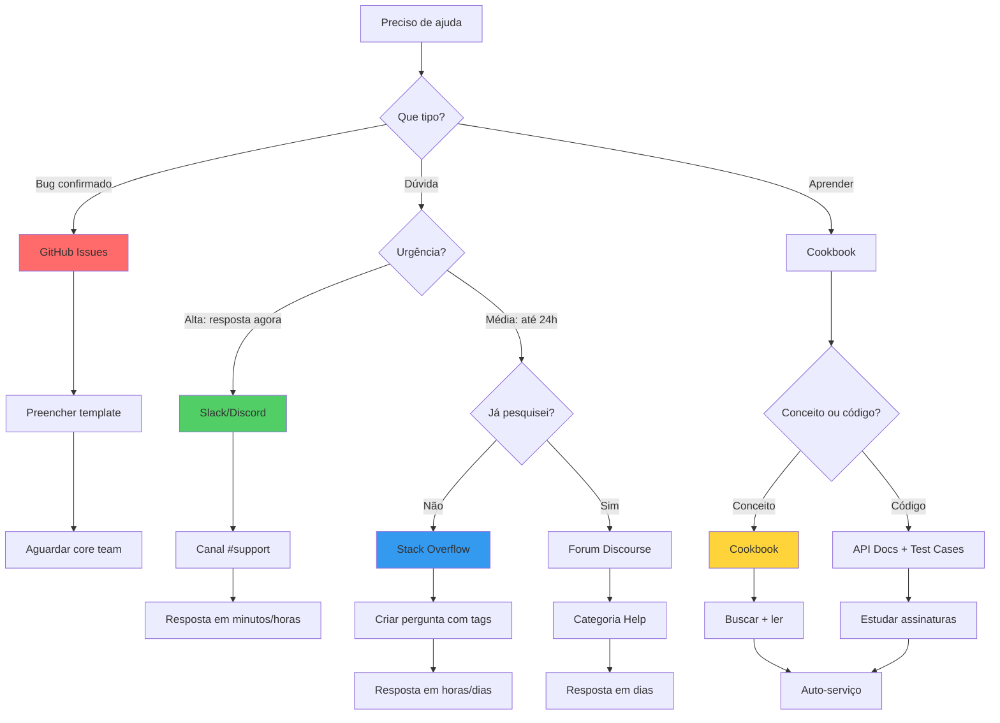

# Onde Buscar Ajuda

Seja bem-vindo à comunidade CakePHP! Esta página centraliza **todos os recursos** para você encontrar ajuda, aprender e se conectar com outros desenvolvedores. Independente do seu nível de experiência, há um canal perfeito para você.

---

## 🚀 Começando: Por Onde Ir Primeiro?

!!! tip "Primeira vez pedindo ajuda?"
    **Siga esta ordem para obter ajuda mais rápida:**

    1. 📚 **Pesquise no [Cookbook](#cookbook)** (manual oficial)
    2. 🔍 **Busque no [Stack Overflow](#stack-overflow)** (perguntas já respondidas)
    3. 💬 **Pergunte no [Slack](#slack) ou [Discord](#discord)** (se ainda estiver preso)
    4. 🐛 **Reporte no [GitHub Issues](#github-issues)** (se for um bug confirmado)

---

## 📊 Comparação Rápida: Qual Canal Usar?

| Recurso | Velocidade | Detalhes | Público | Melhor Para |
|---------|------------|----------|---------|-------------|
| **[Cookbook](#cookbook)** | ⚡⚡ | 🔍🔍🔍 | 🌐 Global | Aprender conceitos, tutoriais |
| **[API Docs](#api)** | ⚡⚡⚡ | 🔍🔍🔍🔍🔍 | 🌐 Global | Referência técnica, assinaturas de métodos |
| **[Test Cases](#test-cases)** | ⚡⚡⚡ | 🔍🔍🔍🔍 | 🌐 Global | Exemplos de código real |
| **[Slack](#slack)** | ⚡⚡⚡⚡⚡ | 🔍🔍 | 🌐 8 idiomas | Dúvidas rápidas, discussões |
| **[Discord](#discord)** | ⚡⚡⚡⚡⚡ | 🔍🔍 | 🌐 Global | Chat em tempo real |
| **[Forum](#forum-oficial)** | ⚡⚡⚡ | 🔍🔍🔍 | 🌐 Global | Discussões longas, ideias |
| **[Stack Overflow](#stack-overflow)** | ⚡⚡ | 🔍🔍🔍🔍 | 🌐 Global | Q&A indexado, problemas complexos |
| **[GitHub Issues](#github-issues)** | ⚡ | 🔍🔍🔍🔍🔍 | 🌐 Global | Reportar bugs, solicitar features |

**Legenda:**
- ⚡ = Velocidade de resposta (mais rápido → mais lento)
- 🔍 = Nível de detalhes (superficial → profundo)

---

## 📚 Documentação Oficial

### Site Oficial CakePHP

**🔗 [https://cakephp.org](https://cakephp.org)**

O portal oficial é seu ponto de partida para tudo relacionado ao CakePHP:

- **Downloads** - Versões estáveis e dev
- **Screencasts** - Vídeos tutoriais
- **Ferramentas de desenvolvedor** - Bake, DebugKit, etc
- **Showcase** - Projetos construídos com CakePHP
- **Novidades** - Anúncios de releases

!!! example "Quando visitar"
    - Baixar nova versão do framework
    - Ver demonstrações de recursos
    - Descobrir ferramentas oficiais
    - Acompanhar roadmap do projeto

---

### Cookbook

**🔗 [https://book.cakephp.org](https://book.cakephp.org)**

O **Cookbook** é o manual oficial completo do CakePHP. Este documento que você está lendo agora faz parte dele!

#### Por que começar pelo Cookbook?

!!! quote "Filosofia da Comunidade"
    "Try your best to answer your questions on your own first. Answers may come slower, but will remain longer – and you'll also be lightening our support load."

    Responder suas próprias perguntas através da documentação **fortalece seu aprendizado** e ajuda a comunidade volunteer-based a escalar melhor.

#### O que você encontra aqui:

- **Tutoriais passo-a-passo** (CMS, Blog, API REST)
- **Guias de conceitos** (MVC, ORM, Routing)
- **Referência de componentes** (Auth, Pagination, etc)
- **Best practices** e convenções
- **Guias de migração** entre versões

#### Dica de busca:

```text title="Como buscar no Cookbook"
1. Use Ctrl+F no navegador para buscar na página atual
2. Use a barra de busca do site (topo direito)
3. Busque no Google: site:book.cakephp.org "sua dúvida"
```

!!! success "Cookbook em Português"
    Esta documentação está sendo traduzida e melhorada para português brasileiro!
    Sempre mencione a versão (ex: CakePHP 5.x) ao pesquisar.

---

### API

**🔗 [https://api.cakephp.org/](https://api.cakephp.org/)**

A **documentação da API** (Application Programming Interface) é a referência técnica mais completa, gerada automaticamente a partir do código-fonte.

#### Para quem é a API?

!!! info "Bring your propeller hat 🤓"
    A API é para desenvolvedores que precisam de detalhes técnicos profundos sobre:

    - Assinaturas exatas de métodos
    - Tipos de parâmetros e retorno
    - Hierarquia de classes
    - Interfaces e traits disponíveis
    - Métodos protegidos/privados

#### Exemplo de uso:

=== "Cenário"
    Você quer saber **todos os parâmetros** do método `Query::where()`

=== "Solução"
    1. Acesse [api.cakephp.org/5.x/](https://api.cakephp.org/5.x/)
    2. Busque por "Query"
    3. Navegue até `Cake\ORM\Query`
    4. Encontre o método `where()`
    5. Veja assinatura completa, tipos, exemplos PHPDoc

**Estrutura:**
```text
Cake\                       # Namespace raiz do framework
├── Controller\             # Controllers e components
├── ORM\                    # Object-Relational Mapping
│   ├── Query              # Query builder
│   ├── Table              # Table classes
│   └── Entity             # Entity classes
├── View\                   # Views e helpers
├── Http\                   # Request, Response, Middleware
└── ...
```

---

### Test Cases

**📂 Localização no seu projeto:** `tests/TestCase/`

Os **test cases oficiais do CakePHP** são exemplos práticos de como usar cada classe do framework.

#### Por que estudar os testes?

!!! tip "Exemplos reais de código"
    Se a documentação da API não é suficiente, os test cases mostram:

    - Como instanciar classes corretamente
    - Como passar parâmetros
    - Casos de uso reais (inclusive edge cases)
    - Como usar traits e helpers

#### Exemplo prático:

=== "Problema"
    Você quer entender como usar `Application::bootstrap()`

=== "Solução"
    ```bash
    # Abra o test case
    $ cat tests/TestCase/ApplicationTest.php
    ```

    ```php
    <?php
    namespace App\Test\TestCase;

    use App\Application;
    use Cake\TestSuite\TestCase;

    class ApplicationTest extends TestCase
    {
        public function testBootstrap()
        {
            // ✅ Exemplo de como instanciar Application
            $app = new Application(dirname(__DIR__, 2) . '/config');

            // ✅ Como chamar bootstrap()
            $app->bootstrap();

            // ✅ Como verificar plugins
            $plugins = $app->getPlugins();
            $this->assertTrue($plugins->has('Bake'));
        }
    }
    ```

#### Estrutura dos test cases:

```bash title="Estrutura de tests/TestCase/"
tests/TestCase/
├── Controller/             # Testes de controllers
│   └── PagesControllerTest.php
├── Model/                  # Testes de models
│   ├── Table/
│   └── Entity/
├── View/                   # Testes de views
└── ApplicationTest.php     # Bootstrap e configuração
```

!!! warning "Test cases do framework vs seus testes"
    - **Seus testes** (`tests/TestCase/`): Testes da sua aplicação
    - **Testes do CakePHP** (em `vendor/cakephp/cakephp/tests/`): Código-fonte do framework

    Para aprender, estude ambos!

---

## 💬 Comunidade e Suporte em Tempo Real

### Slack

**🔗 [https://cakesf.slack.com/](https://cakesf.slack.com/)** (canal #support)

O **Slack CakePHP** é o canal principal para suporte em tempo real.

#### Como funciona:

1. **Solicite acesso:** https://cakephp.org (link "Join Slack")
2. **Entre no workspace:** cakesf.slack.com
3. **Canais principais:**
   - `#support` - Dúvidas gerais
   - `#dev` - Discussões técnicas avançadas
   - `#random` - Off-topic, networking

#### Etiqueta no Slack:

!!! success "Boas práticas"
    ✅ **FAÇA:**

    - Pesquise mensagens antigas antes de perguntar (Ctrl+F)
    - Forneça **código** (use ``` para formatar)
    - Mencione sua **versão** do CakePHP e PHP
    - Seja paciente - todos são voluntários

    ❌ **NÃO FAÇA:**

    - Perguntar "Alguém usa CakePHP?" (todos usam)
    - Postar print screens de código (cole o código como texto)
    - Fazer cross-posting (mesma pergunta em vários canais)
    - Pedir para alguém "dar uma olhada" sem contexto

#### Canais por idioma:

O Slack CakePHP tem canais dedicados para diferentes idiomas:

=== "Português"
    - `#portuguese` - Comunidade lusófona (BR + PT)

    !!! info "Comunidade brasileira"
        Embora exista um canal Portuguese genérico, a comunidade brasileira também se organiza em grupos externos (Telegram, Facebook). Veja seção [Ajuda em Português Brasileiro](#ajuda-em-portugues-brasileiro).

=== "Outros Idiomas"
    - `#danish` - Dinamarquês
    - `#french` - Francês
    - `#german` - Alemão
    - `#dutch` - Holandês
    - `#japanese` - Japonês
    - `#spanish` - Espanhol

---

### Discord

**🔗 [https://discord.com/invite/k4trEMPebj](https://discord.com/invite/k4trEMPebj)**

O **Discord CakePHP** é uma alternativa ao Slack para chat em tempo real.

#### Slack vs Discord:

| Aspecto | Slack | Discord |
|---------|-------|---------|
| **Histórico** | 10k mensagens (free tier) | Ilimitado |
| **Integrações** | Mais integrações dev | Foco em comunidade |
| **Audiência** | Profissional | Mix profissional/casual |
| **Mobile app** | Excelente | Excelente |

!!! tip "Use ambos!"
    Muitos desenvolvedores estão em ambos. Escolha o que preferir ou use os dois!

---

### Forum Oficial

**🔗 [https://discourse.cakephp.org](https://discourse.cakephp.org)**

O **Forum CakePHP** (Discourse) é o canal oficial para discussões assíncronas.

#### Vantagens do Forum:

✅ **Persistência:** Discussões ficam indexadas permanentemente
✅ **Detalhes:** Espaço para respostas longas e detalhadas
✅ **Organização:** Categorias, tags, busca avançada
✅ **Notificações:** Email/RSS para tópicos que você segue
✅ **Reputação:** Sistema de likes, badges, trust levels

#### Quando usar o Forum:

- Discussões de arquitetura/design
- Sugestões de features
- Dúvidas que exigem respostas longas
- Compartilhar soluções com a comunidade
- Anúncios de plugins/pacotes

#### Categorias principais:

- **Help** - Dúvidas gerais
- **Internals** - Desenvolvimento do core
- **Plugins** - Discussões sobre plugins
- **Jobs** - Vagas e freelas
- **Showcase** - Projetos da comunidade

!!! example "Criar conta"
    É gratuito e leva 1 minuto. Use GitHub/Google para login rápido.

---

## 🐛 Reportando Bugs e Solicitando Features

### GitHub Issues

**🔗 [https://github.com/cakephp/cakephp/issues](https://github.com/cakephp/cakephp/issues)**

O **GitHub Issues** é o canal **oficial** para reportar bugs, vulnerabilidades de segurança e solicitar features.

#### ⚠️ Antes de abrir um issue:

!!! warning "Confirme que é realmente um bug"
    **GitHub Issues é APENAS para bugs confirmados do framework.**

    ❌ **NÃO use para:**

    - Dúvidas de como usar ("How do I...")
    - Erros no SEU código
    - Suporte geral
    - Discussões de ideias

    ✅ **Use para:**

    - Bugs confirmados do CakePHP core
    - Vulnerabilidades de segurança
    - Feature requests bem documentados
    - Documentação incorreta/desatualizada

#### Checklist antes de abrir issue:

```markdown title="Checklist de Bug Report"
- [ ] Busquei nos issues existentes (abertos e fechados)
- [ ] Confirmo que é um bug do framework (não do meu código)
- [ ] Testei na versão mais recente do CakePHP
- [ ] Tenho um código de reprodução mínima
- [ ] Sei informar: versão CakePHP, versão PHP, OS

Se todos ✅, pode abrir o issue!
```

#### Estrutura de um bom bug report:

```markdown title="Template de Issue"
### Descrição do Bug
[Descrição clara do problema]

### Versões
- **CakePHP:** 5.0.5
- **PHP:** 8.2.10
- **Database:** MySQL 8.0.34
- **OS:** Ubuntu 22.04

### Como Reproduzir
1. Crie um Table com...
2. Chame o método...
3. Veja o erro

### Código de Reprodução
​```php
// Código mínimo que reproduz o bug
$query = $this->Articles->find()
    ->where(['status' => 'published']);
​```

### Comportamento Esperado
[O que deveria acontecer]

### Comportamento Atual
[O que está acontecendo]

### Logs/Erros
​```
[Stacktrace ou mensagem de erro]
​```
```

#### Vulnerabilidades de segurança:

!!! danger "Segurança: NÃO abra issue público"
    Para reportar vulnerabilidades de segurança:

    📧 **Email:** security@cakephp.org
    🔒 **Privado:** Não divulgue publicamente antes do patch

    A equipe responderá em 48h e lançará patch prioritário.

---

## 📚 Recursos da Comunidade

### The Bakery

**🔗 [https://bakery.cakephp.org](https://bakery.cakephp.org)**

O **Bakery** é o blog oficial da comunidade CakePHP.

#### O que você encontra:

- **Tutoriais** - Guias passo-a-passo da comunidade
- **Case studies** - Projetos reais construídos com CakePHP
- **Artigos técnicos** - Deep dives em recursos avançados
- **Anúncios** - Releases, eventos, novidades

!!! tip "Contribua!"
    Depois de dominar CakePHP, **compartilhe seu conhecimento** no Bakery.
    Log in e submeta seu artigo. Ganhe visibilidade na comunidade!

---

### Awesome CakePHP

**🔗 [https://github.com/FriendsOfCake/awesome-cakephp](https://github.com/FriendsOfCake/awesome-cakephp)**

Lista **curada pela comunidade** com os melhores recursos CakePHP.

#### Categorias:

- **Plugins** - Autenticação, upload, admin, API, etc
- **Tutoriais** - Artigos, vídeos, cursos
- **Ferramentas** - IDEs, Docker, deployment
- **Comunidade** - Meetups, conferences
- **Empresas** - Agências que usam CakePHP

!!! example "Por que usar Awesome CakePHP?"
    Antes de criar um plugin do zero, **verifique se já existe** na lista Awesome!
    Economize horas de desenvolvimento.

---

### Stack Overflow

**🔗 [https://stackoverflow.com/questions/tagged/cakephp](https://stackoverflow.com/questions/tagged/cakephp)**

O **Stack Overflow** é excelente para Q&A público e indexado.

#### Como usar a tag `cakephp`:

```text title="Boas práticas de tags"
[cakephp] [cakephp-5.0] [php] [mysql]

Sempre use:
- Tag 'cakephp' (obrigatória)
- Tag da versão específica (ex: 'cakephp-5.0')
- Tags relacionadas (php, orm, routing, etc)
```

#### Vantagens do Stack Overflow:

✅ **Indexado pelo Google** - Suas perguntas/respostas aparecem em buscas
✅ **Sistema de reputação** - Ganhe pontos ajudando outros
✅ **Qualidade alta** - Perguntas mal formuladas são fechadas
✅ **Respostas aceitas** - Solução oficial marcada

#### Como fazer boas perguntas:

!!! success "Estrutura ideal"
    **1. Título claro e específico**
    ```
    ❌ "CakePHP not working"
    ✅ "CakePHP 5.0: Query::contain() not loading associations"
    ```

    **2. Contexto**
    - O que você está tentando fazer?
    - O que já tentou?

    **3. Código mínimo reproduzível**
    ```php
    // Entity
    class Article extends Entity { ... }

    // Query
    $articles = $this->Articles->find()
        ->contain(['Authors'])  // ← Não está funcionando
        ->toArray();
    ```

    **4. Erro/Comportamento atual**
    ```
    Expected: Authors data loaded
    Actual: Authors field is null
    ```

    **5. Ambiente**
    - CakePHP 5.0.5
    - PHP 8.2
    - MySQL 8.0

---

## 🌐 Redes Sociais e Novidades

Acompanhe o CakePHP em outras plataformas:

### Twitter/X

**🔗 [@cakephp](https://twitter.com/cakephp)**

- Anúncios de releases
- Dicas rápidas
- Retweets de artigos da comunidade

### YouTube

**🔗 Canais recomendados:**

- **CakeDC** - Screencasts oficiais e tutoriais
- **Busque por:** "CakePHP 5 tutorial" para vídeos recentes

### LinkedIn

Siga a **CakePHP Software Foundation** para:

- Vagas de emprego
- Eventos e conferences
- Networking profissional

---

## 🇧🇷 Ajuda em Português Brasileiro

Embora o canal `#portuguese` do Slack seja internacional, a comunidade brasileira também se organiza em grupos específicos:

### Recursos em Português

!!! info "Comunidade BR"
    A comunidade brasileira de CakePHP é ativa mas **descentralizada**.
    Recursos principais:

    - **Slack Portuguese:** Canal internacional lusófono
    - **Grupos Facebook:** Busque "CakePHP Brasil" ou "PHP Brasil"
    - **Telegram:** Grupos de PHP que também discutem CakePHP
    - **YouTube BR:** Canais de PHP com tutoriais CakePHP

### Particularidades Brasileiras

Ao pedir ajuda em português, considere:

=== "Hostings Populares no Brasil"
    - **Locaweb** - Shared hosting com cPanel
    - **Hostgator BR** - Configuração CakePHP friendly
    - **UOL Host** - Suporte a PHP 8.x
    - **DigitalOcean** - VPS (requer configuração manual)

=== "Validações PT-BR"
    Validações comuns para Brasil:

    - **CPF/CNPJ** - Use plugin `cakephp-br-validator`
    - **CEP** - Integração com ViaCEP API
    - **Telefone** - Formato (XX) XXXXX-XXXX
    - **Data** - Formato d/m/Y (não Y-m-d americano)

=== "Localização"
    ```php
    // config/bootstrap.php
    date_default_timezone_set('America/Sao_Paulo');

    // config/app.php
    'defaultLocale' => 'pt_BR',
    ```

---

## 🎯 Fluxograma: Qual Canal Usar?



---

## 💡 Como Fazer Boas Perguntas

Independente do canal escolhido, seguir estas práticas aumenta **drasticamente** suas chances de obter ajuda:

### ✅ Checklist Universal

```markdown
- [ ] Pesquisei antes (Google, Cookbook, Stack Overflow)
- [ ] Tenho um título claro e específico
- [ ] Informei minhas versões (CakePHP, PHP, DB)
- [ ] Incluí código (não print screen)
- [ ] Formatei o código corretamente
- [ ] Expliquei o que espero vs o que acontece
- [ ] Incluí mensagens de erro completas
- [ ] Fui educado e paciente
```

### Template Genérico

```markdown title="Template de Pergunta"
**Contexto:**
Estou tentando [objetivo]

**Código:**
​```php
// Seu código aqui
$query = $this->Articles->find();
​```

**Erro:**
​```
[Mensagem de erro ou comportamento incorreto]
​```

**Ambiente:**
- CakePHP: 5.0.5
- PHP: 8.2
- Database: MySQL 8.0

**O que já tentei:**
- [Tentativa 1]
- [Tentativa 2]
```

### ❌ Erros Comuns

!!! failure "Evite estas práticas"
    ❌ "Não funciona" (sem detalhes)
    ❌ Código em print screen (cole como texto)
    ❌ "Urgente!!!" (todos têm pressa)
    ❌ Código completo do projeto (isole o problema)
    ❌ "Alguém pode fazer pra mim?" (peça orientação, não código pronto)
    ❌ Sem versões (CakePHP 3.x ≠ 5.x)

---

## 📊 Comparação Completa de Canais

<div class="grid" markdown>

<div markdown>
### 📚 Auto-Serviço
**Mais rápido, aprenda mais**

- [Cookbook](#cookbook) - Manual completo
- [API](#api) - Referência técnica
- [Test Cases](#test-cases) - Exemplos de código
- [Awesome CakePHP](#awesome-cakephp) - Lista curada

**Vantagens:**
✅ Disponível 24/7
✅ Informação confiável
✅ Aprenda no seu ritmo

**Desvantagens:**
❌ Requer esforço de leitura
❌ Pode não cobrir casos específicos
</div>

<div markdown>
### 💬 Comunidade
**Interativo, respostas personalizadas**

- [Slack](#slack) - Tempo real
- [Discord](#discord) - Alternativa ao Slack
- [Forum](#forum-oficial) - Assíncrono
- [Stack Overflow](#stack-overflow) - Q&A público

**Vantagens:**
✅ Respostas personalizadas
✅ Discussão de abordagens
✅ Networking

**Desvantagens:**
❌ Depende de disponibilidade
❌ Pode demorar
❌ Requer esforço de formulação
</div>

<div markdown>
### 🔧 Oficial
**Canônico, mantido pelo core team**

- [GitHub Issues](#github-issues) - Bugs
- [cakephp.org](https://cakephp.org) - Portal
- [Bakery](#the-bakery) - Blog oficial

**Vantagens:**
✅ Informação oficial
✅ Core team envolvido
✅ Contribui pro projeto

**Desvantagens:**
❌ Processo formal
❌ Não é para dúvidas gerais
❌ Resposta pode demorar
</div>

</div>

---

## 🎓 Recursos de Aprendizado

Além de pedir ajuda, aprenda proativamente:

### Cursos e Tutoriais

- **Cookbook Oficial** - Completo e gratuito
- **CakeDC** - Cursos profissionais pagos
- **YouTube** - Busque "CakePHP 5 tutorial"
- **Udemy** - Cursos em português (verificar versão)

### Livros

!!! info "Livros recomendados"
    Atenção: Verifique se o livro cobre CakePHP 5.x (não 3.x ou 4.x)

    - **Rapid Application Development with CakePHP** (em inglês)
    - Busque na Amazon por "CakePHP 5"

### Meetups e Conferences

- **CakeFest** - Conferência anual oficial
- **PHP Conference Brasil** - Trilhas de frameworks
- **Meetups locais** - Busque "PHP [sua cidade]"

---

## 🤝 Contribuindo com a Comunidade

Depois de receber ajuda, **retribua**:

### Como contribuir:

1. **Responda perguntas** no Slack/Forum/Stack Overflow
2. **Escreva artigos** no Bakery ou seu blog
3. **Crie plugins** e compartilhe no Packagist
4. **Reporte bugs** que encontrar
5. **Melhore a documentação** (PRs são bem-vindos)
6. **Traduza** a documentação para português

!!! success "Todos podem contribuir"
    Não precisa ser expert. Até iniciantes podem:

    - Melhorar documentação confusa
    - Adicionar exemplos de código
    - Reportar erros de digitação
    - Compartilhar experiências

---

## 📞 Resumo de Contatos Rápidos

| Canal | URL | Melhor Para |
|-------|-----|-------------|
| **Cookbook** | [book.cakephp.org](https://book.cakephp.org) | Aprender, tutoriais |
| **API** | [api.cakephp.org](https://api.cakephp.org/) | Referência técnica |
| **Slack** | [cakesf.slack.com](https://cakesf.slack.com/) | Dúvidas rápidas |
| **Discord** | [discord.com/invite/k4trEMPebj](https://discord.com/invite/k4trEMPebj) | Chat alternativo |
| **Forum** | [discourse.cakephp.org](https://discourse.cakephp.org) | Discussões longas |
| **GitHub** | [github.com/cakephp/cakephp/issues](https://github.com/cakephp/cakephp/issues) | Reportar bugs |
| **Stack Overflow** | [stackoverflow.com/questions/tagged/cakephp](https://stackoverflow.com/questions/tagged/cakephp) | Q&A público |
| **Awesome** | [github.com/FriendsOfCake/awesome-cakephp](https://github.com/FriendsOfCake/awesome-cakephp) | Lista de recursos |
| **Bakery** | [bakery.cakephp.org](https://bakery.cakephp.org) | Artigos, tutoriais |
| **Twitter** | [@cakephp](https://twitter.com/cakephp) | Novidades |

---

## ❓ FAQ: Dúvidas Frequentes

??? question "Qual canal é mais rápido para obter ajuda?"
    **Slack/Discord** para dúvidas rápidas (minutos a horas).

    Mas **pesquise no Cookbook primeiro** - é ainda mais rápido e você aprende mais!

??? question "Posso fazer perguntas em português?"
    Sim! Use:

    - Slack canal `#portuguese`
    - Stack Overflow PT (menor audiência CakePHP)
    - Grupos brasileiros de PHP/CakePHP

    Mas lembre-se: **comunidade global em inglês é maior**.

??? question "Como reportar um bug de segurança?"
    **NÃO abra issue público.**

    Envie email para: **security@cakephp.org**

    O core team responderá em 48h e lançará patch prioritário.

??? question "Preciso pagar para usar Slack/Discord/Forum?"
    Não! Todos os canais oficiais são **100% gratuitos**.

??? question "Posso pedir para alguém fazer meu código?"
    ❌ **Não.**

    A comunidade oferece orientação, não código pronto.

    Se precisa de desenvolvimento pago, use:

    - Forum (categoria "Jobs")
    - LinkedIn
    - Plataformas de freela (Workana, 99Freelas)

??? question "Quanto tempo até receber resposta?"
    Depende do canal:

    - **Slack/Discord:** Minutos a horas (se alguém online)
    - **Stack Overflow:** Horas a dias
    - **Forum:** Dias a semanas
    - **GitHub Issues:** Dias a semanas (prioridade do core team)

    **Lembre-se:** Todos são voluntários!

??? question "Onde encontro vagas de emprego CakePHP?"
    - **Forum Discourse** (categoria Jobs)
    - **LinkedIn** (#cakephp, #phpjobs)
    - **Twitter** (@cakephp retweets vagas)
    - **Grupos Facebook** de PHP Brasil

---

## 🎉 Bem-vindo à Comunidade!

A comunidade CakePHP é **acolhedora, ativa e global**. Com mais de **15 anos** de história, milhares de desenvolvedores já encontraram ajuda e fizeram amigos aqui.

!!! success "Próximos passos"
    1. ✅ Entre no [Slack](https://cakesf.slack.com/) e se apresente em #random
    2. ✅ Crie conta no [Forum](https://discourse.cakephp.org)
    3. ✅ Favorite o [Cookbook](https://book.cakephp.org)
    4. ✅ Siga [@cakephp](https://twitter.com/cakephp) no Twitter
    5. ✅ Estude os [Test Cases](#test-cases) do seu projeto

    **Agora você tem todas as ferramentas para ter sucesso com CakePHP!** 🚀

---

**Lembre-se:** A melhor forma de aprender é **fazer** e **compartilhar**. Boas perguntas levam a boas respostas. Boa sorte e divirta-se!
